# Reporte de resultados 2023

Los resultados corresponden a 386 respuestas obtenidas. A continuación se muestra la cantidad de respuestas por sexo y género.

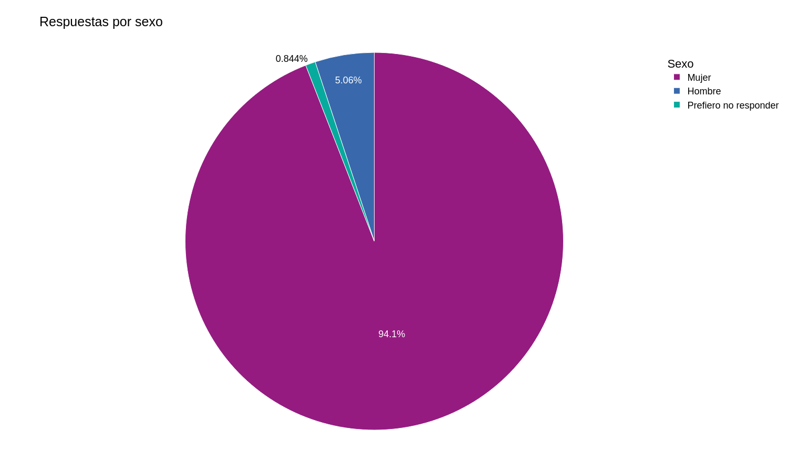

Un poco menos del 6% de las personas encuestadas manifestaron ser hombres o no indicar el sexo. 

### Respuestas por género

<div>
<style scoped>
    .dataframe tbody tr th:only-of-type {
        vertical-align: middle;
    }

    .dataframe tbody tr th {
        vertical-align: top;
    }

    .dataframe thead th {
        text-align: right;
    }
</style>
<table border="1" class="dataframe">
  <thead>
    <tr style="text-align: right;">
      <th>Sexo</th>
      <th>Hombre</th>
      <th>Mujer</th>
      <th>Prefiero no responder</th>
    </tr>
    <tr>
      <th>Género</th>
      <th></th>
      <th></th>
      <th></th>
    </tr>
  </thead>
  <tbody>
    <tr>
      <th>Femenino</th>
      <td>0</td>
      <td>360</td>
      <td>1</td>
    </tr>
    <tr>
      <th>Masculino</th>
      <td>20</td>
      <td>1</td>
      <td>0</td>
    </tr>
    <tr>
      <th>Otro</th>
      <td>0</td>
      <td>1</td>
      <td>0</td>
    </tr>
    <tr>
      <th>Prefiero no decir</th>
      <td>1</td>
      <td>1</td>
      <td>0</td>
    </tr>
    <tr>
      <th>Trans femenino</th>
      <td>0</td>
      <td>0</td>
      <td>1</td>
    </tr>
  </tbody>
</table>
</div>


## Resultados para las mujeres

Los siguientes resultados corresponden a las **mujeres** que respondieron la encuesta.

### Respuestas por rangos de edad

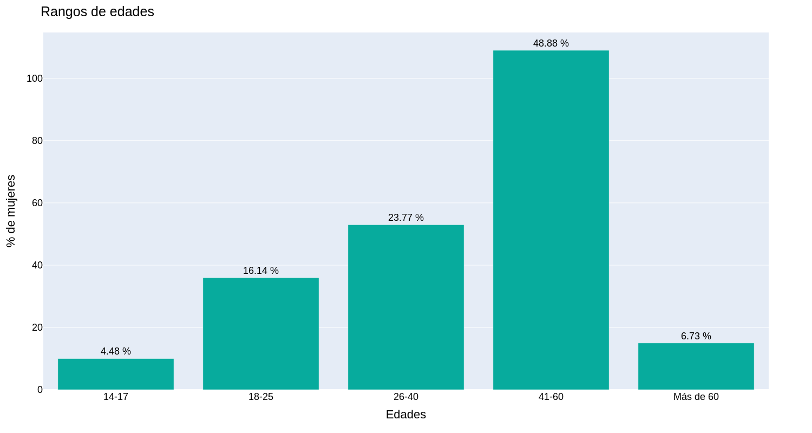

Alrededor del 72% de los encuestados tienen edades comprendidas entre 26 y 60 años.

### Respuestas por estados
    
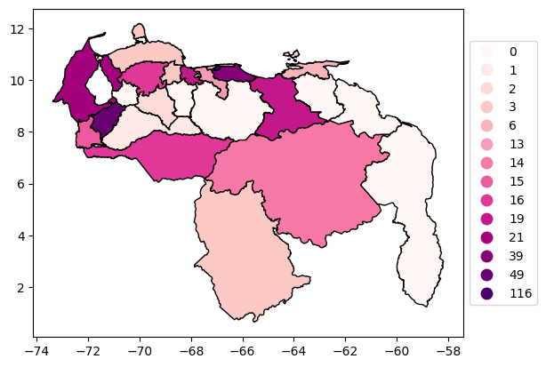
    
Los lugares donde hubo más respuestas fue Distrito Capital con 31.96%, seguido de Mérida y Miranda con 13.5% y 10.74% respectivamente.


<div>
<style scoped>
    .dataframe tbody tr th:only-of-type {
        vertical-align: middle;
    }

    .dataframe tbody tr th {
        vertical-align: top;
    }

    .dataframe thead th {
        text-align: right;
    }
</style>
<table border="1" class="dataframe">
  <thead>
    <tr style="text-align: right;">
      <th></th>
      <th>Nº de mujeres</th>
      <th>%</th>
    </tr>
    <tr>
      <th>Estado</th>
      <th></th>
      <th></th>
    </tr>
  </thead>
  <tbody>
    <tr>
      <th>Amazonas</th>
      <td>3</td>
      <td>0.83</td>
    </tr>
    <tr>
      <th>Anzoátegui</th>
      <td>19</td>
      <td>5.23</td>
    </tr>
    <tr>
      <th>Apure</th>
      <td>16</td>
      <td>4.41</td>
    </tr>
    <tr>
      <th>Aragua</th>
      <td>13</td>
      <td>3.58</td>
    </tr>
    <tr>
      <th>Barinas</th>
      <td>1</td>
      <td>0.28</td>
    </tr>
    <tr>
      <th>Bolívar</th>
      <td>14</td>
      <td>3.86</td>
    </tr>
    <tr>
      <th>Carabobo</th>
      <td>19</td>
      <td>5.23</td>
    </tr>
    <tr>
      <th>Distrito Capital</th>
      <td>116</td>
      <td>31.96</td>
    </tr>
    <tr>
      <th>Falcón</th>
      <td>3</td>
      <td>0.83</td>
    </tr>
    <tr>
      <th>Lara</th>
      <td>16</td>
      <td>4.41</td>
    </tr>
    <tr>
      <th>Miranda</th>
      <td>39</td>
      <td>10.74</td>
    </tr>
    <tr>
      <th>Mérida</th>
      <td>49</td>
      <td>13.50</td>
    </tr>
    <tr>
      <th>Nueva Esparta</th>
      <td>2</td>
      <td>0.55</td>
    </tr>
    <tr>
      <th>Portuguesa</th>
      <td>2</td>
      <td>0.55</td>
    </tr>
    <tr>
      <th>Sucre</th>
      <td>6</td>
      <td>1.65</td>
    </tr>
    <tr>
      <th>Táchira</th>
      <td>15</td>
      <td>4.13</td>
    </tr>
    <tr>
      <th>Vargas</th>
      <td>6</td>
      <td>1.65</td>
    </tr>
    <tr>
      <th>Yaracuy</th>
      <td>3</td>
      <td>0.83</td>
    </tr>
    <tr>
      <th>Zulia</th>
      <td>21</td>
      <td>5.79</td>
    </tr>
  </tbody>
</table>
</div>


### Ocupaciones más comunes de las mujeres

<div>
<style scoped>
    .dataframe tbody tr th:only-of-type {
        vertical-align: middle;
    }

    .dataframe tbody tr th {
        vertical-align: top;
    }

    .dataframe thead th {
        text-align: right;
    }
</style>
<table border="1" class="dataframe">
  <thead>
    <tr style="text-align: right;">
      <th></th>
      <th>Nº de mujeres</th>
      <th>%</th>
    </tr>
    <tr>
      <th>Ocupación</th>
      <th></th>
      <th></th>
    </tr>
  </thead>
  <tbody>
    <tr>
      <th>Docente</th>
      <td>56</td>
      <td>15.43</td>
    </tr>
    <tr>
      <th>Abogado(a)</th>
      <td>40</td>
      <td>11.02</td>
    </tr>
    <tr>
      <th>Psicólogo(a)</th>
      <td>24</td>
      <td>6.61</td>
    </tr>
    <tr>
      <th>Empleado(a) Público(a)</th>
      <td>19</td>
      <td>5.23</td>
    </tr>
    <tr>
      <th>Trabajo social</th>
      <td>17</td>
      <td>4.68</td>
    </tr>
    <tr>
      <th>Ingeniero(a)</th>
      <td>17</td>
      <td>4.68</td>
    </tr>
    <tr>
      <th>Estudiante</th>
      <td>15</td>
      <td>4.13</td>
    </tr>
    <tr>
      <th>Periodista</th>
      <td>14</td>
      <td>3.86</td>
    </tr>
    <tr>
      <th>Jubilado(a)</th>
      <td>10</td>
      <td>2.75</td>
    </tr>
    <tr>
      <th>Gerente</th>
      <td>8</td>
      <td>2.20</td>
    </tr>
  </tbody>
</table>
</div>

Una cuarta parte de las mujeres encuestadas indican ser docentes o abogadas.

En el caso de "otra" hay 34 respuestas, que se dividen de la siguiente manera:

<div>
<style scoped>
    .dataframe tbody tr th:only-of-type {
        vertical-align: middle;
    }

    .dataframe tbody tr th {
        vertical-align: top;
    }

    .dataframe thead th {
        text-align: right;
    }
</style>
<table border="1" class="dataframe">
  <thead>
    <tr style="text-align: right;">
      <th></th>
      <th>Nº de mujeres</th>
    </tr>
    <tr>
      <th>Ocupación</th>
      <th></th>
    </tr>
  </thead>
  <tbody>
    <tr>
      <th>Desempleada</th>
      <td>3</td>
    </tr>
    <tr>
      <th>Socióloga</th>
      <td>3</td>
    </tr>
    <tr>
      <th>Promotora</th>
      <td>1</td>
    </tr>
    <tr>
      <th>antropologa</th>
      <td>1</td>
    </tr>
    <tr>
      <th>Repostera</th>
      <td>1</td>
    </tr>
    <tr>
      <th>Consultora</th>
      <td>1</td>
    </tr>
    <tr>
      <th>Educadora ambiental. Redactora</th>
      <td>1</td>
    </tr>
    <tr>
      <th>Promotora</th>
      <td>1</td>
    </tr>
    <tr>
      <th>Creación de comidas alternativas y comunes</th>
      <td>1</td>
    </tr>
    <tr>
      <th>Promotora de Lectura, Cuenta Cuentos</th>
      <td>1</td>
    </tr>
    <tr>
      <th>Organización y métodos</th>
      <td>1</td>
    </tr>
    <tr>
      <th>Nutricionista</th>
      <td>1</td>
    </tr>
    <tr>
      <th>Artista audiovisual</th>
      <td>1</td>
    </tr>
    <tr>
      <th>Lcda. Recursos Humanos</th>
      <td>1</td>
    </tr>
    <tr>
      <th>Investigadora</th>
      <td>1</td>
    </tr>
    <tr>
      <th>Profesor Universitario</th>
      <td>1</td>
    </tr>
    <tr>
      <th>Asistente personal</th>
      <td>1</td>
    </tr>
    <tr>
      <th>Trabajadora social</th>
      <td>1</td>
    </tr>
    <tr>
      <th>Comunicadora</th>
      <td>1</td>
    </tr>
    <tr>
      <th>Tareas digitales</th>
      <td>1</td>
    </tr>
    <tr>
      <th>Emprendedor en casa de encomiendas</th>
      <td>1</td>
    </tr>
    <tr>
      <th>Agente de Viajes y Turismo</th>
      <td>1</td>
    </tr>
    <tr>
      <th>Trainer Coach Profesional</th>
      <td>1</td>
    </tr>
    <tr>
      <th>Investigadora</th>
      <td>1</td>
    </tr>
    <tr>
      <th>Ilustradora</th>
      <td>1</td>
    </tr>
    <tr>
      <th>Xxx</th>
      <td>1</td>
    </tr>
    <tr>
      <th>Representante en ventas</th>
      <td>1</td>
    </tr>
    <tr>
      <th>desempleada</th>
      <td>1</td>
    </tr>
    <tr>
      <th>Correctora de estilo</th>
      <td>1</td>
    </tr>
    <tr>
      <th>Agente de operaciones remoto</th>
      <td>1</td>
    </tr>
  </tbody>
</table>
</div>


### Horas de uso diario de internet

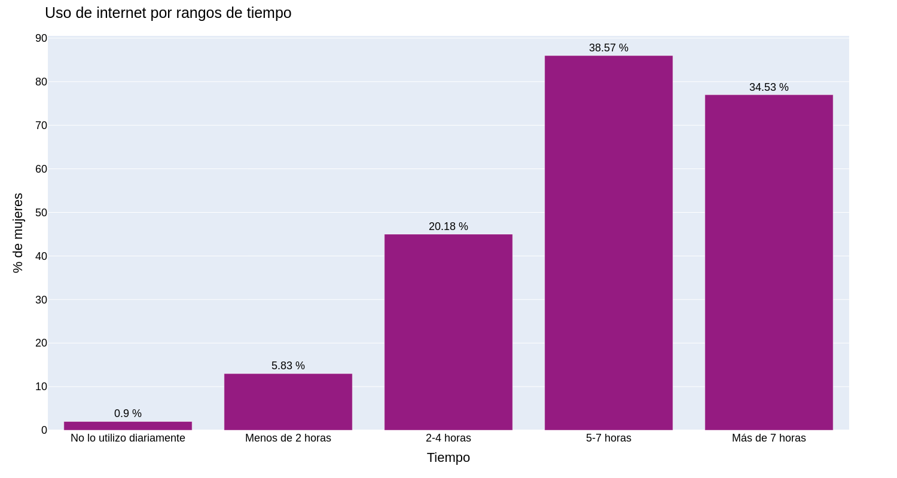

Alrededor del 72% de las mujeres indicaron que utilizan al menos 5 horas de internet al día. 


### Principales usos de internet

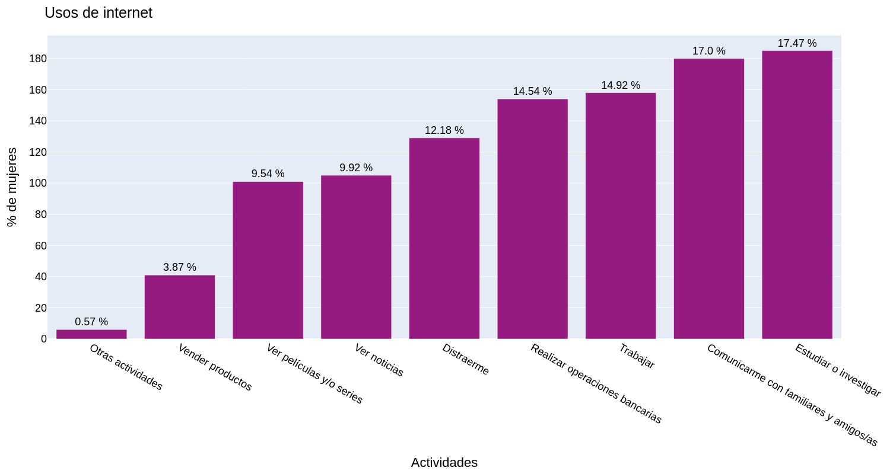

Frecuentemente utilizan el internet para estudiar o investigar, trabajar, comunicarse con familiares y amigos y realizar operaciones bancarias.

<
En el caso de la respuesta "Otras actividades", podemos observar lo siguiente:


<div>
<style scoped>
    .dataframe tbody tr th:only-of-type {
        vertical-align: middle;
    }

    .dataframe tbody tr th {
        vertical-align: top;
    }

    .dataframe thead th {
        text-align: right;
    }
</style>
<table border="1" class="dataframe">
  <thead>
    <tr style="text-align: right;">
      <th></th>
      <th>Nº de mujeres</th>
    </tr>
    <tr>
      <th>Otros usos de internet</th>
      <th></th>
    </tr>
  </thead>
  <tbody>
    <tr>
      <th>Temas de salud</th>
      <td>1</td>
    </tr>
    <tr>
      <th>Talleres y formaciones</th>
      <td>1</td>
    </tr>
    <tr>
      <th>Investigación</th>
      <td>1</td>
    </tr>
    <tr>
      <th>Subir estados de mensajes claves y de empoderamiento</th>
      <td>1</td>
    </tr>
    <tr>
      <th>Buscar direccciones</th>
      <td>1</td>
    </tr>
    <tr>
      <th>Comprar productos</th>
      <td>1</td>
    </tr>
    <tr>
      <th>Escuchar música, poner comiquitas educativas, buscar poesías, corregir ortografía, …</th>
      <td>1</td>
    </tr>
    <tr>
      <th>Compartir contenido</th>
      <td>1</td>
    </tr>
    <tr>
      <th>Jugar</th>
      <td>1</td>
    </tr>
  </tbody>
</table>
</div>


### Aumento de uso de internet por Covid19

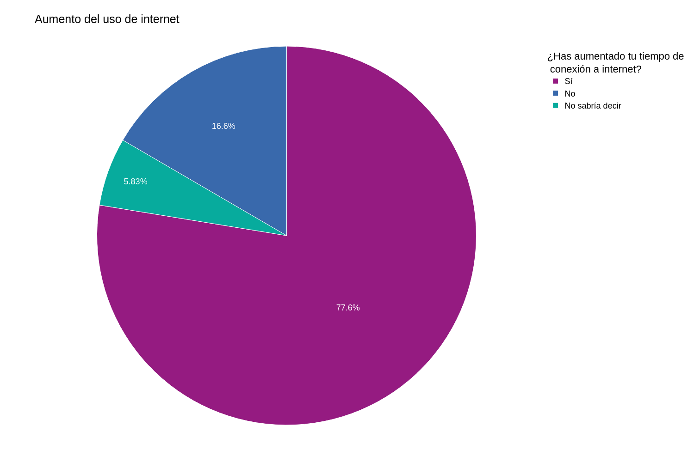


La mayoría de las mujeres indicaron haber aumentado el tiempo de conexión a internet post-pandemia, alrededor del 77%.

### Uso de redes sociales/aplicaciones

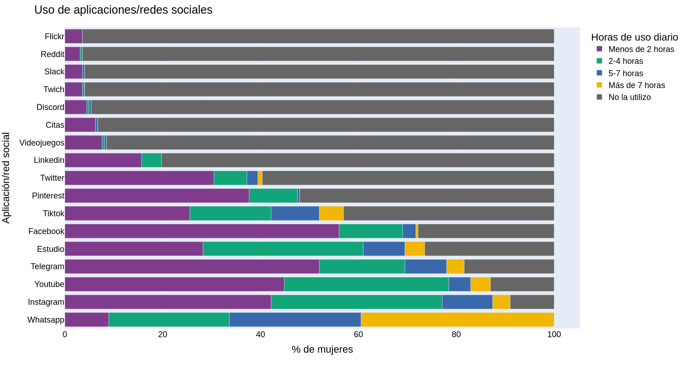

Las aplicaciones más utilizadas por las mujeres son WhatsApp e Instagram, sin embargo, WhatsApp la utilizan cerca del 40% de las mujeres por más de 7 horas.

### Incidencia de violencias

En la siguiente tabla se muestran los diferentes tipos de violencias manejadas en esta encuesta y la cantidad de mujeres encuestadas que manifestaron haber sufrido cada una de estas.

<div>
<style scoped>
    .dataframe tbody tr th:only-of-type {
        vertical-align: middle;
    }

    .dataframe tbody tr th {
        vertical-align: top;
    }

    .dataframe thead tr th {
        text-align: left;
    }
</style>
<table border="1" class="dataframe">
  <thead>
    <tr>
      <th></th>
      <th>No</th>
      <th>Sí</th>
    </tr>
  </thead>
  <tbody>
    <tr>
      <th>Duplicación de identidad</th>
      <td>320</td>
      <td>43</td>
    </tr>
    <tr>
      <th>Ciberacoso</th>
      <td>228</td>
      <td>135</td>
    </tr>
    <tr>
      <th>Doxxing</th>
      <td>318</td>
      <td>45</td>
    </tr>
    <tr>
      <th>Mobbing</th>
      <td>305</td>
      <td>58</td>
    </tr>
    <tr>
      <th>Ciberdifamación</th>
      <td>303</td>
      <td>60</td>
    </tr>
    <tr>
      <th>Cibervigilancia (stalking)</th>
      <td>197</td>
      <td>166</td>
    </tr>
    <tr>
      <th>Ciberextorsión</th>
      <td>342</td>
      <td>21</td>
    </tr>
    <tr>
      <th>Grooming</th>
      <td>323</td>
      <td>40</td>
    </tr>
    <tr>
      <th>Phishing/Vishing/Smishing</th>
      <td>285</td>
      <td>78</td>
    </tr>
    <tr>
      <th>Trata de personas en línea</th>
      <td>324</td>
      <td>39</td>
    </tr>
    <tr>
      <th>Captación con fines de explotación sexual</th>
      <td>356</td>
      <td>7</td>
    </tr>
    <tr>
      <th>Exclusión digital</th>
      <td>326</td>
      <td>37</td>
    </tr>
    <tr>
      <th>Cyberflashing</th>
      <td>173</td>
      <td>190</td>
    </tr>
    <tr>
      <th>Deepfake</th>
      <td>353</td>
      <td>10</td>
    </tr>
    <tr>
      <th>Clonación de aplicaciones</th>
      <td>313</td>
      <td>50</td>
    </tr>
  </tbody>
</table>
</div>


Posteriormente se observa el gráfico de incidencias de acuerdo a cada tipo de violencia:

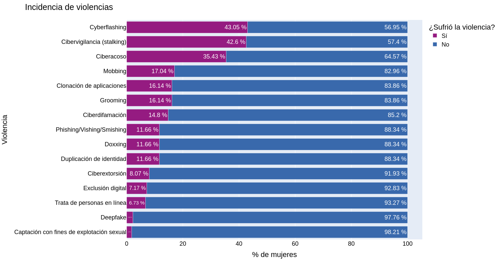

Las violencias que más reportaron las mujeres haber sufrido son Cyberflashing, cibervigilancia(stalking) y ciberacoso.Al contrario, las violencias con menos incidencia son captaciones con fines e explotación sexual y deepfake.

#### Cantidad de violencias sufridas


Cerca del 47% de las mujeres sufrieron entre 1 y 3 tipos diferentes de violencias y, en promedio, una mujer es víctima de 3 diferentes tipos de violencias digitales.


#### Resultados para los casos de duplicación de identidad

- Se han reportado 43 casos de duplicación de identidad, de los cuales el 74,4% indica solo haberla sufrido una vez.

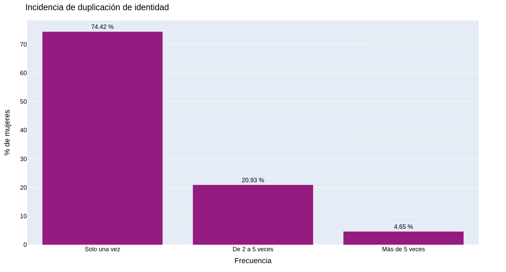

- Más del 70% de las mujeres reportó que los casos ocurrieron en los seis meses previos a la encuesta.

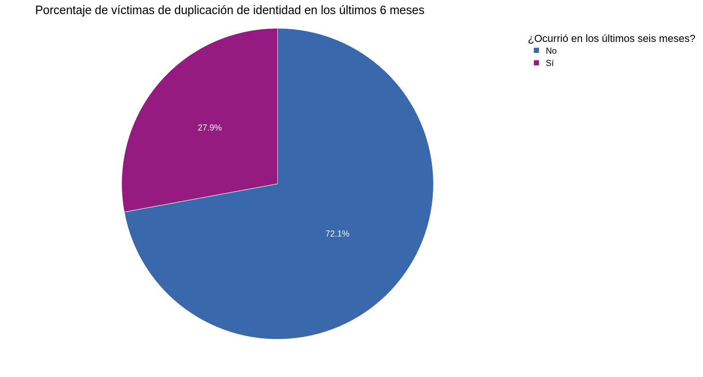

- Con respecto a los **rangos de edades** en que las mujeres sufrieron duplicación de identidad por primera vez se tiene lo siguiente:

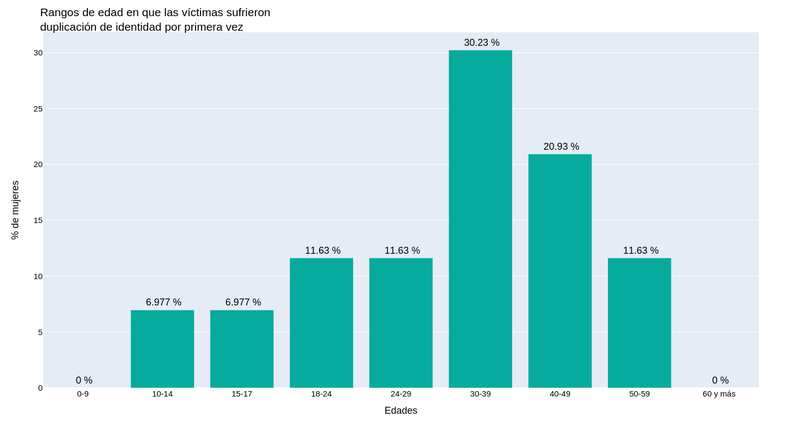

Se observa que la mayoría de las mujeres reporta haber tenido entre 30 y 49 años cuando fueron víctimas de esta violencia por primera vez.

- El siguiente gráfico muestra el **Parentesco de la persona agresora con las mujeres víctimas de duplicación de identidad**

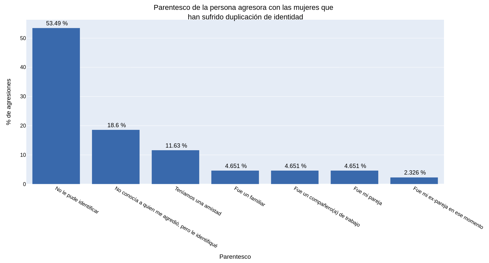

Cabe destacar que más del 50% de las mujeres víctimas no pudieron identificar a la persona que duplicó su identidad. Y solo menos del 10% manifiesta que fue su pareja o un familiar.

- En cuanto al **Sexo de la persona agresora** se observa que en la mayoría de los casos el agresor es un hombre.

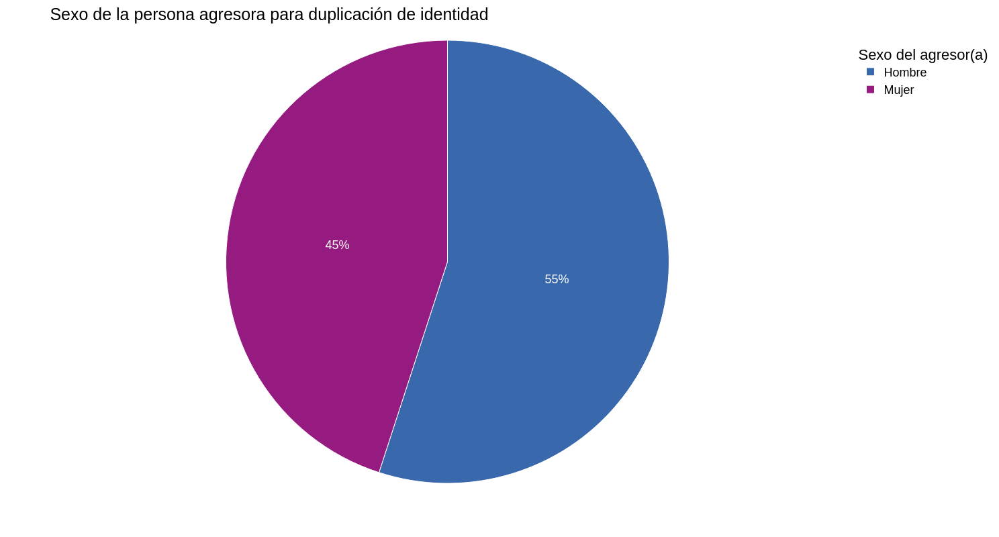

- Por otra parte, más del 74% de las mujeres indican haber sufrido esta violencia por Facebook. Luego de esta, las plataformas más comunes por donde fueron víctimas de duplicación de identidad son Instagram, correo electrónico y WhatsApp, como se muestra a continuación:


#### Resultados para los casos de ciberacoso

- Se han reportado 135 casos de ciberacoso.

- La frecuencia con la que ocurrió la violencia se muestra en el siguiente gráfico:

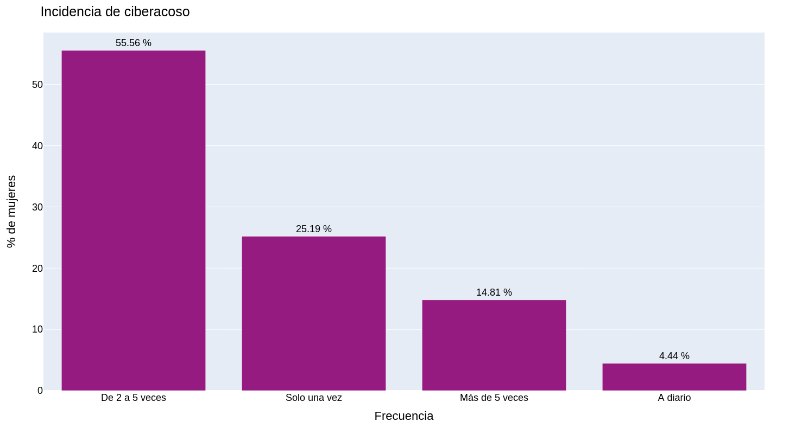

Más del 70% de las mujeres reportan haber sido víctimas de ciberacoso en más de dos ocasiones.

- Por su parte, solo el 32% de las víctimas indica que sufrió la violencia en los seis meses previos a la encuesta como se muestra en el siguiente gráfico:

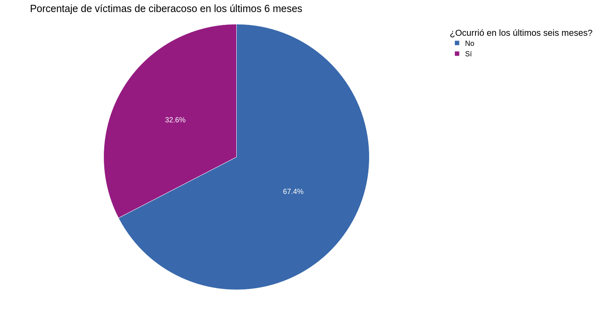

- Posteriormente se visualizan los **rangos de edades** en que las mujeres fueron víctimas de ciberacoso por primera vez:

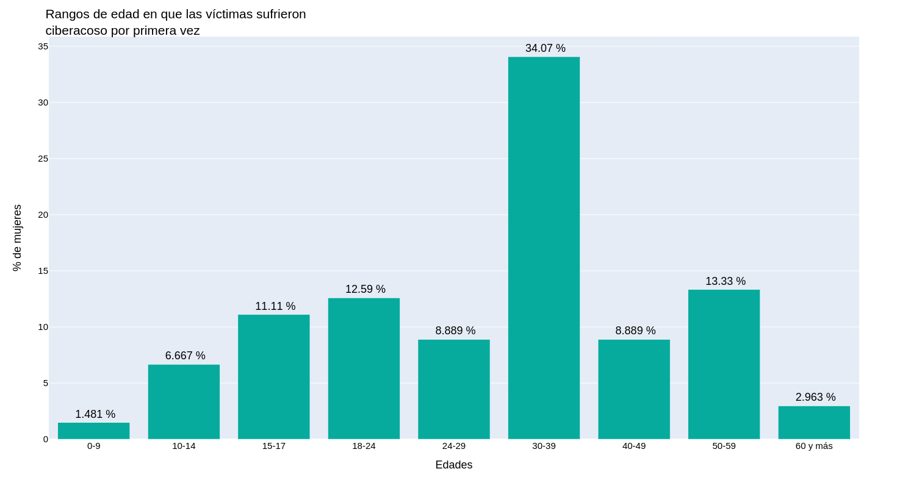

Cerca al 55% de las víctimas de ciberacoso tenían entre 18 y 39 años cuando la sufrieron por primera vez.

- De acuerdo al **parentesco con la persona agresora** se tiene que:

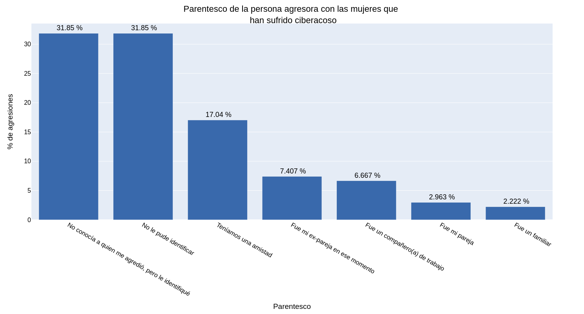

Un poco más del 62% de las víctimas manifiesta que no pudo identificar al agresor o que no lo conocía pero le pudo identificar.

- _Las mujeres víctimas de ciberacoso indican que en el 75% de los casos, sus agresores son hombres_.

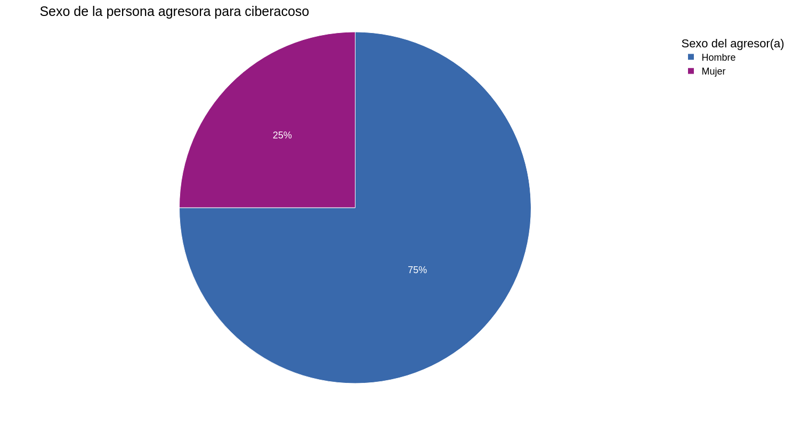

- Facebook, WhatsApp e Instagram son las aplicaciones por las cuales la mayoría de las víctimas reporta haber sufrido ciberacoso. Se puede ver con más detalle en el gráfico a continuación:

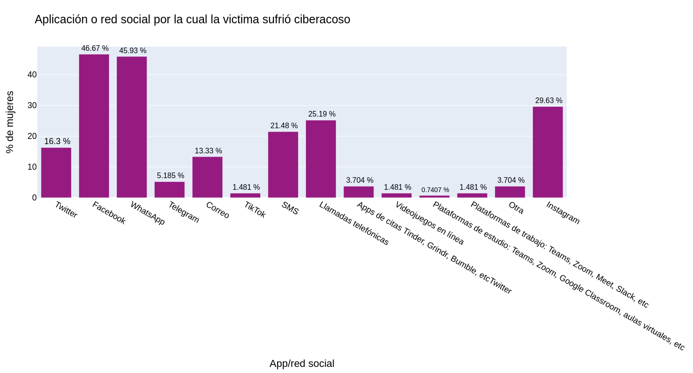


#### Resultados para los casos doxxing


Se han reportado 45 casos de doxxing.


Alrededor del 40% de las mujeres víctimas de doxxing reportan haberlo sufrido al menos 2 veces.

- En el siguiente gráfico se observa que un poco menos del 30% de las mujeres indica que la violencia se produjo en los seis meses anteriores a la encuesta.

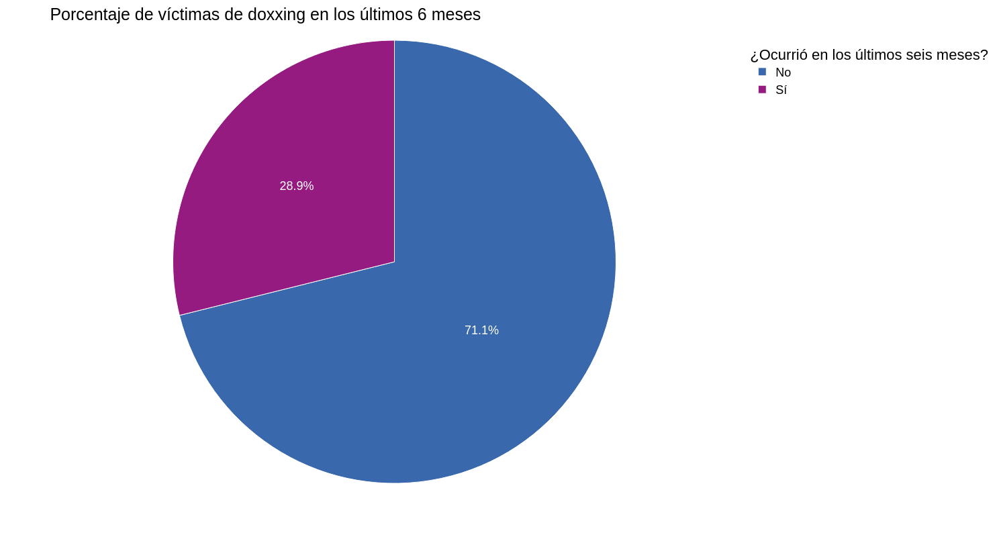

- A continuación se observan los **rangos de edades** en que las mujeres fueron víctimas de doxxing por primera vez:

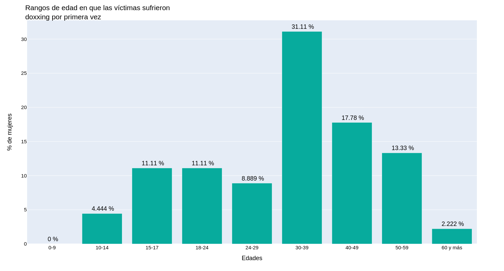

Cerca del 35% de las mujeres reportan haber tenido entre 10 y 29 años cuando sufrieron la violencia por primera vez.

- En cuanto al **Parentesco con la persona agresora**, tenemos lo siguiente:

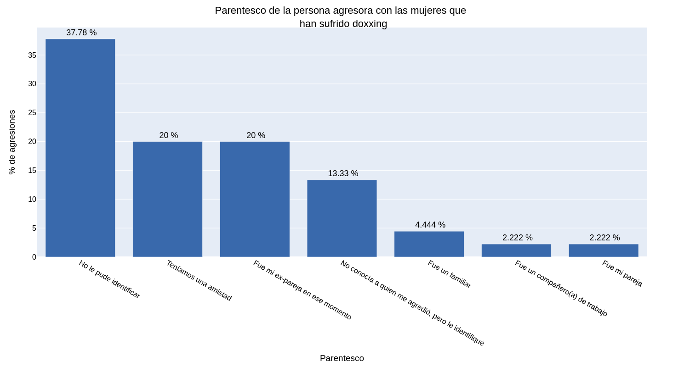

El 40% de las mujeres víctimas de doxxing manifiestan que la persona que los agredió era su ex-pareja en ese momento o que tenían una amistad.

- _Un poco más del 46% de los casos reportados indican que la persona agresora es también una mujer_.

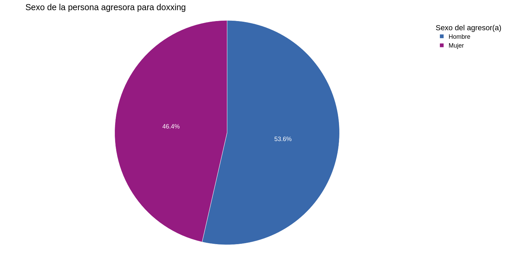

- Así como para ciberacoso, se observa que Facebook, WhatsApp e Instagram son las aplicaciones por donde ocurren la mayoría de casos de doxxing.

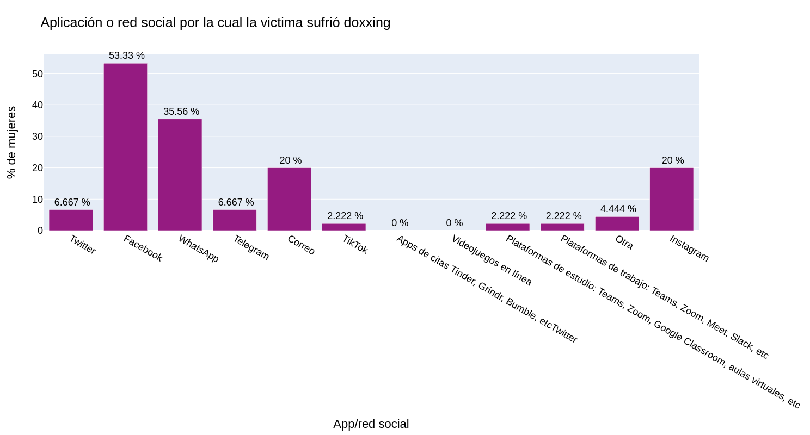

Posteriormente se muestra una tabla con las respuestas de acuerdo a otras aplicaciones o redes sociales reportadas.


<div>
<style scoped>
    .dataframe tbody tr th:only-of-type {
        vertical-align: middle;
    }

    .dataframe tbody tr th {
        vertical-align: top;
    }

    .dataframe thead th {
        text-align: right;
    }
</style>
<table border="1" class="dataframe">
  <thead>
    <tr style="text-align: right;">
      <th></th>
      <th>N° de mujeres</th>
    </tr>
    <tr>
      <th>Otras aplicaciones o redes sociales</th>
      <th></th>
    </tr>
  </thead>
  <tbody>
    <tr>
      <th>Hispachan</th>
      <td>1</td>
    </tr>
    <tr>
      <th>Correo electrónico</th>
      <td>1</td>
    </tr>
  </tbody>
</table>
</div>


#### Resultados para los casos de mobbing


Se han reportado 58 casos de mobbing, de los cuales alrededor del 60% manifiesta haberlo sufrido al menos 2 veces.

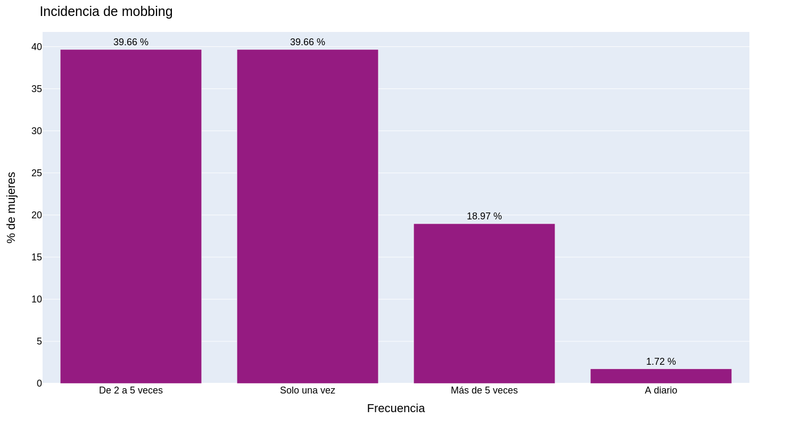

- La mayoría de las mujeres manifiestan que la violencia no ocurrió en los seis meses previos a la encuesta.

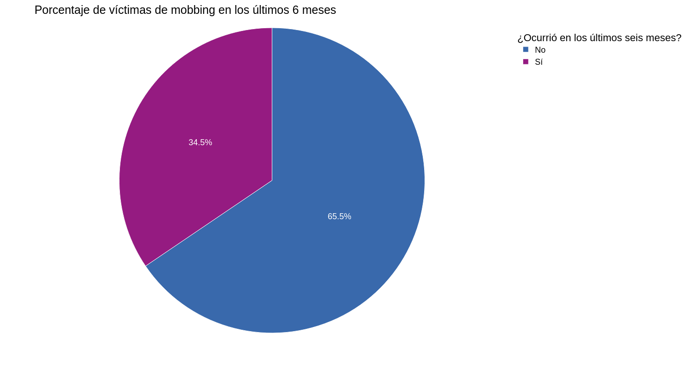

- A continuación se muestran los **rangos de edad** en que las mujeres fueron victimas de mobbing por primera vez:

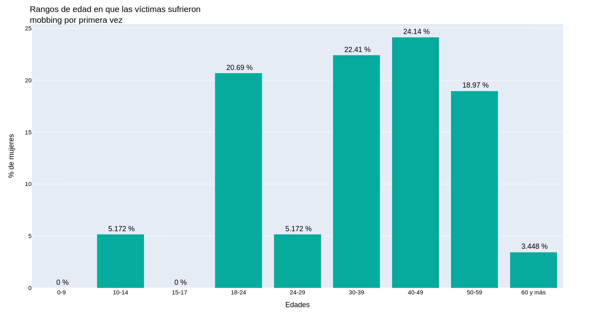

Cerca del 65% de las mujeres víctimas de mobbing, indican haber tenido entre 30 y 59 años cuando sufrieron la violencia por primera vez.

- Para el caso de mobbing, debido a la naturaleza de la violencia, se reformuló la pregunta acerca del parentesco con la persona agresora y en su lugar se pidió información sobre la relación laboral con esta.

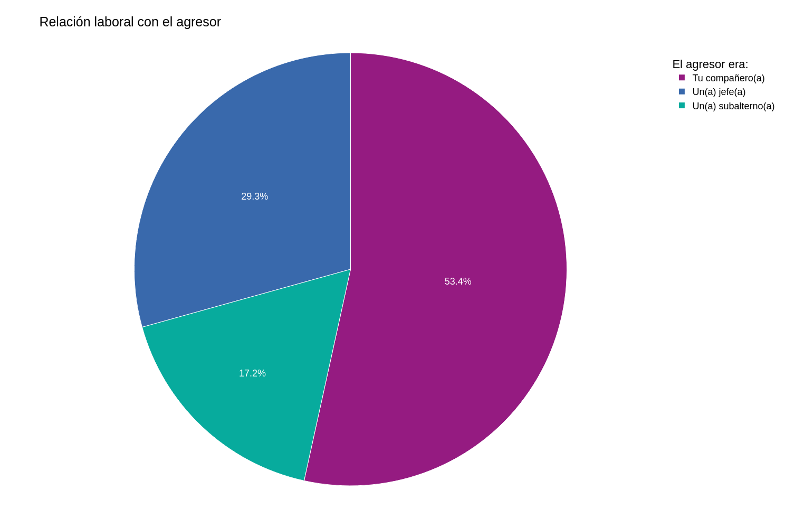

Se reportan pocos casos en los que el agresor fue un subalterno y alrededor del 30% son víctimas de su propio jefe(a).

- Asimismo, _las víctimas de mobbing indican que en la mayoría de los casos su agresor es un hombre_
 
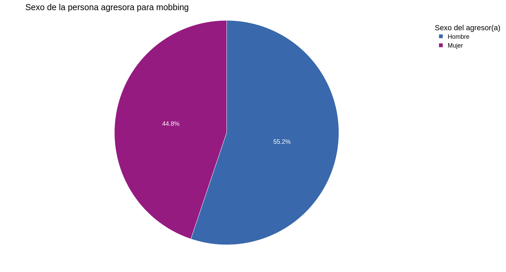

- A continuación se muestran las aplicaciones o redes sociales por las cuales las mujeres sufrieron mobbing.

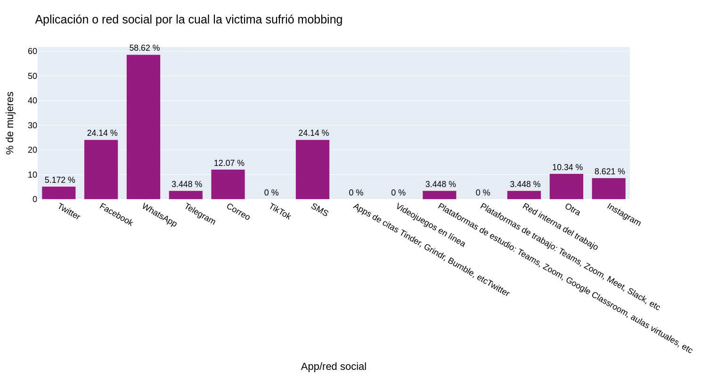

Resultando WhatsApp como la aplicación más común, seguida de Facebook y SMS.

La siguiente tabla muestra las respuestas de las mujeres de acuerdo a otras aplicaciones por las cuales fueron víctimas de mobbing:


<div>
<style scoped>
    .dataframe tbody tr th:only-of-type {
        vertical-align: middle;
    }

    .dataframe tbody tr th {
        vertical-align: top;
    }

    .dataframe thead th {
        text-align: right;
    }
</style>
<table border="1" class="dataframe">
  <thead>
    <tr style="text-align: right;">
      <th></th>
      <th>N° de mujeres</th>
    </tr>
    <tr>
      <th>Otras aplicaciones o redes sociales</th>
      <th></th>
    </tr>
  </thead>
  <tbody>
    <tr>
      <th>Llamada</th>
      <td>1</td>
    </tr>
    <tr>
      <th>Persona</th>
      <td>1</td>
    </tr>
    <tr>
      <th>Televisión</th>
      <td>1</td>
    </tr>
    <tr>
      <th>Personal</th>
      <td>1</td>
    </tr>
    <tr>
      <th>Google hangouts</th>
      <td>1</td>
    </tr>
    <tr>
      <th>Impreso</th>
      <td>1</td>
    </tr>
  </tbody>
</table>
</div>


#### Resultados para los casos de ciberdifamación

Se han reportado 60 casos de ciberdifamación, indicando el 36.67% haber sido víctimas en 2 o más ocasiones.  

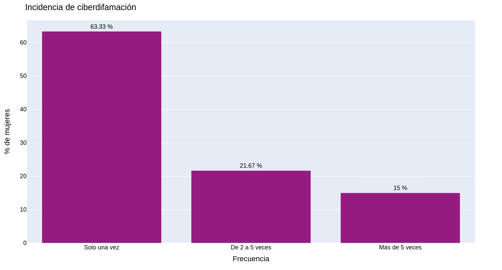

- Pocas mujeres manifiestan haber sufrido esta violencia en los últimos seis meses, como se muestra en el siguiente gráfico:

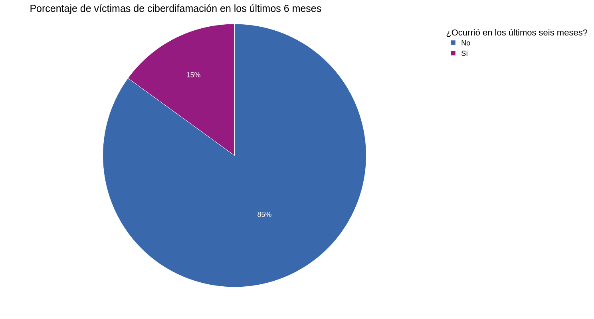

- Alrededor del 70% de las mujeres indican haber tenido 39 años o menos cuando fueron víctimas de ciberdifamación por primera vez.

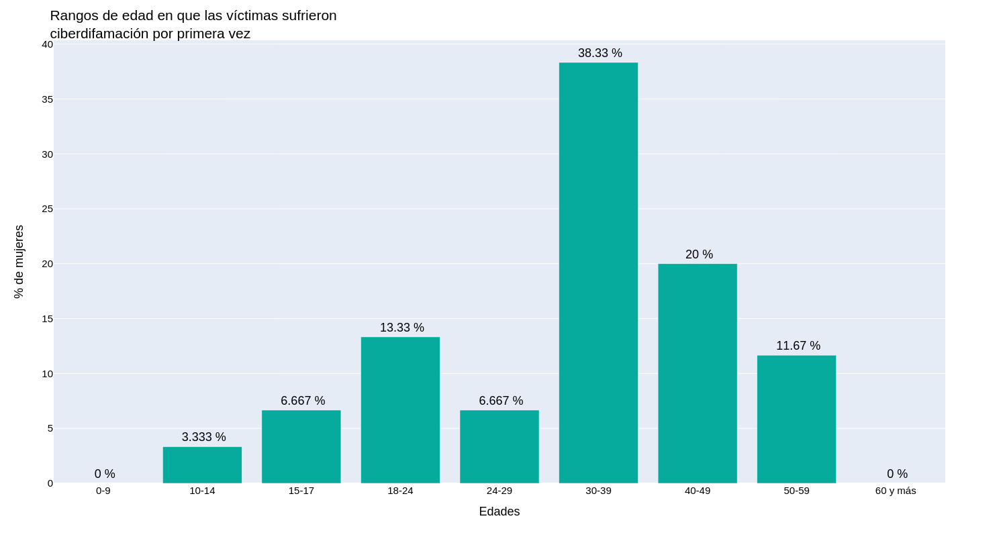

- A continuación se observan las respuestas en cuanto al parentesco de la víctima con la persona agresora:

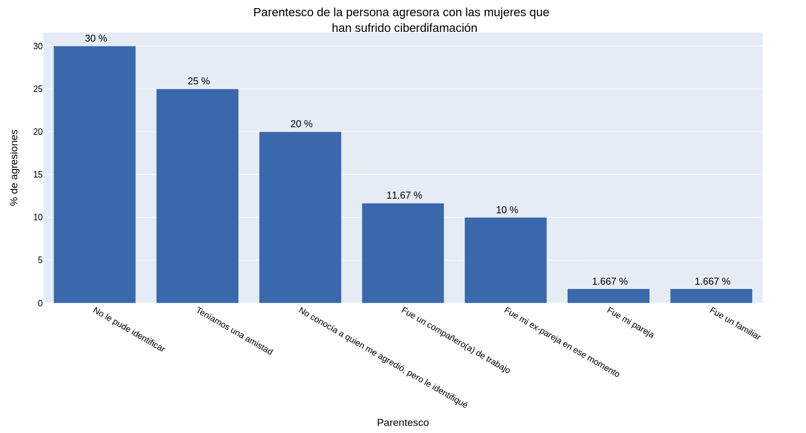

El 70% logró identificar a la persona agresora, de los cuales el 25% indica que tenía una amistad con su agresor.

- De estos casos, _alrededor del 65% reporta haber sufrido de ciberdifamación causada por una mujer_.

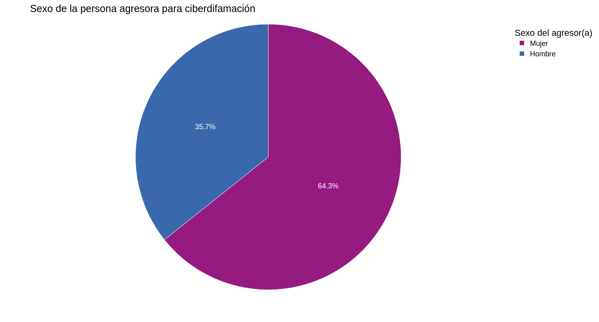

- Por su parte, Facebook es la red social más frecuente donde se produce la ciberdifamación, seguida de WhatsApp y correo electrónico. Esto se observa en el gráfico a continuación:

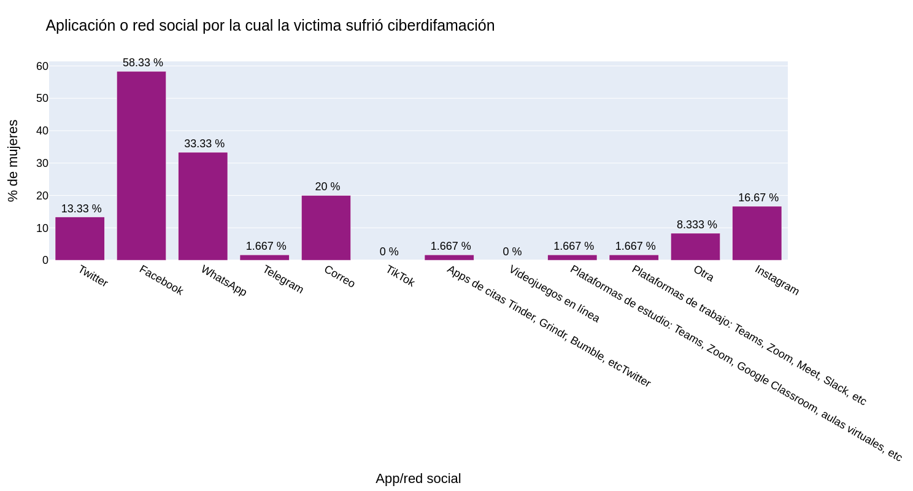

Posteriormente se muestra una tabla con otras aplicaciones reportadas por las víctimas de ciberdifamación:


<div>
<style scoped>
    .dataframe tbody tr th:only-of-type {
        vertical-align: middle;
    }

    .dataframe tbody tr th {
        vertical-align: top;
    }

    .dataframe thead th {
        text-align: right;
    }
</style>
<table border="1" class="dataframe">
  <thead>
    <tr style="text-align: right;">
      <th></th>
      <th>N° de mujeres</th>
    </tr>
    <tr>
      <th>Otras aplicaciones o redes sociales</th>
      <th></th>
    </tr>
  </thead>
  <tbody>
    <tr>
      <th>Ask.fm</th>
      <td>1</td>
    </tr>
    <tr>
      <th>Portal web</th>
      <td>1</td>
    </tr>
    <tr>
      <th>Twitter</th>
      <td>1</td>
    </tr>
    <tr>
      <th>Mensajería Blackberry</th>
      <td>1</td>
    </tr>
    <tr>
      <th>Prensa escrita</th>
      <td>1</td>
    </tr>
  </tbody>
</table>
</div>


#### Resultados para los casos de cibervigilancia (stalking)


```python
tbl_stalking = datos.query("stalking == 1")[dic_violencias["stalking"]]
```

Se han reportado 166 casos de stalking.


```python
frecuencia_stalking = fg.grafico_frecuencia(tbl_stalking)
```


```python
temporalidad_stalking = fg.grafico_temporalidad(tbl_stalking)
```


```python
edad_stalking = fg.grafico_edad(tbl_stalking)
```


```python
parentesco_stalking = fg.grafico_parentesco(tbl_stalking)
```

```python
sexo_stalking = fg.grafico_sexo_parentesco(tbl_stalking)
```


```python
medios_stalking = fg.grafico_medios(tbl_stalking)[2]
```


```python
pd.DataFrame(tbl_stalking.otraR_stalking.value_counts()).rename_axis(
    index={"otraR_stalking": "Otras aplicaciones o redes sociales"}
).rename(columns={"count": "N° de mujeres"})
```


<div>
<style scoped>
    .dataframe tbody tr th:only-of-type {
        vertical-align: middle;
    }

    .dataframe tbody tr th {
        vertical-align: top;
    }

    .dataframe thead th {
        text-align: right;
    }
</style>
<table border="1" class="dataframe">
  <thead>
    <tr style="text-align: right;">
      <th></th>
      <th>N° de mujeres</th>
    </tr>
    <tr>
      <th>Otras aplicaciones o redes sociales</th>
      <th></th>
    </tr>
  </thead>
  <tbody>
    <tr>
      <th>Skype</th>
      <td>1</td>
    </tr>
    <tr>
      <th>Washaop</th>
      <td>1</td>
    </tr>
  </tbody>
</table>
</div>


#### Resultados para los casos de ciberextorsión


```python
tbl_ciberextorsion = datos.query("ciberextorsion == 1")[
    dic_violencias["ciberextorsion"]
]
```

Se han reportado 21 casos de ciberextorsión.


```python
frecuencia_ciberextorsion = fg.grafico_frecuencia(tbl_ciberextorsion)
```


```python
temporalidad_ciberextorsion = fg.grafico_temporalidad(tbl_ciberextorsion)
```

```python
edad_ciberextorsion = fg.grafico_edad(tbl_ciberextorsion)
```


```python
parentesco_ciberextorsion = fg.grafico_parentesco(tbl_ciberextorsion)
```


```python
sexo_ciberextorsion = fg.grafico_sexo_parentesco(tbl_ciberextorsion)
```


```python
medios_ciberextorsion = fg.grafico_medios(tbl_ciberextorsion)[2]
```

```python
pd.DataFrame(tbl_ciberextorsion.otraR_ciberextorsion.value_counts()).rename_axis(
    index={"otraR_ciberextorsion": "Otras aplicaciones o redes sociales"}
).rename(columns={"count": "N° de mujeres"})
```


<div>
<style scoped>
    .dataframe tbody tr th:only-of-type {
        vertical-align: middle;
    }

    .dataframe tbody tr th {
        vertical-align: top;
    }

    .dataframe thead th {
        text-align: right;
    }
</style>
<table border="1" class="dataframe">
  <thead>
    <tr style="text-align: right;">
      <th></th>
      <th>N° de mujeres</th>
    </tr>
    <tr>
      <th>Otras aplicaciones o redes sociales</th>
      <th></th>
    </tr>
  </thead>
  <tbody>
    <tr>
      <th>Skype</th>
      <td>1</td>
    </tr>
  </tbody>
</table>
</div>


#### Resultados para los casos de grooming


```python
tbl_grooming = datos.query("grooming == 1")[dic_violencias["grooming"]]
```

Se han reportado 40 casos de grooming.


```python
frecuencia_grooming = fg.grafico_frecuencia(tbl_grooming)
```


```python
temporalidad_grooming = fg.grafico_temporalidad(tbl_grooming)
```


```python
edad_grooming = fg.grafico_edad(tbl_grooming)
```


```python
parentesco_grooming = fg.grafico_parentesco(tbl_grooming)
```

```python
sexo_grooming = fg.grafico_sexo_parentesco(tbl_grooming)
```


```python
medios_grooming = fg.grafico_medios(tbl_grooming)[2]
```


```python
pd.DataFrame(tbl_grooming.otraR_grooming.value_counts()).rename_axis(
    index={"otraR_grooming": "Otras aplicaciones o redes sociales"}
).rename(columns={"count": "N° de mujeres"})
```


<div>
<style scoped>
    .dataframe tbody tr th:only-of-type {
        vertical-align: middle;
    }

    .dataframe tbody tr th {
        vertical-align: top;
    }

    .dataframe thead th {
        text-align: right;
    }
</style>
<table border="1" class="dataframe">
  <thead>
    <tr style="text-align: right;">
      <th></th>
      <th>N° de mujeres</th>
    </tr>
    <tr>
      <th>Otras aplicaciones o redes sociales</th>
      <th></th>
    </tr>
  </thead>
  <tbody>
    <tr>
      <th>Hello tall</th>
      <td>1</td>
    </tr>
    <tr>
      <th>Messenger, cuando existia</th>
      <td>1</td>
    </tr>
    <tr>
      <th>Chats internacionales (Latinchat)</th>
      <td>1</td>
    </tr>
    <tr>
      <th>Skype</th>
      <td>1</td>
    </tr>
    <tr>
      <th>Messenger, hi5, latinchat</th>
      <td>1</td>
    </tr>
    <tr>
      <th>Messenger</th>
      <td>1</td>
    </tr>
    <tr>
      <th>Iqc</th>
      <td>1</td>
    </tr>
  </tbody>
</table>
</div>


#### Resultados para los casos de phishing-vishing-smishing


```python
tbl_phishing_vs = datos.query("phishing_vs == 1")[dic_violencias["phishing_vs"]]
```

Se han reportado 78 casos de phishing-vishing-smishing.


```python
frecuencia_phishing_vs = fg.grafico_frecuencia(tbl_phishing_vs)
```


```python
temporalidad_phishing_vs = fg.grafico_temporalidad(tbl_phishing_vs)
```


```python
edad_phishing_vs = fg.grafico_edad(tbl_phishing_vs)
```


```python
parentesco_phishing_vs = fg.grafico_parentesco(tbl_phishing_vs)
```

```python
sexo_phishing_vs = fg.grafico_sexo_parentesco(tbl_phishing_vs)
```


```python
pd.DataFrame(tbl_phishing_vs.otraR_phishing_vs.value_counts()).rename_axis(
    index={"otraR_phishing_vs": "Otras aplicaciones o redes sociales"}
).rename(columns={"count": "N° de mujeres"})
```


<div>
<style scoped>
    .dataframe tbody tr th:only-of-type {
        vertical-align: middle;
    }

    .dataframe tbody tr th {
        vertical-align: top;
    }

    .dataframe thead th {
        text-align: right;
    }
</style>
<table border="1" class="dataframe">
  <thead>
    <tr style="text-align: right;">
      <th></th>
      <th>N° de mujeres</th>
    </tr>
    <tr>
      <th>Otras aplicaciones o redes sociales</th>
      <th></th>
    </tr>
  </thead>
  <tbody>
    <tr>
      <th>Messenger live</th>
      <td>1</td>
    </tr>
    <tr>
      <th>Linkedin</th>
      <td>1</td>
    </tr>
  </tbody>
</table>
</div>


```python
medios_phishing_vs = fg.grafico_medios(tbl_phishing_vs)[2]
```

#### Resultados para los casos de trata de personas en línea


```python
for i in datos.query("otraR_trata == 'Instagram '").index:
    datos.loc[i, "instagram_trata"] = True
```


```python
tbl_trata = datos.query("trata == 1")[dic_violencias["trata"]]
```

Se han reportado 39 casos de trata de personas en línea.


```python
frecuencia_trata = fg.grafico_frecuencia(tbl_trata)
```


```python
temporalidad_trata = fg.grafico_temporalidad(tbl_trata)
```


```python
edad_trata = fg.grafico_edad(tbl_trata)
```


```python
parentesco_trata = fg.grafico_parentesco(tbl_trata)
```


```python
sexo_trata = fg.grafico_sexo_parentesco(tbl_trata)
```


```python
medios_trata = fg.grafico_medios(tbl_trata)[2]
```


```python
pd.DataFrame(tbl_trata.otraR_trata.value_counts()).rename_axis(
    index={"otraR_trata": "Otras aplicaciones o redes sociales"}
).rename(columns={"count": "N° de mujeres"}).iloc[1:]
```


<div>
<style scoped>
    .dataframe tbody tr th:only-of-type {
        vertical-align: middle;
    }

    .dataframe tbody tr th {
        vertical-align: top;
    }

    .dataframe thead th {
        text-align: right;
    }
</style>
<table border="1" class="dataframe">
  <thead>
    <tr style="text-align: right;">
      <th></th>
      <th>N° de mujeres</th>
    </tr>
    <tr>
      <th>Otras aplicaciones o redes sociales</th>
      <th></th>
    </tr>
  </thead>
  <tbody>
    <tr>
      <th>badoo</th>
      <td>1</td>
    </tr>
    <tr>
      <th>Gmail</th>
      <td>1</td>
    </tr>
  </tbody>
</table>
</div>


#### Resultados para los casos de captación con fines de explotación sexual


```python
tbl_explotacion = datos.query("explotacion == 1")[dic_violencias["explotacion"]]
```

Se han reportado 7 casos de captación con fines de explotación sexual.


```python
frecuencia_explotacion = fg.grafico_frecuencia(tbl_explotacion)
```

```python
temporalidad_explotacion = fg.grafico_temporalidad(tbl_explotacion)
```


```python
edad_explotacion = fg.grafico_edad(tbl_explotacion)
```

```python
parentesco_explotacion = fg.grafico_parentesco(tbl_explotacion)
```


```python
sexo_explotacion = fg.grafico_sexo_parentesco(tbl_explotacion)
```

    Para captación con fines de explotación sexual todas las personas agresoras son de sexo Hombre


```python
medios_explotacion = fg.grafico_medios(tbl_explotacion)[2]
```


```python
pd.DataFrame(tbl_explotacion.otraR_explotacion.value_counts()).rename_axis(
    index={"otraR_explotacion": "Otras aplicaciones o redes sociales"}
).rename(columns={"count": "N° de mujeres"})
```


<div>
<style scoped>
    .dataframe tbody tr th:only-of-type {
        vertical-align: middle;
    }

    .dataframe tbody tr th {
        vertical-align: top;
    }

    .dataframe thead th {
        text-align: right;
    }
</style>
<table border="1" class="dataframe">
  <thead>
    <tr style="text-align: right;">
      <th></th>
      <th>N° de mujeres</th>
    </tr>
    <tr>
      <th>Otras aplicaciones o redes sociales</th>
      <th></th>
    </tr>
  </thead>
  <tbody>
    <tr>
      <th>Texto</th>
      <td>1</td>
    </tr>
  </tbody>
</table>
</div>


#### Resultados para los casos de exclusión digital


```python
tbl_exclusion = datos.query("exclusion == 1")[dic_violencias["exclusion"]]
```

Se han reportado 37 casos de exclusión digital.


```python
frecuencia_exclusion = fg.grafico_frecuencia(tbl_exclusion)
```


```python
temporalidad_exclusion = fg.grafico_temporalidad(tbl_exclusion)
```


```python
edad_exclusion = fg.grafico_edad(tbl_exclusion)
```


En el caso de exclusión no se realizó la pregunta asociada las personas agresoras.


```python
medios_exclusion = fg.grafico_medios(tbl_exclusion)[2]
```


```python
pd.DataFrame(tbl_exclusion.otraR_exclusion.value_counts()).rename_axis(
    index={"otraR_exclusion": "Otras aplicaciones o redes sociales"}
).rename(columns={"count": "N° de mujeres"})
```


<div>
<style scoped>
    .dataframe tbody tr th:only-of-type {
        vertical-align: middle;
    }

    .dataframe tbody tr th {
        vertical-align: top;
    }

    .dataframe thead th {
        text-align: right;
    }
</style>
<table border="1" class="dataframe">
  <thead>
    <tr style="text-align: right;">
      <th></th>
      <th>N° de mujeres</th>
    </tr>
    <tr>
      <th>Otras aplicaciones o redes sociales</th>
      <th></th>
    </tr>
  </thead>
  <tbody>
    <tr>
      <th>Ninguna</th>
      <td>1</td>
    </tr>
    <tr>
      <th>ninguna</th>
      <td>1</td>
    </tr>
    <tr>
      <th>Telefónicamente</th>
      <td>1</td>
    </tr>
    <tr>
      <th>Telefonía local</th>
      <td>1</td>
    </tr>
  </tbody>
</table>
</div>


#### Resultados para los casos de cyberflashing


```python
tbl_cyberflashing = datos.query("cyberflashing == 1")[dic_violencias["cyberflashing"]]
```

Se han reportado 190 casos de cyberflashing.


```python
frecuencia_cyberflashing = fg.grafico_frecuencia(tbl_cyberflashing)
```


```python
temporalidad_cyberflashing = fg.grafico_temporalidad(tbl_cyberflashing)
```


```python
edad_cyberflashing = fg.grafico_edad(tbl_cyberflashing)
```


```python
parentesco_cyberflashing = fg.grafico_parentesco(tbl_cyberflashing)
```


```python
sexo_cyberflashing = fg.grafico_sexo_parentesco(tbl_cyberflashing)
```


```python
medios_cyberflashing = fg.grafico_medios(tbl_cyberflashing)[2]
```


```python
pd.DataFrame(tbl_cyberflashing.otraR_cyberflashing.value_counts()).rename_axis(
    index={"otraR_cyberflashing": "Otras aplicaciones o redes sociales"}
).rename(columns={"count": "N° de mujeres"})
```


<div>
<style scoped>
    .dataframe tbody tr th:only-of-type {
        vertical-align: middle;
    }

    .dataframe tbody tr th {
        vertical-align: top;
    }

    .dataframe thead th {
        text-align: right;
    }
</style>
<table border="1" class="dataframe">
  <thead>
    <tr style="text-align: right;">
      <th></th>
      <th>N° de mujeres</th>
    </tr>
    <tr>
      <th>Otras aplicaciones o redes sociales</th>
      <th></th>
    </tr>
  </thead>
  <tbody>
    <tr>
      <th>Pink</th>
      <td>1</td>
    </tr>
    <tr>
      <th>Canales de ver series</th>
      <td>1</td>
    </tr>
    <tr>
      <th>O re uerdo</th>
      <td>1</td>
    </tr>
    <tr>
      <th>Instagram</th>
      <td>1</td>
    </tr>
    <tr>
      <th>Messinger</th>
      <td>1</td>
    </tr>
    <tr>
      <th>chats online, skype</th>
      <td>1</td>
    </tr>
    <tr>
      <th>Skype, mensajes texto y el antiguo chat de Google "talk".</th>
      <td>1</td>
    </tr>
    <tr>
      <th>YouTube red</th>
      <td>1</td>
    </tr>
    <tr>
      <th>messenger de MSN</th>
      <td>1</td>
    </tr>
    <tr>
      <th>Latinchat</th>
      <td>1</td>
    </tr>
    <tr>
      <th>Mensaje de texto</th>
      <td>1</td>
    </tr>
    <tr>
      <th>Messenger</th>
      <td>1</td>
    </tr>
    <tr>
      <th>Kik</th>
      <td>1</td>
    </tr>
  </tbody>
</table>
</div>


#### Resultados para los casos de deepfake


```python
tbl_deepfake = datos.query("deepfake == 1")[dic_violencias["deepfake"]]
```

Se han reportado 10 casos de deepfake.


```python
frecuencia_deepfake = fg.grafico_frecuencia(tbl_deepfake)
```


```python
edad_deepfake = fg.grafico_edad(tbl_deepfake)
```


```python
parentesco_deepfake = fg.grafico_parentesco(tbl_deepfake)
```


```python
sexo_deepfake = fg.grafico_sexo_parentesco(tbl_deepfake)
```

```python
medios_deepfake = fg.grafico_medios(tbl_deepfake)[2]
```


```python
pd.DataFrame(tbl_deepfake.otraR_deepfake.value_counts()).rename_axis(
    index={"otraR_deepfake": "Otras aplicaciones o redes sociales"}
).rename(columns={"count": "N° de mujeres"})
```


<div>
<style scoped>
    .dataframe tbody tr th:only-of-type {
        vertical-align: middle;
    }

    .dataframe tbody tr th {
        vertical-align: top;
    }

    .dataframe thead th {
        text-align: right;
    }
</style>
<table border="1" class="dataframe">
  <thead>
    <tr style="text-align: right;">
      <th></th>
      <th>N° de mujeres</th>
    </tr>
    <tr>
      <th>Otras aplicaciones o redes sociales</th>
      <th></th>
    </tr>
  </thead>
  <tbody>
    <tr>
      <th>Messenger</th>
      <td>1</td>
    </tr>
    <tr>
      <th>BB pin</th>
      <td>1</td>
    </tr>
  </tbody>
</table>
</div>


#### Resultados para los casos de clonación de aplicaciones


```python
tbl_clonacion = datos.query("clonacion == 1")[dic_violencias["clonacion"]]
```

Se han reportado 50 casos de clonación de aplicaciones.


```python
frecuencia_clonacion = fg.grafico_frecuencia(tbl_clonacion)
```


```python
temporalidad_clonacion = fg.grafico_temporalidad(tbl_clonacion)
```


```python
edad_clonacion = fg.grafico_edad(tbl_clonacion)
```


```python
parentesco_clonacion = fg.grafico_parentesco(tbl_clonacion)
```


```python
sexo_clonacion = fg.grafico_sexo_parentesco(tbl_clonacion)
```


```python
medios_clonacion = fg.grafico_medios(tbl_clonacion)[2]
```


```python
pd.DataFrame(tbl_clonacion.otraR_clonacion.value_counts()).rename_axis(
    index={"otraR_clonacion": "Otras aplicaciones o redes sociales"}
).rename(columns={"count": "N° de mujeres"})
```


<div>
<style scoped>
    .dataframe tbody tr th:only-of-type {
        vertical-align: middle;
    }

    .dataframe tbody tr th {
        vertical-align: top;
    }

    .dataframe thead th {
        text-align: right;
    }
</style>
<table border="1" class="dataframe">
  <thead>
    <tr style="text-align: right;">
      <th></th>
      <th>N° de mujeres</th>
    </tr>
    <tr>
      <th>Otras aplicaciones o redes sociales</th>
      <th></th>
    </tr>
  </thead>
  <tbody>
    <tr>
      <th>Falsificaron mi firma</th>
      <td>1</td>
    </tr>
    <tr>
      <th>Messenger</th>
      <td>1</td>
    </tr>
  </tbody>
</table>
</div>


### Conocimiento sobre violencia digital basada en género


```python
tbl_vdbg = datos.vdbg.value_counts()
```


```python
fig = go.Figure(data=[go.Pie(labels=tbl_vdbg.index, values=tbl_vdbg)])
fig.update_layout(
    title_text="Conocimiento de VDBG",
    legend_title="¿Habías escuchado antes el término <br> Violencia Digital Basada en Género?",
    font=dict(family="Arial", size=18, color="black"),
    width=1500,
    height=1000,
)
fig.update_traces(
    marker=dict(
        colors=["rgb(149, 27, 129)", "rgb(57, 105, 172)", "rgb(7, 171, 157)"],
        line=dict(color="white", width=1),
    )
)
fig.show()
fig.write_image("img/vdbg.png")
```


```python
vdbg_violencias = [s for s in list(datos.columns) if "vdbg_" in s]
```


```python
con_violencia = pd.DataFrame(
    datos.query("vdbg == 'Sí'")[vdbg_violencias[1:]].T.sum().value_counts()
)
con_violencia.index.name = "Nº de violencias conocidas"
con_violencia["%"] = round(con_violencia / len(datos) * 100, 2)
con_violencia.rename(columns={"count": "Cantidad de mujeres"}).sort_index()
```


<div>
<style scoped>
    .dataframe tbody tr th:only-of-type {
        vertical-align: middle;
    }

    .dataframe tbody tr th {
        vertical-align: top;
    }

    .dataframe thead th {
        text-align: right;
    }
</style>
<table border="1" class="dataframe">
  <thead>
    <tr style="text-align: right;">
      <th></th>
      <th>Cantidad de mujeres</th>
      <th>%</th>
    </tr>
    <tr>
      <th>Nº de violencias conocidas</th>
      <th></th>
      <th></th>
    </tr>
  </thead>
  <tbody>
    <tr>
      <th>1</th>
      <td>17</td>
      <td>4.68</td>
    </tr>
    <tr>
      <th>2</th>
      <td>19</td>
      <td>5.23</td>
    </tr>
    <tr>
      <th>3</th>
      <td>27</td>
      <td>7.44</td>
    </tr>
    <tr>
      <th>4</th>
      <td>29</td>
      <td>7.99</td>
    </tr>
    <tr>
      <th>5</th>
      <td>22</td>
      <td>6.06</td>
    </tr>
    <tr>
      <th>6</th>
      <td>24</td>
      <td>6.61</td>
    </tr>
    <tr>
      <th>7</th>
      <td>32</td>
      <td>8.82</td>
    </tr>
    <tr>
      <th>8</th>
      <td>26</td>
      <td>7.16</td>
    </tr>
    <tr>
      <th>9</th>
      <td>21</td>
      <td>5.79</td>
    </tr>
    <tr>
      <th>10</th>
      <td>15</td>
      <td>4.13</td>
    </tr>
    <tr>
      <th>11</th>
      <td>11</td>
      <td>3.03</td>
    </tr>
    <tr>
      <th>12</th>
      <td>9</td>
      <td>2.48</td>
    </tr>
    <tr>
      <th>13</th>
      <td>5</td>
      <td>1.38</td>
    </tr>
    <tr>
      <th>14</th>
      <td>2</td>
      <td>0.55</td>
    </tr>
    <tr>
      <th>15</th>
      <td>5</td>
      <td>1.38</td>
    </tr>
  </tbody>
</table>
</div>


```python
tbl_conocimiento_violencia = pd.DataFrame(datos[vdbg_violencias[1:]].sum())
```


```python
tbl_conocimiento_violencia.index = violencias
tbl_conocimiento_violencia.rename(
    index=violencias_nombres, columns={0: "cantidad"}, inplace=True
)
tbl_conocimiento_violencia = round(tbl_conocimiento_violencia / len(datos) * 100, 2)
```


```python
fig = px.bar(
    tbl_conocimiento_violencia.sort_values("cantidad", ascending=False),
    y="cantidad",
    x=tbl_conocimiento_violencia.index,
    text_auto=True,
)
fig.update_layout(
    title="Conocimiento de la violencia",
    xaxis_title="Violencia",
    yaxis_title="% de mujeres",
    font=dict(
        family="Arial",
        size=18,
        color="black",
    ),
    width=1500,
    height=800,
)
fig.update_traces(
    textfont_size=18,
    textangle=0,
    textposition="outside",
    cliponaxis=False,
    showlegend=False,
    marker_color="rgb(149, 27, 129)",
    marker_line_color="white",
    texttemplate="%{value: .4} %",
)
fig.show()
fig.write_image("img/conocimiento_violencia.png")
```

### Reacciones de las víctima al sufrir la(s) violencia(s)


```python
reacciones = [s for s in list(datos.columns) if "reaccion_" in s]
```


```python
tbl_reacciones = round(pd.DataFrame(datos[reacciones].sum() / len(datos) * 100), 2)
```


```python
tbl_reacciones.rename(
    index={
        "reaccion_ignorar": "Ignoraron al agresor",
        "reaccion_contar": "Le contaron a un amigo(a) o familiar",
        "reaccion_ayuda": "Acudieron a un centro de ayuda o denuncia",
        "reaccion_reportar": "Reportaron el perfil o publicación en la red social",
        "reaccion_internet": "Redujeron el uso en internet",
        "reaccion_borrar": "Borraron la aplicación donde ocurrió",
        "reaccion_eliminar": "Eliminaron la cuenta de usuario",
        "reaccion_crear": "Crearon una cuenta de usuario distinta",
        "reaccion_bloquear": "Bloquearon a la persona agresora",
        "reaccion_enfrentar": "Enfrentaron a la persona agresora",
    },
    columns={0: "cantidad"},
    inplace=True,
)
```


```python
fig = px.bar(
    tbl_reacciones.sort_values("cantidad", ascending=False),
    y=tbl_reacciones["cantidad"],
    x=tbl_reacciones.index,
    text_auto=True,
)
fig.update_layout(
    title="Reacción de la víctima al sufrir la(s) violencia(s)",
    xaxis_title="Violencia",
    yaxis_title="% de mujeres",
    font=dict(
        family="Arial",
        size=18,
        color="black",
    ),
    width=1500,
    height=800,
)
fig.update_traces(
    textfont_size=18,
    textangle=0,
    textposition="outside",
    cliponaxis=False,
    showlegend=False,
    marker_color="rgb(57, 105, 172)",
    marker_line_color="white",
    texttemplate="%{value: .4} %",
)
fig.show()
fig.write_image("img/reaccion_violencia.png")
```


### Conocimiento de víctimas


```python
tbl_victima = datos.victima.value_counts()
```


```python
fig = go.Figure(data=[go.Pie(labels=tbl_victima.index, values=tbl_victima)])
fig.update_layout(
    title_text="Conocimiento de Víctimas",
    font=dict(family="Arial", size=18, color="black"),
    legend_title="¿Conoces a alguna mujer que haya <br> sido víctima de violencia digital?",
    width=1500,
    height=1000,
    legend=dict(font=dict(size=18)),
)
fig.update_traces(
    marker=dict(
        colors=["rgb(149, 27, 129)", "rgb(57, 105, 172)"],
        line=dict(color="white", width=1),
    )
)
fig.show()
fig.write_image("img/victima.png")
```


```python
num_victimas = pd.DataFrame(datos.numero_victima.value_counts())
```


```python
fig = px.bar(
    num_victimas.sort_index(),
    y=num_victimas.sort_index()["count"],
    x=num_victimas.sort_index().index.values,
    text=round(num_victimas.sort_index() / len(datos) * 100, 2)["count"],
)
fig.update_layout(
    title="Cantidad de víctimas conocidas",
    xaxis_title="Nº de victimas",
    yaxis_title="% de mujeres",
    font=dict(
        family="Arial",
        size=18,
        color="black",
    ),
    width=1500,
    height=800,
)
fig.update_traces(
    textfont_size=18,
    textangle=0,
    textposition="outside",
    cliponaxis=False,
    showlegend=False,
    marker_color="rgb(7, 171, 157)",
    marker_line_color="white",
    texttemplate="%{text: .4} %",
)
fig.show()
fig.write_image("img/num_victimas.png")
```

### Conocimiento de leyes y normas


```python
tbl_leyes = datos.leyes_normas.value_counts()
```


```python
fig = go.Figure(data=[go.Pie(labels=tbl_leyes.index, values=tbl_leyes)])
fig.update_layout(
    title_text="Conocimiento de Leyes y Normas",
    legend_title="¿Conoces leyes o normativas en el país <br> que contemplan las violencias digitales?",
    width=1500,
    height=1000,
    font=dict(family="Arial", size=18, color="black"),
)
fig.update_traces(
    marker=dict(
        colors=["rgb(149, 27, 129)", "rgb(57, 105, 172)"],
        line=dict(color="white", width=1),
    )
)
fig.show()
fig.write_image("img/ley.png")
```


### Interacciones entre ciertos ítems de la encuesta

#### Tipos de violencia y edad en que ocurrió por primera vez


```python
edades_violencias = [s for s in list(datos.columns) if "edad_" in s]
```


```python
lista_edades_violencias = []
for i in edades_violencias:
    j = (
        pd.cut(
            datos[edades_violencias].loc[:, i],
            bins=[0, 10, 15, 18, 25, 30, 40, 50, 60, 75],
            right=False,
        )
        .value_counts()
        .sort_index()
    )
    j = j.reset_index()
    for k in violencias_nombres.keys():
        if k in j.columns[0]:
            j["violencia"] = [violencias_nombres[k]] * len(j)
    j = j.rename(columns={j.columns[0]: "Edad"})
    lista_edades_violencias.append(j)
```


```python
tbl_edades_primera_vez = pd.concat(lista_edades_violencias, join="inner").reset_index(
    drop=True
)
```


```python
tbl_edades_primera_vez.Edad = tbl_edades_primera_vez.Edad.astype("str")
```


```python
l_ = []
for i in lista_edades_violencias:
    j = round(i["count"] / i["count"].sum() * 100, 3)
    i["count"] = j
    l_.append(i)
```


```python
edades_primera_vez = (
    pd.concat(l_, join="inner")
    .reset_index(drop=True)
    .rename(columns={"violencia": "Violencia"})
)
```


```python
edades_primera_vez.Edad = edades_primera_vez.Edad.astype("str")
```


```python
fig = px.bar(
    edades_primera_vez,
    x="Edad",
    y="count",
    color="Violencia",
    title="Tasa de incidencia por grupo etario según tipo de violencia",
    barmode="group",
    color_discrete_sequence=px.colors.qualitative.Plotly,
    width=1600,
    height=600,
)
fig.update_layout(
    font=dict(family="Arial", size=16, color="black"),
)
fig.update_yaxes(title="% de mujeres")
fig.update_xaxes(
    title="Rangos de edad",
    labelalias={
        "[0, 10)": "0-9",
        "[10, 15)": "10-14",
        "[15, 18)": "15-17",
        "[18, 25)": "18-24",
        "[25, 30)": "24-29",
        "[30, 40)": "30-39",
        "[40, 50)": "40-49",
        "[50, 60)": "50-59",
        "[60, 75)": "60 y más",
    },
)
fig.show()
fig.write_image("img/violencia_edad2.png")
```

#### Tipo de violencia según el medio por el cual ocurrió


```python
lista_medios = [s for s in list(vars()) if "medios_" in s]
ls_medios = []
for i in [s for s in list(vars()) if "medios_" in s]:
    df = vars()[i]
    ls_medios.append(df)
```


```python
lista_df_medios = []
for df, i in zip(ls_medios, lista_medios):
    tbl = pd.DataFrame(df)
    if i.split("_")[1] in violencias_nombres.keys():
        l_violencia = [violencias_nombres[i.split("_")[1]]] * len(df)
    else:
        l_violencia = ["Phishing/Vishing/Smishing"] * len(df)
    tbl["violencia"] = l_violencia
    tbl.rename(columns={0: "cantidad"}, inplace=True)
    tbl.reset_index(inplace=True)
    tbl.rename(columns={"index": "Medio"}, inplace=True)
    lista_df_medios.append(tbl)
```


```python
tbl_violencia_medio = pd.concat(lista_df_medios)
```


```python
tbl_violencia_medio.reset_index(drop=True, inplace=True)
```


```python
tbl_violencia_medio = tbl_violencia_medio.astype(
    {"cantidad": "float", "violencia": "str", "Medio": "str"}
)
```


```python
fig = px.bar(
    tbl_violencia_medio.sort_values("cantidad", ascending=False),
    x="cantidad",
    y="violencia",
    color="Medio",
    title="Tipo de violencia según el medio por el cual ocurrió",
    barmode="stack",
    orientation="h",
    color_discrete_sequence=px.colors.qualitative.Bold,
    width=1600,
    height=600,
)
fig.update_layout(
    font=dict(family="Arial", size=16, color="black"),
)
fig.update_yaxes(title="Violencia")
fig.update_xaxes(title="% de mujeres")
fig.show()
fig.write_image("img/violencia_medio1.png")
```

#### Parentesco de la persona agresora con las mujeres que han sufrido violencias


```python
lista_df_parentescos = [
    parentesco_identidad[2],
    parentesco_ciberacoso[2],
    parentesco_doxxing[2],
    parentesco_ciberdifamacion[2],
    parentesco_stalking[2],
    parentesco_ciberextorsion[2],
    parentesco_explotacion[2],
    parentesco_cyberflashing[2],
    parentesco_deepfake[2],
    parentesco_clonacion[2],
]
```


```python
parentescos_ = [
    "identidad",
    "ciberacoso",
    "doxxing",
    "ciberdifamacion",
    "stalking",
    "ciberextorsion",
    "explotacion",
    "cyberflashing",
    "deepfake",
    "clonacion",
]
```


```python
for i, j in zip(lista_df_parentescos, parentescos_):
    if j in violencias_nombres.keys():
        ls_index = [violencias_nombres[j]] * len(i)
    i["violencia"] = ls_index
```


```python
tbl_parentesco_ = pd.concat(lista_df_parentescos)
```


```python
tbl_parentesco_.reset_index(inplace=True)
```


```python
fig = px.bar(
    tbl_parentesco_,
    x="violencia",
    y="count",
    color="parentesco",
    title="Parentesco de la persona agresora con las mujeres que han sufrido violencias",
    barmode="group",
    color_discrete_sequence=px.colors.qualitative.Plotly,
    width=1500,
    height=1000,
)
fig.update_layout(
    legend_title="Parentesco con el agresor(a):",
    font=dict(family="Arial", size=18, color="black"),
)
fig.update_xaxes(title="Violencia")
fig.update_yaxes(title="% de mujeres")
fig.show()
fig.write_image("img/violencia_parentesco1.png")
```


NOTA: Para las siguientes violencias, la pregunta sobre parentesco se reformuló consultando si se logró o no identificar al agresor(a).


```python
parentesco_violencia = tbl_parentesco_.pivot(
    index="violencia", columns="parentesco", values="count"
).fillna(0)
```


```python
tbl_grooPt = pd.concat(
    [parentesco_grooming[2], parentesco_phishing_vs[2], parentesco_trata[2]],
    axis=1,
    keys=["Grooming", "Phishing", "Trata"],
).T.reset_index(level=1, drop=True)
tbl_grooPt
```


<div>
<style scoped>
    .dataframe tbody tr th:only-of-type {
        vertical-align: middle;
    }

    .dataframe tbody tr th {
        vertical-align: top;
    }

    .dataframe thead th {
        text-align: right;
    }
</style>
<table border="1" class="dataframe">
  <thead>
    <tr style="text-align: right;">
      <th></th>
      <th>No</th>
      <th>Sí</th>
    </tr>
  </thead>
  <tbody>
    <tr>
      <th>Grooming</th>
      <td>26</td>
      <td>14</td>
    </tr>
    <tr>
      <th>Phishing</th>
      <td>66</td>
      <td>12</td>
    </tr>
    <tr>
      <th>Trata</th>
      <td>35</td>
      <td>4</td>
    </tr>
  </tbody>
</table>
</div>


NOTA: Para mobbing, por la naturaleza de la agresión, la víctima conoce a su agresor(a).


```python
tbl_parentesco_mobbing = parentesco_mobbing[1]
```


```python
tbl_parentesco_mobbing.astype({"count": "int"}).rename_axis(
    index={"parentesco_mobbing": "Relación laboral"}
).rename(columns={"count": "N° de mujeres"})
```


<div>
<style scoped>
    .dataframe tbody tr th:only-of-type {
        vertical-align: middle;
    }

    .dataframe tbody tr th {
        vertical-align: top;
    }

    .dataframe thead th {
        text-align: right;
    }
</style>
<table border="1" class="dataframe">
  <thead>
    <tr style="text-align: right;">
      <th></th>
      <th>N° de mujeres</th>
    </tr>
    <tr>
      <th>Relación laboral</th>
      <th></th>
    </tr>
  </thead>
  <tbody>
    <tr>
      <th>Tu compañero(a)</th>
      <td>31</td>
    </tr>
    <tr>
      <th>Un(a) jefe(a)</th>
      <td>17</td>
    </tr>
    <tr>
      <th>Un(a) subalterno(a)</th>
      <td>10</td>
    </tr>
  </tbody>
</table>
</div>


#### Identificación de la persona agresora


```python
tbl_identificacion_si = pd.DataFrame(
    parentesco_violencia[
        [
            "Fue mi ex-pareja en ese momento",
            "Fue mi pareja",
            "Fue un compañero(a) de trabajo",
            "Fue un familiar",
            "No conocía a quien me agredió, pero le identifiqué",
            "Teníamos una amistad",
        ]
    ].sum(1)
).rename(columns={0: "Sí"})
```


```python
tbl_identificacion_no = pd.DataFrame(
    parentesco_violencia["No le pude identificar"]
).rename(columns={"No le pude identificar": "No"})
```


```python
tabla_identificacion = pd.concat(
    [tbl_identificacion_si.join(tbl_identificacion_no), tbl_grooPt]
)
```


```python
porcentaje_identificacion = round(
    (tabla_identificacion.T / tabla_identificacion.sum(1) * 100).T, 2
)
```


```python
fig = px.bar(
    porcentaje_identificacion,
    barmode="group",
    text_auto="True",
    color_discrete_map={"Sí": "rgb(149, 27, 129)", "No": "rgb(57, 105, 172)"},
    width=1500,
    height=1000,
)
fig.update_layout(
    title="Identificación del agresor",
    xaxis_title="Violencia",
    yaxis_title="% de mujeres",
    legend_title="¿Identificó al agresor?",
    font=dict(
        family="Arial",
        size=18,
        color="black",
    ),
)
fig.update_traces(
    textfont_size=18,
    textangle=0,
    textposition="outside",
    cliponaxis=False,
    texttemplate="%{value} %",
)

fig.show()
fig.write_image("img/id_agresor.png")
```

#### Sexo del agresor por tipo de violencia


```python
variables_sexo = [
    "sexo_identidad",
    "sexo_ciberacoso",
    "sexo_doxxing",
    "sexo_mobbing",
    "sexo_ciberdifamacion",
    "sexo_stalking",
    "sexo_ciberextorsion",
    "sexo_grooming",
    "sexo_phishing_vs",
    "sexo_trata",
    "sexo_explotacion",
    "sexo_cyberflashing",
    "sexo_deepfake",
    "sexo_clonacion",
    "sexo_violencias",
]
```


```python
sexo_violencias = []
names_ = []
for i in variables_sexo:
    df = vars()[i]
    names_.append(df[1].index.name.split)
    sexo_violencias.append(df[1])
```


```python
tbl_sexo_violencias = (
    pd.concat(
        sexo_violencias,
        join="outer",
        axis=1,
        keys=[
            "Duplicación de identidad",
            "Ciberacoso",
            "Doxxing",
            "Mobbing",
            "Ciberdifamación",
            "Cibervigilancia (stalking)",
            "Ciberextorsión",
            "Grooming",
            "Phishing/Vishing/Smishing",
            "Trata de personas en línea",
            "Captación con fines de explotación sexual",
            "Cyberflashing",
            "Deepfake",
            "Clonación",
        ],
    )
    .T.reset_index(1, drop=True)
    .fillna(0)
)
```


```python
sexo_porcentaje = round((tbl_sexo_violencias.T / tbl_sexo_violencias.sum(1) * 100).T, 2)
```


```python
fig = px.bar(
    sexo_porcentaje,
    barmode="group",
    color_discrete_sequence=[
        "rgb(149, 27, 129)",
        "rgb(57, 105, 172)",
        "rgb(7, 171, 157)",
    ],
    width=1500,
    height=1000,
    text_auto=True,
)
fig.update_layout(
    title="Sexo del agresor por tipo de violencia",
    xaxis_title="Violencia",
    yaxis_title="% de mujeres",
    legend_title="Sexo del agresor(a)",
    font=dict(
        family="Arial",
        size=18,
        color="black",
    ),
)
fig.update_traces(
    textfont_size=18,
    textangle=0,
    textposition="outside",
    cliponaxis=False,
    texttemplate="%{value: } %",
)

fig.show()
fig.write_image("img/sexo_agresor_violencia.png")
```

```python
cruce = porcentaje_identificacion.join(sexo_porcentaje)
```


```python
cruce.columns = pd.MultiIndex.from_tuples(
    [
        ("Sí", "%"),
        ("No", "%"),
        ("Sí", "Mujer"),
        ("Sí", "Hombre"),
        ("Sí", "Un grupo de personas"),
    ]
)
```


```python
variables = [
    s
    for s in tbl_identidad.columns
    if s.startswith("sexo_") or s.startswith("parentesco_")
]
```


```python
lista = []
for j, k in zip(tbl_identidad[variables[0]], tbl_identidad[variables[1]]):
    if j != "No le pude identificar" and j != "No":
        lista.append((j, k))
df = pd.DataFrame(lista, columns=["Parentesco", "Sexo"]).value_counts()
```


```python
dic_sexo = {}
for i in [s for s in violencias if s != "exclusion"]:
    lista = []
    g = datos.query(f"{i} == 1")
    for j, k in zip(g[dic_violencias[i][4]], g[dic_violencias[i][5]]):
        if j != "No le pude identificar" and j != "No":
            lista.append((j, k))
    dic_sexo[i] = pd.DataFrame(lista, columns=["Parentesco", "Sexo"]).value_counts()
```


```python
for i in [s for s in violencias if s != "exclusion"]:
    lista = []
    g = datos.query(f"{i} == 1")
    for j, k in zip(g[dic_violencias[i][4]], g[dic_violencias[i][5]]):
        if j != "No le pude identificar" and j != "No":
            lista.append((j, k))
    dic_sexo[i] = pd.DataFrame(lista, columns=["Parentesco", "Sexo"]).value_counts()
```

#### Sexo del agresor(a) y parentesco con la víctima por tipo de violencia


```python
dic_sexo = {}
for i in [s for s in violencias if s != "exclusion"]:
    lista = []
    g = datos.query(f"{i} == 1")
    for j, k in zip(g[dic_violencias[i][4]], g[dic_violencias[i][5]]):
        if j != "No le pude identificar" and j != "No":
            lista.append((i, j, k))
    dic_sexo[i] = pd.DataFrame(
        lista, columns=["Violencia", "Parentesco", "Sexo"]
    ).value_counts()
```


```python
lista_sexo = [
    dic_sexo[i].reset_index(level=0, drop=True)
    for i in dic_sexo
    if i
    in [
        "identidad",
        "ciberacoso",
        "doxxing",
        "ciberdifamacion",
        "stalking",
        "ciberextorsion",
        "explotacion",
        "cyberflashing",
        "deepfake",
        "clonacion",
    ]
]
```


```python
lista_parentesco_sexo = [
    round(dic_sexo[i] / dic_sexo[i].sum() * 100, 2).reset_index()
    for i in dic_sexo
    if i
    in [
        "identidad",
        "ciberacoso",
        "doxxing",
        "ciberdifamacion",
        "stalking",
        "ciberextorsion",
        "explotacion",
        "cyberflashing",
        "deepfake",
        "clonacion",
    ]
]
```


```python
porcentaje_parentesco_sexo = pd.concat(lista_parentesco_sexo)
```


```python
porcentaje_parentesco_sexo.Violencia.replace(violencias_nombres, inplace=True)
```


```python
porcentaje_parentesco_sexo.reset_index(drop=True, inplace=True)
```


```python
fig = px.bar(
    porcentaje_parentesco_sexo,
    x="Parentesco",
    y="count",
    color="Sexo",
    barmode="group",
    facet_col="Violencia",
    facet_col_wrap=2,
    color_discrete_map={"Mujer": "rgb(149, 27, 129)", "Hombre": "rgb(57, 105, 172)"},
    width=1000,
    height=1500,
    text_auto=True,
)
fig.update_layout(
    title="Sexo del agresor(a) y parentesco con la víctima por tipo de violencia",
    legend_title="Sexo del agresor(a)",
    font=dict(
        family="Arial",
        size=14,
        color="black",
    ),
)
fig.update_traces(
    textfont_size=18,
    textangle=0,
    textposition="outside",
    cliponaxis=False,
    texttemplate="%{value} %",
)
fig.for_each_annotation(lambda a: a.update(text=a.text.split("=")[-1]))
fig.for_each_yaxis(lambda y: y.update(title=""))
fig.add_annotation(
    x=-0.07,
    y=0.5,
    text="% de incidencias",
    textangle=-90,
    xref="paper",
    yref="paper",
)
fig.show()
fig.write_image("img/violencia_parentesco_sexo.png")
```

```python
tbl_parentesco_sexo = (
    pd.concat(
        lista_sexo,
        join="outer",
        keys=[
            "identidad",
            "ciberacoso",
            "doxxing",
            "ciberdifamacion",
            "stalking",
            "ciberextorsion",
            "explotacion",
            "cyberflashing",
            "deepfake",
            "clonacion",
        ],
        axis=1,
    )
    .fillna(0)
    .sort_index(level=0)
    .T
)
```

#### Sexo del agresor(a) y parentesco con la víctima por tipo de violencia: individual


```python
sp_df = []
for i in lista_parentesco_sexo:
    df = i.pivot(index="Parentesco", columns="Sexo", values="count").fillna(0)
    df.Hombre = df.Hombre * -1
    sp_df.append(df)
```


```python
for i, j in zip(sp_df, lista_parentesco_sexo):
    v = j.Violencia[1]
    if len(i.columns) < 2:
        print(v, "Son solo hombres")
    else:
        if v in violencias_nombres.keys():
            # Creating instance of the figure
            fig = go.Figure()

            # Adding Male data to the figure
            fig.add_trace(
                go.Bar(
                    y=i.index,
                    x=i.Hombre,
                    name="Hombre",
                    orientation="h",
                    text=-1 * i.Hombre.values.astype("float"),
                    marker_color="rgb(57, 105, 172)",
                )
            )

            # Adding Female data to the figure
            fig.add_trace(
                go.Bar(
                    y=i.index,
                    x=i.Mujer,
                    name="Mujer",
                    orientation="h",
                    text=i.Mujer,
                    marker_color="rgb(149, 27, 129)",
                )
            )

            # Updating the layout for our graph
            fig.update_layout(
                title=" ".join(
                    [
                        "Sexo del agresor(a) y parentesco con la víctima de",
                        violencias_nombres[v].casefold(),
                    ]
                ),
                legend_title="Sexo del agresor",
                title_font_size=22,
                barmode="relative",
                bargap=0.0,
                bargroupgap=0.5,
                xaxis=dict(
                    title="% de Mujeres",
                    title_font_size=14,
                    tickvals=[-100, -50, 0, 0, 50, 100],
                    ticktext=["100", "50", "0", "0", "50", "100"],
                ),
                width=1500,
                height=600,
                margin=dict(l=30),
                font=dict(
                    family="Arial",
                    size=18,
                    color="black",
                ),
            )
            fig.update_traces(
                textfont_size=10,
                textangle=0,
                textposition="outside",
                cliponaxis=False,
                texttemplate="%{text: 4}%",
            )
            fig.show()
            fig.write_image("".join(["img/piramide_", v, ".png"]))
```


    explotacion Son solo hombres


```python
veces_violencias = [s for s in list(datos.columns) if "veces_" in s]
```


```python
violencias_6 = [s for s in list(datos.columns) if "6_" in s]
```


```python
r_inf = []
r_sup = []
for i in datos["edad"]:
    if i == "Más de 60":
        r_inf.append(60)
        r_sup.append(100)
    else:
        r_inf.append(int(i.split("-")[0]))
        r_sup.append(int(i.split("-")[1]))
```

#### Violencias por ocupación


```python
dict_violencias_ocupaciones = {}
for i in violencias:
    df = datos.query(f"{i} == 1 and ocupacion != 'Otra'")["ocupacion"].value_counts()
    df = round(df[:10] / df.sum() * 100, 2)
    dict_violencias_ocupaciones[violencias_nombres[i]] = df
```


```python
tbl_vo = pd.DataFrame.from_dict(dict_violencias_ocupaciones, orient="index").fillna(0)
```


```python
fig = px.bar(
    tbl_vo.sort_values("Abogado(a)"),
    orientation="h",
    color_discrete_sequence=px.colors.qualitative.Bold,
    width=1500,
    height=800,
)
fig.update_layout(
    title="Ocupaciones más frecuentes por violencia sufrida",
    xaxis_title="% de mujeres",
    yaxis_title="Violencia",
    legend_title="Ocupaciones",
    font=dict(
        family="Arial",
        size=18,
        color="black",
    ),
)

fig.show()
fig.write_image("img/violencia_ocupacion.png")
```


#### Violencias por estados


```python
for i in violencias:
    df_ = datos.query(f"{i} == 1")["estado"].value_counts()
    df = df_ / df_.sum() * 100

    lista_valores = []
    for j in df_mapa.ESTADO:
        if j in df.index:
            lista_valores.append(df.loc[j])
        else:
            lista_valores.append(0)
    df_mapa[violencias_nombres[i]] = lista_valores
```


```python
tbl_violencia_estado = df_mapa.drop(columns="Mujeres")
```


```python
tbl_ve = (
    pd.melt(
        tbl_violencia_estado,
        id_vars=["ESTADO"],
        value_vars=[violencias_nombres[s] for s in violencias_nombres.keys()],
        var_name="violencia",
        value_name="porcentaje",
    )
    .pivot(index="violencia", columns="ESTADO", values="porcentaje")
    .sort_index(axis=0)
)
```


```python
fig = px.bar(
    tbl_ve.sort_index(axis=1),
    orientation="h",
    color_discrete_sequence=px.colors.qualitative.Bold,
    width=1500,
    height=800,
)
fig.update_layout(
    title="Ubicación de las víctimas por violencia sufrida",
    xaxis_title="% de mujeres",
    yaxis_title="Violencia",
    legend_title="Estado",
    font=dict(
        family="Arial",
        size=18,
        color="black",
    ),
)

fig.show()
fig.write_image("img/violencia_estado.png")
```


#### Promedio de incidencias


```python
round(
    (tbl_numero_violencia.index * tbl_numero_violencia["count"]).sum()
    / tbl_numero_violencia.sum().iloc[0],
    3,
)
```


    2.697


En promedio una mujer es víctima de 3 violencias.

#### Cantidad de veces en que la víctima reporta haber sufrido la violencia


```python
repeticiones = []
for j in [i for i in list(vars().keys()) if "frecuencia_" in i]:
    df = vars()[j][2].rename(columns={"count": fg.violencias_names[j.split("_")[1]]})
    df.rename(index={"Sólo una vez": "Solo una vez"}, inplace=True)
    repeticiones.append(df)
```


```python
tbl_repeticiones = pd.concat(repeticiones, axis=1).fillna(0).T
```


```python
fig = px.bar(
    tbl_repeticiones.sort_values("Solo una vez"),
    orientation="h",
    color_discrete_sequence=px.colors.qualitative.Bold,
    width=1500,
    height=800,
)
fig.update_layout(
    title="Cantidad de veces que la víctima reporta haber sufrido la violencia",
    xaxis_title="% de mujeres",
    yaxis_title="Violencia",
    legend_title="Frecuencias",
    font=dict(
        family="Arial",
        size=14,
        color="black",
    ),
)
fig.update_traces(
    textfont_size=18,
    textangle=0,
    cliponaxis=False,
    marker_line_color="white",
    texttemplate="%{value: 4} %",
)
fig.show()
fig.write_image("img/repeticiones_violencia.png")
```

#### Patrón de uso de aplicaciones por tipo de violencias y según medio más frecuente por el que ocurrió


```python
dict_medios_medios = {}
medio_frecuente = []
for i in violencias:
    df = datos.query(f"{i} == 1")
    variable = [s for s in df.columns if "".join(["medio_", i]) in s]
    start_cols = list(range(23, 40))
    var_idx = df.columns.get_loc(variable[0])
    end_col = df.columns.get_loc("".join(["otraR_", i]))

    # concatenar rangos de columnas con np.r_[]
    col_range = np.r_[start_cols, var_idx + 1 : end_col]

    # seleccionar las columnas del DataFrame
    info = df.iloc[:, col_range]

    # Cálculo del valor máximo en el medio de la violencia
    medio_mas_freq = info.loc[:, "".join(["twitter_", i]) :].sum().astype(int).idxmax()
    medio_frecuente.append(medio_mas_freq.split("_")[0])

    df_medios = info.query(f"{medio_mas_freq} == 1")[redes]

    dicts = {}
    for red_app in redes:
        dicts[red_app.capitalize()] = (
            df_medios[[red_app]]
            .value_counts()
            .reset_index()
            .set_index(red_app)["count"]
        )

    aplicaciones = pd.DataFrame.from_dict(dicts, orient="index").fillna(0)[
        [
            "Menos de 2 horas",
            "2-4 horas",
            "5-7 horas",
            "Más de 7 horas",
            "No la utilizo",
        ]
    ]

    dict_medios_medios[violencias_nombres[i]] = round(aplicaciones / len(df) * 100, 2)
```


```python
for i, j in zip(dict_medios_medios.keys(), medio_frecuente):
    fig = px.bar(
        dict_medios_medios[i].sort_values("No la utilizo"),
        orientation="v",
        barmode="group",
        color_discrete_sequence=px.colors.qualitative.Bold,
        width=1500,
        height=800,
    )
    fig.update_layout(
        title=f"Patrón de uso de aplicaciones para {i.casefold()} sufrida por {j} ",
        yaxis_title="% de mujeres",
        xaxis_title="Aplicación o red social",
        legend_title="Frecuencia de uso",
        font=dict(
            family="Arial",
            size=18,
            color="black",
        ),
    )
    fig.update_traces(
        textfont_size=18,
        textangle=0,
        textposition="outside",
        cliponaxis=False,
        texttemplate="%{value: 4}%",
    )
    fig.show()
    fig.write_image(f"img/apps{i[:8]}.png")
```

#### Víctimas y conocimiento del nombre de la violencia que sufrieron


```python
dict_conocimiento_frecuencia = {}
for i in violencias:
    df = datos.query(f"{i} == 1")["vdbg"].value_counts()
    dict_conocimiento_frecuencia[violencias_nombres[i]] = round(df / df.sum() * 100, 2)
```


```python
df_victima_conocimiento = pd.DataFrame.from_dict(
    dict_conocimiento_frecuencia, orient="index"
).fillna(0)

df_victima_conocimiento.columns.name = "Conocimiento del nombre de la violencia"

df_victima_conocimiento
```


<div>
<style scoped>
    .dataframe tbody tr th:only-of-type {
        vertical-align: middle;
    }

    .dataframe tbody tr th {
        vertical-align: top;
    }

    .dataframe thead th {
        text-align: right;
    }
</style>
<table border="1" class="dataframe">
  <thead>
    <tr style="text-align: right;">
      <th>Conocimiento del nombre de la violencia</th>
      <th>Sí</th>
      <th>No</th>
    </tr>
  </thead>
  <tbody>
    <tr>
      <th>Duplicación de identidad</th>
      <td>79.07</td>
      <td>20.93</td>
    </tr>
    <tr>
      <th>Ciberacoso</th>
      <td>76.30</td>
      <td>23.70</td>
    </tr>
    <tr>
      <th>Doxxing</th>
      <td>68.89</td>
      <td>31.11</td>
    </tr>
    <tr>
      <th>Mobbing</th>
      <td>75.86</td>
      <td>24.14</td>
    </tr>
    <tr>
      <th>Ciberdifamación</th>
      <td>76.67</td>
      <td>23.33</td>
    </tr>
    <tr>
      <th>Cibervigilancia (stalking)</th>
      <td>75.30</td>
      <td>24.70</td>
    </tr>
    <tr>
      <th>Ciberextorsión</th>
      <td>76.19</td>
      <td>23.81</td>
    </tr>
    <tr>
      <th>Grooming</th>
      <td>75.00</td>
      <td>25.00</td>
    </tr>
    <tr>
      <th>Phishing/Vishing/Smishing</th>
      <td>79.49</td>
      <td>20.51</td>
    </tr>
    <tr>
      <th>Trata de personas en línea</th>
      <td>69.23</td>
      <td>30.77</td>
    </tr>
    <tr>
      <th>Captación con fines de explotación sexual</th>
      <td>42.86</td>
      <td>57.14</td>
    </tr>
    <tr>
      <th>Exclusión digital</th>
      <td>70.27</td>
      <td>29.73</td>
    </tr>
    <tr>
      <th>Cyberflashing</th>
      <td>71.58</td>
      <td>28.42</td>
    </tr>
    <tr>
      <th>Deepfake</th>
      <td>80.00</td>
      <td>20.00</td>
    </tr>
    <tr>
      <th>Clonación de aplicaciones</th>
      <td>58.00</td>
      <td>42.00</td>
    </tr>
  </tbody>
</table>
</div>


Esta tabla contiene la información de las mujeres que sufrieron las violencias y se compara con la respuesta de si conoce o no el nombre.


```python
# data = pd.read_pickle("vdbg_final.pkl")

data = pd.read_csv("datos_final.csv", index_col=0)
```


```python
parentesco_lista = [
    s for s in list(data.columns) if "parentesco_" in s or "identificacion_" in s
]
```


```python
data.loc[:, parentesco_lista] = data[parentesco_lista].astype("category")
```


```python
data.edad = data.edad.astype("category").cat.set_categories(
    ["14-17", "18-25", "26-40", "41-60", "Más de 60"], ordered=True
)
```

Los siguientes resultados corresponden a los 21 **hombres** que respondieron la encuesta.


```python
data.horas_internet = data.horas_internet.astype("category").cat.set_categories(
    [
        "No lo utilizo diariamente",
        "Menos de 2 horas",
        "2-4 horas",
        "5-7 horas",
        "Más de 7 horas",
    ],
    ordered=True,
)
```

## Resultados para los hombres


```python
del data
```


```python
# data = pd.read_pickle("vdbg_final.pkl")

data = pd.read_csv("datos_final.csv", index_col=0)
```


```python
parentesco_lista = [
    s for s in list(data.columns) if "parentesco_" in s or "identificacion_" in s
]
```


```python
data.loc[:, parentesco_lista] = data[parentesco_lista].astype("category")
```


```python
data.edad = data.edad.astype("category").cat.set_categories(
    ["14-17", "18-25", "26-40", "41-60", "Más de 60"], ordered=True
)
```


```python
data.horas_internet = data.horas_internet.astype("category").cat.set_categories(
    [
        "No lo utilizo diariamente",
        "Menos de 2 horas",
        "2-4 horas",
        "5-7 horas",
        "Más de 7 horas",
    ],
    ordered=True,
)
```


```python
datos = data.query("sexo == 'Hombre'")
```

### Rangos de edad


```python
tbl_edad = pd.DataFrame(datos.edad.value_counts()).sort_index()
```


```python
tbl_edad_porcentaje = (
    round(tbl_edad / tbl_edad.sum() * 100, 2)["count"].astype(str) + " %"
)
```


```python
fig = px.bar(tbl_edad, text=tbl_edad_porcentaje)
fig.update_layout(
    title="Rangos de edades",
    xaxis_title="Edades",
    yaxis_title="% de hombres",
    font=dict(
        family="Arial",
        size=18,
        color="black",
    ),
    width=1500,
    height=800,
)
fig.update_traces(
    textfont_size=18,
    textangle=0,
    textposition="outside",
    cliponaxis=False,
    showlegend=False,
    marker_color="rgb(157, 178, 191)",
    marker_line_color="white",
)
fig.show()
fig.write_image("img/hombres/edades.png");
```


### Respuestas por estados


```python
serie_estados = datos.estado.value_counts()
```


```python
fp = "./Estados_Venezuela/Estados_Venezuela.shp"
df_mapa = gpd.read_file(fp)
```


```python
ls = []
for i in df_mapa.ESTADO:
    if i in serie_estados.index:
        ls.append(serie_estados.loc[i])
    else:
        ls.append(0)
df_mapa["Hombres"] = ls
```


```python
df_mapa.plot(
    "Hombres",
    cmap="GnBu",
    categorical=True,
    edgecolor="black",
    legend=True,
    legend_kwds={"loc": "center left", "bbox_to_anchor": (1, 0.5), "fmt": "{:.0f}"},
);
```


    
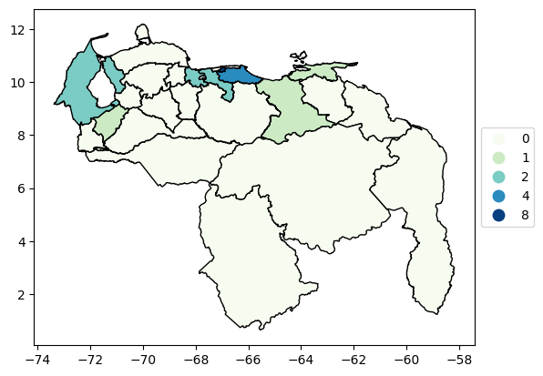
    


```python
informacion_estados = pd.DataFrame(serie_estados.sort_index())
informacion_estados["%"] = round(
    informacion_estados / informacion_estados.sum() * 100, 2
)
informacion_estados.rename_axis(index={"estado": "Estado"}, inplace=True)
informacion_estados.rename(columns={"count": "Nº de hombres"})
```


<div>
<style scoped>
    .dataframe tbody tr th:only-of-type {
        vertical-align: middle;
    }

    .dataframe tbody tr th {
        vertical-align: top;
    }

    .dataframe thead th {
        text-align: right;
    }
</style>
<table border="1" class="dataframe">
  <thead>
    <tr style="text-align: right;">
      <th></th>
      <th>Nº de hombres</th>
      <th>%</th>
    </tr>
    <tr>
      <th>Estado</th>
      <th></th>
      <th></th>
    </tr>
  </thead>
  <tbody>
    <tr>
      <th>Anzoátegui</th>
      <td>1</td>
      <td>4.76</td>
    </tr>
    <tr>
      <th>Aragua</th>
      <td>2</td>
      <td>9.52</td>
    </tr>
    <tr>
      <th>Carabobo</th>
      <td>2</td>
      <td>9.52</td>
    </tr>
    <tr>
      <th>Distrito Capital</th>
      <td>8</td>
      <td>38.10</td>
    </tr>
    <tr>
      <th>Miranda</th>
      <td>4</td>
      <td>19.05</td>
    </tr>
    <tr>
      <th>Mérida</th>
      <td>1</td>
      <td>4.76</td>
    </tr>
    <tr>
      <th>Sucre</th>
      <td>1</td>
      <td>4.76</td>
    </tr>
    <tr>
      <th>Zulia</th>
      <td>2</td>
      <td>9.52</td>
    </tr>
  </tbody>
</table>
</div>


### Ocupaciones de los hombres

#### Ocupaciones más comunes


```python
df_ocupaciones = (
    pd.DataFrame(datos.ocupacion.value_counts())
    .rename_axis(index={"ocupacion": "Ocupación"})
    .rename(columns={"count": "Nº de hombres"})
)
df_ocupaciones["%"] = round(df_ocupaciones / len(datos) * 100, 2)
df_ocupaciones.drop("Otra")[:10]
```


<div>
<style scoped>
    .dataframe tbody tr th:only-of-type {
        vertical-align: middle;
    }

    .dataframe tbody tr th {
        vertical-align: top;
    }

    .dataframe thead th {
        text-align: right;
    }
</style>
<table border="1" class="dataframe">
  <thead>
    <tr style="text-align: right;">
      <th></th>
      <th>Nº de hombres</th>
      <th>%</th>
    </tr>
    <tr>
      <th>Ocupación</th>
      <th></th>
      <th></th>
    </tr>
  </thead>
  <tbody>
    <tr>
      <th>Docente</th>
      <td>4</td>
      <td>19.05</td>
    </tr>
    <tr>
      <th>Estudiante</th>
      <td>3</td>
      <td>14.29</td>
    </tr>
    <tr>
      <th>Ingeniero(a)</th>
      <td>3</td>
      <td>14.29</td>
    </tr>
    <tr>
      <th>Empleado(a) Público(a)</th>
      <td>3</td>
      <td>14.29</td>
    </tr>
    <tr>
      <th>Abogado(a)</th>
      <td>2</td>
      <td>9.52</td>
    </tr>
    <tr>
      <th>Estadístico(a)</th>
      <td>1</td>
      <td>4.76</td>
    </tr>
    <tr>
      <th>Médico</th>
      <td>1</td>
      <td>4.76</td>
    </tr>
    <tr>
      <th>Analista</th>
      <td>1</td>
      <td>4.76</td>
    </tr>
    <tr>
      <th>Jubilado(a)</th>
      <td>1</td>
      <td>4.76</td>
    </tr>
  </tbody>
</table>
</div>


En "otros" hay 2 respuestas, que se dividen de la siguiente manera:


```python
pd.DataFrame(datos.ocupacionO.value_counts()).rename_axis(
    index={"ocupacionO": "Ocupación"}
).rename(columns={"count": "N° de hombres"})
```


<div>
<style scoped>
    .dataframe tbody tr th:only-of-type {
        vertical-align: middle;
    }

    .dataframe tbody tr th {
        vertical-align: top;
    }

    .dataframe thead th {
        text-align: right;
    }
</style>
<table border="1" class="dataframe">
  <thead>
    <tr style="text-align: right;">
      <th></th>
      <th>N° de hombres</th>
    </tr>
    <tr>
      <th>Ocupación</th>
      <th></th>
    </tr>
  </thead>
  <tbody>
    <tr>
      <th>Coordinador</th>
      <td>1</td>
    </tr>
    <tr>
      <th>Gestor de Casos</th>
      <td>1</td>
    </tr>
  </tbody>
</table>
</div>


### Horas de uso de internet


```python
tbl_uso_internet = pd.DataFrame(datos.horas_internet.value_counts().sort_index())
```


```python
tbl_uso_porcentaje = (
    round(tbl_uso_internet / tbl_uso_internet.sum() * 100, 2)["count"].astype(str)
    + " %"
)
```


```python
fig = px.bar(tbl_uso_internet, text=tbl_uso_porcentaje)
fig.update_layout(
    title="Uso de internet por rangos de tiempo",
    xaxis_title="Tiempo",
    yaxis_title="% de hombres",
    font=dict(
        family="Arial",
        size=18,
        color="black",
    ),
    width=1500,
    height=800,
)
fig.update_traces(
    textfont_size=18,
    textangle=0,
    textposition="outside",
    cliponaxis=False,
    showlegend=False,
    marker_color="rgb(39, 55, 77)",
    marker_line_color="white",
)
fig.show()
fig.write_image("img/hombres/uso_internet.png")
```


### Principales usos de internet


```python
tbl_usos = pd.DataFrame(
    datos[
        [
            "uso_familia",
            "uso_trabajo",
            "uso_venta",
            "uso_distraer",
            "uso_estudiar",
            "uso_banco",
            "uso_otra",
            "uso_peli",
            "uso_noticias",
        ]
    ].sum()
)
```


```python
tbl_usos.index = [
    "Comunicarme con familiares y amigos/as",
    "Trabajar",
    "Vender productos",
    "Distraerme",
    "Estudiar o investigar",
    "Realizar operaciones bancarias",
    "Otras actividades",
    "Ver películas y/o series",
    "Ver noticias",
]
```


```python
tbl_usos_porcentaje = pd.DataFrame(
    round(tbl_usos / tbl_usos.sum() * 100, 2)[0].astype(str) + " %"
)
```


```python
tbl_usos_concat = pd.concat(
    [tbl_usos, tbl_usos_porcentaje.rename(columns={0: "p"})], axis=1
).sort_values(0)
```


```python
fig = px.bar(tbl_usos_concat[0], text=tbl_usos_concat.p)
fig.update_layout(
    title="Usos de internet",
    xaxis_title="Actividades",
    yaxis_title="% de hombres",
    font=dict(
        family="Arial",
        size=18,
        color="black",
    ),
    width=1500,
    height=900,
)
fig.update_traces(
    textfont_size=18,
    textangle=0,
    textposition="outside",
    cliponaxis=False,
    showlegend=False,
    marker_color="rgb(39, 55, 77)",
    marker_line_color="white",
)
fig.show()
fig.write_image("img/hombres/usos_internet.png")
```

En el caso de la respuesta "Otras actividades", se desglosa de la siguiente manera:


```python
pd.DataFrame(datos.uso_otraR.value_counts()).rename_axis(
    index={"uso_otraR": "Otros usos de internet"}
).rename(columns={"count": "Nº de hombres"})
```


<div>
<style scoped>
    .dataframe tbody tr th:only-of-type {
        vertical-align: middle;
    }

    .dataframe tbody tr th {
        vertical-align: top;
    }

    .dataframe thead th {
        text-align: right;
    }
</style>
<table border="1" class="dataframe">
  <thead>
    <tr style="text-align: right;">
      <th></th>
      <th>Nº de hombres</th>
    </tr>
    <tr>
      <th>Otros usos de internet</th>
      <th></th>
    </tr>
  </thead>
  <tbody>
    <tr>
      <th>Noticias, documentales, trámites legales</th>
      <td>1</td>
    </tr>
  </tbody>
</table>
</div>


### Aumento de uso de internet por Covid19


```python
tbl_covid_aumento = datos.covid_aumento.value_counts()
```


```python
fig = go.Figure(data=[go.Pie(labels=tbl_covid_aumento.index, values=tbl_covid_aumento)])
fig.update_layout(
    title_text="Aumento del uso de internet",
    legend_title="¿Has aumentado tu tiempo de <br> conexión a internet?",
    font=dict(family="Arial", size=18, color="black"),
    width=1500,
    height=800,
)
fig.update_traces(
    marker=dict(
        colors=["rgb(39, 55, 77)", "rgb(82, 109, 130)"],
        line=dict(color="white", width=1),
    )
)
fig.show()
fig.write_image("img/hombres/covid.png")
```


### Uso de redes sociales/aplicaciones


```python
datos.loc[:, "telegram"] = datos.telegram.apply(str.strip)
```


```python
redes = [
    "facebook",
    "twitter",
    "instagram",
    "tiktok",
    "discord",
    "slack",
    "citas",
    "videojuegos",
    "whatsapp",
    "telegram",
    "reddit",
    "estudio",
    "linkedin",
    "twich",
    "youtube",
    "pinterest",
    "flickr",
]

dicts = {}
for i in redes:
    dicts[i.capitalize()] = (
        datos[[i]].value_counts().reset_index().set_index(i)["count"]
    )
```


```python
tbl_aplicaciones = round(
    pd.DataFrame.from_dict(dicts, orient="index").fillna(0)[
        [
            "Menos de 2 horas",
            "2-4 horas",
            "5-7 horas",
            "Más de 7 horas",
            "No la utilizo",
        ]
    ]
    / len(datos)
    * 100,
    2,
)
```


```python
fig = px.bar(
    tbl_aplicaciones.sort_values("No la utilizo"),
    orientation="h",
    color_discrete_sequence=[
        "rgb(39, 55, 77)",
        "rgb(82, 109, 130)",
        "rgb(102, 102, 102)",
        "rgb(157, 178, 191)",
        "rgb(221, 230, 237)",
    ],
    width=1500,
    height=800,
)
fig.update_layout(
    title="Uso de aplicaciones/redes sociales",
    xaxis_title="% de hombres",
    yaxis_title="Aplicación/red social",
    legend_title="Horas de uso diario",
    font=dict(
        family="Arial",
        size=18,
        color="black",
    ),
)

fig.show()
fig.write_image("img/hombres/uso_apps.png")
```

### Incidencia de violencias


```python
violencias_nombres = {
    "identidad": "Duplicación de identidad",
    "ciberacoso": "Ciberacoso",
    "doxxing": "Doxxing",
    "mobbing": "Mobbing",
    "ciberdifamacion": "Ciberdifamación",
    "stalking": "Cibervigilancia (stalking)",
    "ciberextorsion": "Ciberextorsión",
    "grooming": "Grooming",
    "phishing_vs": "Phishing/Vishing/Smishing",
    "trata": "Trata de personas en línea",
    "explotacion": "Captación con fines de explotación sexual",
    "exclusion": "Exclusión digital",
    "cyberflashing": "Cyberflashing",
    "deepfake": "Deepfake",
    "clonacion": "Clonación de aplicaciones",
}
```


```python
violencias = list(violencias_nombres.keys())
```


```python
dic = {}
for i in violencias:
    datos.loc[:, i] = datos[i].apply(str.strip).apply(str.capitalize)
    dic[violencias_nombres[i]] = datos[[i]].value_counts().sort_index()
```


```python
tbl_sufrio = pd.DataFrame.from_dict(dic, orient="index").fillna(0)
```


```python
tbl_sufrio = tbl_sufrio.set_axis(["No", "Sí"], axis=1)
```


```python
sufrio_porcentaje = round(tbl_sufrio / len(datos) * 100, 2)
```


```python
fig = px.bar(
    sufrio_porcentaje[["Sí", "No"]].sort_values("Sí"),
    orientation="h",
    text_auto=True,
    color_discrete_map={"Sí": "rgb(39, 55, 77)", "No": "rgb(82, 109, 130)"},
    width=1500,
    height=800,
)
fig.update_layout(
    title="Incidencia de violencias",
    yaxis_title="Violencia",
    xaxis_title="% de hombres",
    legend_title="¿Sufrió la violencia?",
    font=dict(
        family="Arial",
        size=18,
        color="black",
    ),
)
fig.update_traces(
    textfont_size=18,
    textangle=0,
    cliponaxis=False,
    marker_line_color="white",
    texttemplate="%{value: 4} %",
)
fig.show()
fig.write_image("img/hombres/incidencia.png")
```


```python
for i in violencias:
    datos.loc[:, i].replace(
        [
            "No",
            "Sí",
        ],
        [0, 1],
        inplace=True,
    )
```


```python
tbl_numero_violencia = pd.DataFrame(
    datos[violencias].T.sum().value_counts()
).sort_index()
tbl_violencia_porcentaje = round(tbl_numero_violencia / len(datos) * 100, 2)
```


```python
tbl_violencia_porcentaje.index = tbl_violencia_porcentaje.index.astype("string")
```


```python
fig = px.bar(
    tbl_violencia_porcentaje,
    text_auto=True,
)
fig.update_layout(
    title="Cantidad de violencias sufridas",
    xaxis_title="Nº de violencias sufridas",
    yaxis_title="% de hombres",
    font=dict(
        family="Arial",
        size=18,
        color="black",
    ),
    width=1500,
    height=800,
)
fig.update_traces(
    textfont_size=18,
    textangle=0,
    textposition="outside",
    cliponaxis=False,
    showlegend=False,
    marker_line_color="white",
    marker_color="rgb(39, 55, 77)",
    texttemplate="%{value}%",
)
fig.show()
fig.write_image("img/hombres/numero_violencia.png")
```

```python
dic_violencias = {}
for i in violencias:
    dic_violencias[i] = [s for s in list(datos.columns)[:-32] if i in s]
```

#### Resultados para los casos de duplicación de identidad


```python
tbl_identidad = datos.query("identidad == 1")[dic_violencias["identidad"]]
```


```python
print(
    f"Se han reportado {tbl_identidad.iloc[:, 0].sum()} casos de duplicación de identidad."
)
```

    Se han reportado 4 casos de duplicación de identidad.


```python
frecuencia_identidad = fg.grafico_frecuencia(tbl_identidad, "M")
```

```python
temporalidad_identidad = fg.grafico_temporalidad(tbl_identidad, "H")
```

```python
edad_identidad = fg.grafico_edad(tbl_identidad, "Hombre")
```


```python
parentesco_identidad = fg.grafico_parentesco(tbl_identidad, "H")
```

```python
sexo_identidad = fg.grafico_sexo_parentesco(tbl_identidad, "H")
```

    Para duplicación de identidad todas las personas agresoras son de sexo Hombre


```python
medios_identidad = fg.grafico_medios(tbl_identidad, "H")[2]
```


#### Resultados para los casos de ciberacoso


```python
tbl_ciberacoso = datos.query("ciberacoso == 1")[dic_violencias["ciberacoso"]]
```


```python
print(f"Se han reportado {tbl_ciberacoso.iloc[:, 0].sum()} casos de ciberacoso.")
```

    Se han reportado 5 casos de ciberacoso.


```python
frecuencia_ciberacoso = fg.grafico_frecuencia(tbl_ciberacoso, "H")
```


```python
temporalidad_ciberacoso = fg.grafico_temporalidad(tbl_ciberacoso, "H")
```


```python
edad_ciberacoso = fg.grafico_edad(tbl_ciberacoso, "H")
```


```python
parentesco_ciberacoso = fg.grafico_parentesco(tbl_ciberacoso, "H")
```

```python
sexo_ciberacoso = fg.grafico_sexo_parentesco(tbl_ciberacoso, "H")
```


```python
medios_ciberacoso = fg.grafico_medios(tbl_ciberacoso, "H")[2]
```

#### Resultados para los casos de doxxing


```python
tbl_doxxing = datos.query("doxxing == 1")[dic_violencias["doxxing"]]
```


```python
print(f"Se han reportado {tbl_doxxing.iloc[:, 0].sum()} casos de doxxing.")
```

    Se han reportado 2 casos de doxxing.


```python
frecuencia_doxxing = fg.grafico_frecuencia(tbl_doxxing, "H")
```

```python
temporalidad_doxxing = fg.grafico_temporalidad(tbl_doxxing, "H")
```

    Las personas que sufrieron de doxxing, manifiestan que no ocurrió durante los últimos 6 meses


```python
edad_doxxing = fg.grafico_edad(tbl_doxxing, "H")
```


```python
parentesco_doxxing = fg.grafico_parentesco(tbl_doxxing, "H")
```


```python
sexo_doxxing = fg.grafico_sexo_parentesco(tbl_doxxing, "H")
```

    Para doxxing todas las personas agresoras son de sexo Hombre


```python
medios_doxxing = fg.grafico_medios(tbl_doxxing, "H")[2]
```


```python
pd.DataFrame(tbl_doxxing.otraR_doxxing.value_counts()).rename_axis(
    index={"otraR_doxxing": "Otras aplicaciones o redes sociales"}
).rename(columns={"count": "N° de hombres"})
```


<div>
<style scoped>
    .dataframe tbody tr th:only-of-type {
        vertical-align: middle;
    }

    .dataframe tbody tr th {
        vertical-align: top;
    }

    .dataframe thead th {
        text-align: right;
    }
</style>
<table border="1" class="dataframe">
  <thead>
    <tr style="text-align: right;">
      <th></th>
      <th>N° de hombres</th>
    </tr>
    <tr>
      <th>Otras aplicaciones o redes sociales</th>
      <th></th>
    </tr>
  </thead>
  <tbody>
    <tr>
      <th>Buscador de internet Google crome</th>
      <td>1</td>
    </tr>
  </tbody>
</table>
</div>


#### Resultados para los casos de mobbing


```python
tbl_mobbing = datos.query("mobbing == 1")[dic_violencias["mobbing"]]
```


```python
print(f"Se han reportado {tbl_mobbing.iloc[:, 0].sum()} casos de mobbing")
```

    Se han reportado 6 casos de mobbing


```python
frecuencia_mobbing = fg.grafico_frecuencia(tbl_mobbing, "H")
```


```python
temporalidad_mobbing = fg.grafico_temporalidad(tbl_mobbing, "H")
```


```python
edad_mobbing = fg.grafico_edad(tbl_mobbing, "H")
```


```python
parentesco_mobbing = fg.grafico_parentesco(tbl_mobbing, "H")
```


```python
sexo_mobbing = fg.grafico_sexo_parentesco(tbl_mobbing, "H")
```


```python
medios_mobbing = fg.grafico_medios(tbl_mobbing, "H")[2]
```


#### Resultados para los casos de ciberdifamación


```python
tbl_ciberdifamacion = datos.query("ciberdifamacion == 1")[
    dic_violencias["ciberdifamacion"]
]
```


```python
print(
    f"Se han reportado {tbl_ciberdifamacion.iloc[:, 0].sum()} casos de ciberdifamación."
)
```

    Se han reportado 4 casos de ciberdifamación.


```python
frecuencia_ciberdifamacion = fg.grafico_frecuencia(tbl_ciberdifamacion, "H")
```


```python
temporalidad_ciberdifamacion = fg.grafico_temporalidad(tbl_ciberdifamacion, "H")
```


```python
edad_ciberdifamacion = fg.grafico_edad(tbl_ciberdifamacion, "H")
```

```python
parentesco_ciberdifamacion = fg.grafico_parentesco(tbl_ciberdifamacion, "H")
```


```python
sexo_ciberdifamacion = fg.grafico_sexo_parentesco(tbl_ciberdifamacion, "H")
```


```python
medios_ciberdifamacion = fg.grafico_medios(tbl_ciberdifamacion, "H")[2]
```


#### Resultados para los casos de cibervigilancia (stalking)


```python
tbl_stalking = datos.query("stalking == 1")[dic_violencias["stalking"]]
```


```python
print(
    f"Se han reportado {tbl_stalking.iloc[:, 0].sum()} casos de cibervigilancia (stalking)."
)
```

    Se han reportado 7 casos de cibervigilancia (stalking).


```python
frecuencia_stalking = fg.grafico_frecuencia(tbl_stalking, "H")
```

```python
temporalidad_stalking = fg.grafico_temporalidad(tbl_stalking, "H")
```


```python
edad_stalking = fg.grafico_edad(tbl_stalking, "H")
```


```python
parentesco_stalking = fg.grafico_parentesco(tbl_stalking, "H")
```


```python
sexo_stalking = fg.grafico_sexo_parentesco(tbl_stalking, "H")
```


```python
medios_stalking = fg.grafico_medios(tbl_stalking, "H")[2]
```

#### Resultados para los casos de ciberextorsión


```python
tbl_ciberextorsion = datos.query("ciberextorsion == 1")[
    dic_violencias["ciberextorsion"]
]
```


```python
print(
    f"Se han reportado {tbl_ciberextorsion.iloc[:, 0].sum()} casos de ciberextorsión."
)
```

    Se han reportado 4 casos de ciberextorsión.


```python
frecuencia_ciberextorsion = fg.grafico_frecuencia(tbl_ciberextorsion, "H")
```

```python
temporalidad_ciberextorsion = fg.grafico_temporalidad(tbl_ciberextorsion, "H")
```

    Las personas que sufrieron de ciberextorsion, manifiestan que no ocurrió durante los últimos 6 meses


```python
edad_ciberextorsion = fg.grafico_edad(tbl_ciberextorsion, "H")
```


```python
parentesco_ciberextorsion = fg.grafico_parentesco(tbl_ciberextorsion, "H")
```


```python
sexo_ciberextorsion = fg.grafico_sexo_parentesco(tbl_ciberextorsion, "H")
```

    Para ciberextorsión todas las personas agresoras son de sexo Hombre


```python
medios_ciberextorsion = fg.grafico_medios(tbl_ciberextorsion, "H")[2]
```


#### Resultados para los casos de grooming


```python
tbl_grooming = datos.query("grooming == 1")[dic_violencias["grooming"]]
```


```python
print(f"Se han reportado {tbl_grooming.iloc[:, 0].sum()} casos de grooming.")
```

    Se han reportado 8 casos de grooming.


```python
frecuencia_grooming = fg.grafico_frecuencia(tbl_grooming, "H")
```


```python
temporalidad_grooming = fg.grafico_temporalidad(tbl_grooming, "H")
```

```python
edad_grooming = fg.grafico_edad(tbl_grooming, "H")
```


```python
parentesco_grooming = fg.grafico_parentesco(tbl_grooming, "H")
```


```python
sexo_grooming = fg.grafico_sexo_parentesco(tbl_grooming, "H")
```

    Para grooming todas las personas agresoras son de sexo Hombre


```python
medios_grooming = fg.grafico_medios(tbl_grooming, "H")[2]
```


```python
pd.DataFrame(tbl_grooming.otraR_grooming.value_counts()).rename_axis(
    index={"otraR_grooming": "Otras aplicaciones o redes sociales"}
).rename(columns={"count": "N° de hombres"})
```


<div>
<style scoped>
    .dataframe tbody tr th:only-of-type {
        vertical-align: middle;
    }

    .dataframe tbody tr th {
        vertical-align: top;
    }

    .dataframe thead th {
        text-align: right;
    }
</style>
<table border="1" class="dataframe">
  <thead>
    <tr style="text-align: right;">
      <th></th>
      <th>N° de hombres</th>
    </tr>
    <tr>
      <th>Otras aplicaciones o redes sociales</th>
      <th></th>
    </tr>
  </thead>
  <tbody>
    <tr>
      <th>Chatroomde Digitel</th>
      <td>1</td>
    </tr>
  </tbody>
</table>
</div>


#### Resultados para los casos de los casos de phishing/vishing/smishing


```python
tbl_phishing_vs = datos.query("phishing_vs == 1")[dic_violencias["phishing_vs"]]
```


```python
print(
    f"Se han reportado {tbl_phishing_vs.iloc[:, 0].sum()} casos de phishing/vishing/smishing."
)
```

    Se han reportado 7 casos de phishing/vishing/smishing.


```python
frecuencia_phishing_vs = fg.grafico_frecuencia(tbl_phishing_vs, "H")
```


```python
temporalidad_phishing_vs = fg.grafico_temporalidad(tbl_phishing_vs, "H")
```

```python
edad_phishing_vs = fg.grafico_edad(tbl_phishing_vs, "H")
```


```python
parentesco_phishing_vs = fg.grafico_parentesco(tbl_phishing_vs, "H")
```


```python
sexo_phishing_vs = fg.grafico_sexo_parentesco(tbl_phishing_vs, "H")
```


```python
medios_phishing_vs = fg.grafico_medios(tbl_phishing_vs, "H")[2]
```


#### Resultados para los casos de trata


```python
for i in datos.query("otraR_trata == 'Instagram '").index:
    datos.loc[i, "instagram_trata"] = True
```


```python
tbl_trata = datos.query("trata == 1")[dic_violencias["trata"]]
```


```python
print(
    f"Se han reportado {tbl_trata.iloc[:, 0].sum()} casos de trata de persona en línea."
)
```

    Se han reportado 2 casos de trata de persona en línea.


```python
frecuencia_trata = fg.grafico_frecuencia(tbl_trata, "H")
```


```python
temporalidad_trata = fg.grafico_temporalidad(tbl_trata, "H")
```

    Las personas que sufrieron de trata, manifiestan que sí ocurrió durante los últimos 6 meses


```python
edad_trata = fg.grafico_edad(tbl_trata, "H")
```


```python
parentesco_trata = fg.grafico_parentesco(tbl_trata, "H")
```

    Las personas que sufrieron de {i} manifiestan que su parentesco con su agresor es: {data.index[0]}.lower()}


```python
medios_trata = fg.grafico_medios(tbl_trata, "H")[2]
```


#### Resultados para los casos de exclusión


```python
tbl_exclusion = datos.query("exclusion == 1")[dic_violencias["exclusion"]]
```


```python
print(
    f"Se han reportado {tbl_exclusion.iloc[:, 0].sum()} víctimas de exclusión digital."
)
```

    Se han reportado 3 víctimas de exclusión digital.


```python
frecuencia_exclusion = fg.grafico_frecuencia(tbl_exclusion, "H")
```


```python
temporalidad_exclusion = fg.grafico_temporalidad(tbl_exclusion, "H")
```


```python
edad_exclusion = fg.grafico_edad(tbl_exclusion, "H")
```


Para exclusión no se pregunto por agresor.


```python
medios_exclusion = fg.grafico_medios(tbl_exclusion, "H")[2]
```


#### Resultados para los casos de cyberflashing


```python
tbl_cyberflashing = datos.query("cyberflashing == 1")[dic_violencias["cyberflashing"]]
```


```python
print(f"Se han reportado {tbl_cyberflashing.iloc[:, 0].sum()} casos de cyberflashing")
```

    Se han reportado 9 casos de cyberflashing


```python
frecuencia_cyberflashing = fg.grafico_frecuencia(tbl_cyberflashing, "H")
```


```python
edad_cyberflashing = fg.grafico_edad(tbl_cyberflashing, "H")
```


```python
parentesco_cyberflashing = fg.grafico_parentesco(tbl_cyberflashing, "H")
```

    Las personas que sufrieron de {i} manifiestan que su parentesco con su agresor es: {data.index[0]}.lower()}


```python
medios_cyberflashing = fg.grafico_medios(tbl_cyberflashing, "H")[2]
```


#### Resultados para los casos de clonación de aplicaciones


```python
tbl_clonacion = datos.query("clonacion == 1")[dic_violencias["clonacion"]]
```


```python
print(
    f"Se han reportado {tbl_clonacion.iloc[:, 0].sum()} casos de clonación de aplicaciones"
)
```

    Se han reportado 4 casos de clonación de aplicaciones


```python
frecuencia_clonacion = fg.grafico_frecuencia(tbl_clonacion, "H")
```


```python
temporalidad_clonacion = fg.grafico_temporalidad(tbl_clonacion, "H")
```


```python
edad_clonacion = fg.grafico_edad(tbl_clonacion, "H")
```


```python
medios_clonacion = fg.grafico_medios(tbl_clonacion, "H")[2]
```


### Conocimiento sobre violencia digital basada en género


```python
tbl_vdbg = datos.vdbg.value_counts()
```


```python
fig = go.Figure(data=[go.Pie(labels=tbl_vdbg.index, values=tbl_vdbg)])
fig.update_layout(
    title_text="Conocimiento de VDBG",
    legend_title="¿Habías escuchado antes el término <br> Violencia Digital Basada en Género?",
    font=dict(family="Arial", size=18, color="black"),
)
fig.update_traces(
    marker=dict(
        colors=["rgb(39, 55, 77)", "rgb(82, 109, 130)"],
        line=dict(color="white", width=1),
    )
)
fig.show()
fig.write_image("img/hombres/vdbg.png")
```


```python
vdbg_violencias = [s for s in list(datos.columns) if "vdbg_" in s]
```


```python
con_violencia = pd.DataFrame(
    datos.query("vdbg == 'Sí'")[vdbg_violencias[1:]].T.sum().value_counts()
)
con_violencia.index.name = "Nº de violencias conocidas"
con_violencia["%"] = round(con_violencia / len(datos) * 100, 2)
con_violencia.rename(columns={"count": "Cantidad de hombres"}).sort_index()
```


<div>
<style scoped>
    .dataframe tbody tr th:only-of-type {
        vertical-align: middle;
    }

    .dataframe tbody tr th {
        vertical-align: top;
    }

    .dataframe thead th {
        text-align: right;
    }
</style>
<table border="1" class="dataframe">
  <thead>
    <tr style="text-align: right;">
      <th></th>
      <th>Cantidad de hombres</th>
      <th>%</th>
    </tr>
    <tr>
      <th>Nº de violencias conocidas</th>
      <th></th>
      <th></th>
    </tr>
  </thead>
  <tbody>
    <tr>
      <th>1</th>
      <td>1</td>
      <td>4.76</td>
    </tr>
    <tr>
      <th>4</th>
      <td>1</td>
      <td>4.76</td>
    </tr>
    <tr>
      <th>5</th>
      <td>1</td>
      <td>4.76</td>
    </tr>
    <tr>
      <th>6</th>
      <td>1</td>
      <td>4.76</td>
    </tr>
    <tr>
      <th>7</th>
      <td>1</td>
      <td>4.76</td>
    </tr>
    <tr>
      <th>8</th>
      <td>2</td>
      <td>9.52</td>
    </tr>
    <tr>
      <th>10</th>
      <td>1</td>
      <td>4.76</td>
    </tr>
    <tr>
      <th>11</th>
      <td>2</td>
      <td>9.52</td>
    </tr>
    <tr>
      <th>12</th>
      <td>1</td>
      <td>4.76</td>
    </tr>
  </tbody>
</table>
</div>


```python
tbl_conocimiento_violencia = pd.DataFrame(datos[vdbg_violencias[1:]].sum())
tbl_conocimiento_violencia.index = violencias
tbl_conocimiento_violencia.rename(
    index=violencias_nombres, columns={0: "cantidad"}, inplace=True
)
tbl_conocimiento_violencia = round(tbl_conocimiento_violencia / len(datos) * 100, 2)
```


```python
fig = px.bar(
    tbl_conocimiento_violencia.sort_values("cantidad", ascending=False),
    y="cantidad",
    x=tbl_conocimiento_violencia.index,
    text_auto=True,
)
fig.update_layout(
    title="Conocimiento de la violencia",
    xaxis_title="Violencia",
    yaxis_title="% de hombres",
    font=dict(
        family="Arial",
        size=18,
        color="black",
    ),
)
fig.update_traces(
    textfont_size=18,
    textangle=0,
    textposition="outside",
    cliponaxis=False,
    showlegend=False,
    marker_color="rgb(82, 109, 130)",
    marker_line_color="white",
    texttemplate="%{value: .4} %",
)
fig.show()
fig.write_image("img/hombres/conocimiento_violencia.png")
```


### Reacciones de las víctimas al sufrir la(s) violencia(s)


```python
reacciones = [s for s in list(datos.columns) if "reaccion_" in s]
```


```python
tbl_reacciones = round(pd.DataFrame(datos[reacciones].sum() / len(datos) * 100), 2)
```


```python
tbl_reacciones.rename(
    index={
        "reaccion_ignorar": "Ignoraron al agresor",
        "reaccion_contar": "Le contaron a un amigo(a) o familiar",
        "reaccion_ayuda": "Acudieron a un centro de ayuda o denuncia",
        "reaccion_reportar": "Reportaron el perfil o publicación en la red social",
        "reaccion_internet": "Redujeron el uso en internet",
        "reaccion_borrar": "Borraron la aplicación donde ocurrió",
        "reaccion_eliminar": "Eliminaron la cuenta de usuario",
        "reaccion_crear": "Crearon una cuenta de usuario distinta",
        "reaccion_bloquear": "Bloquearon a la persona agresora",
        "reaccion_enfrentar": "Enfrentaron a la persona agresora",
    },
    columns={0: "cantidad"},
    inplace=True,
)
```


```python
fig = px.bar(
    tbl_reacciones.sort_values("cantidad", ascending=False),
    y=tbl_reacciones["cantidad"],
    x=tbl_reacciones.index,
    text_auto=True,
)
fig.update_layout(
    title="Reacción de la víctima al sufrir la(s) violencia(s)",
    xaxis_title="Violencia",
    yaxis_title="Nº de Hombres",
    font=dict(
        family="Arial",
        size=18,
        color="black",
    ),
)
fig.update_traces(
    textfont_size=18,
    textangle=0,
    textposition="outside",
    cliponaxis=False,
    showlegend=False,
    marker_color="rgb(157, 178, 191)",
    marker_line_color="white",
    texttemplate="%{value: .4} %",
)
fig.show()
fig.write_image("img/hombres/reaccion_violencia.png")
```

### Conocimiento de víctimas


```python
tbl_victima = datos.victima.value_counts()
```


```python
fig = go.Figure(data=[go.Pie(labels=tbl_victima.index, values=tbl_victima)])
fig.update_layout(
    title_text="Conocimiento de Víctimas",
    legend_title="¿Conoces a alguna mujer que haya <br> sido víctima de violencia digital?",
)
fig.update_traces(
    marker=dict(
        colors=["rgb(39, 55, 77)", "rgb(82, 109, 130)"],
        line=dict(color="white", width=1),
    )
)
fig.show()
fig.write_image("img/hombres/victima.png")
```

```python
num_victimas = pd.DataFrame(datos.numero_victima.value_counts())
```


```python
fig = px.bar(
    num_victimas.sort_index(),
    y=num_victimas.sort_index()["count"],
    x=num_victimas.sort_index().index.values,
    text=round(num_victimas.sort_index() / len(datos) * 100, 2)["count"],
)
fig.update_layout(
    title="Cantidad de víctimas conocidas",
    xaxis_title="Nº de victimas",
    yaxis_title="% de hombres",
    font=dict(
        family="Arial",
        size=18,
        color="black",
    ),
)
fig.update_traces(
    textfont_size=18,
    textangle=0,
    textposition="outside",
    cliponaxis=False,
    showlegend=False,
    marker_color="rgb(82, 109, 130)",
    marker_line_color="white",
    texttemplate="%{text: .4} %",
)
fig.show()
fig.write_image("img/hombres/num_victimas.png")
```

### Conocimiento de leyes y normas


```python
tbl_leyes = datos.leyes_normas.value_counts()
```


```python
fig = go.Figure(data=[go.Pie(labels=tbl_leyes.index, values=tbl_leyes)])
fig.update_layout(
    title_text="Conocimiento de Leyes y Normas",
    legend_title="¿Conoces leyes o normativas en el país <br> que contemplan las violencias digitales?",
)
fig.update_traces(
    marker=dict(
        colors=["rgb(39, 55, 77)", "rgb(82, 109, 130)"],
        line=dict(color="white", width=1),
    )
)
fig.show()
fig.write_image("img/hombres/ley.png")
```


### Interacciones entre ciertos ítems de la encuesta

#### Tipos de violencia y edad en que ocurrió por primera vez


```python
edades_violencias = [s for s in list(datos.columns) if "edad_" in s]
```


```python
lista_edades_violencias = []
for i in edades_violencias:
    j = (
        pd.cut(
            datos[edades_violencias].loc[:, i],
            bins=[0, 10, 15, 18, 25, 30, 40, 50, 60, 75],
            right=False,
        )
        .value_counts()
        .sort_index()
    )
    j = j.reset_index()
    for k in violencias_nombres.keys():
        if k in j.columns[0]:
            j["violencia"] = [violencias_nombres[k]] * len(j)
    j = j.rename(columns={j.columns[0]: "Edad"})
    lista_edades_violencias.append(j)
```


```python
tbl_edades_primera_vez = pd.concat(lista_edades_violencias, join="inner").reset_index(
    drop=True
)
```


```python
tbl_edades_primera_vez.Edad = tbl_edades_primera_vez.Edad.astype("str")
```


```python
l_ = []
for i in lista_edades_violencias:
    j = round(i["count"] / i["count"].sum() * 100, 3)
    i["count"] = j
    l_.append(i)
```


```python
edades_primera_vez = (
    pd.concat(l_, join="inner")
    .reset_index(drop=True)
    .rename_axis(columns={"violencia": "Violencia"})
)
```


```python
edades_primera_vez.Edad = edades_primera_vez.Edad.astype("str")
```


```python
fig = px.bar(
    edades_primera_vez,
    x="Edad",
    y="count",
    color="violencia",
    title="Tasa de incidencia por grupo etario según tipo de violencia",
    barmode="group",
    color_discrete_sequence=px.colors.qualitative.Prism_r,
    width=1200,
    height=600,
)
fig.update_yaxes(title="% de hombres")
fig.update_xaxes(
    title="Rangos de edad",
    labelalias={
        "[0, 10)": "0-9",
        "[10, 15)": "10-14",
        "[15, 18)": "15-17",
        "[18, 25)": "18-24",
        "[25, 30)": "24-29",
        "[30, 40)": "30-39",
        "[40, 50)": "40-49",
        "[50, 60)": "50-59",
        "[60, 75)": "60 y más",
    },
)
fig.show()
fig.write_image("img/violencia_edad2.png")
```

#### Tipo de violencia según el medio por el cual ocurrió


```python
lista_medios_hombres = [s for s in list(vars()) if "medios_" in s]
ls_medios = []
for i in [s for s in list(vars()) if "medios_" in s]:
    df = vars()[i]
    ls_medios.append(df)
```


```python
lista_df_medios_hombres = []
for df, i in zip(ls_medios, lista_medios):
    tbl = pd.DataFrame(df)
    if i.split("_")[1] in violencias_nombres.keys():
        l_violencia = [violencias_nombres[i.split("_")[1]]] * len(df)
    else:
        l_violencia = ["Phishing/Vishing/Smishing"] * len(df)
    tbl["violencia"] = l_violencia
    tbl.rename(columns={0: "cantidad"}, inplace=True)
    tbl.reset_index(inplace=True)
    tbl.rename(columns={"index": "Medio"}, inplace=True)
    lista_df_medios.append(tbl)
```


```python
tbl_violencia_medio = pd.concat(lista_df_medios)
```


```python
tbl_violencia_medio.reset_index(drop=True, inplace=True)
```


```python
tbl_violencia_medio = tbl_violencia_medio.astype(
    {"cantidad": "float", "violencia": "str", "Medio": "str"}
)
```


```python
fig = px.bar(
    tbl_violencia_medio.sort_values("cantidad", ascending=False),
    x="cantidad",
    y="violencia",
    color="Medio",
    title="Tipo de violencia según el medio por el cual ocurrió",
    barmode="stack",
    orientation="h",
    color_discrete_sequence=px.colors.qualitative.Antique_r,
    width=1600,
    height=600,
)
fig.update_yaxes(title="Violencia")
fig.update_xaxes(title="% de hombres")
fig.show()
fig.write_image("img/hombres/violencia_medio1.png")
```

#### Parentesco de la persona agresora con las mujeres que han sufrido violencias


```python
lista_df_parentescos = [
    parentesco_identidad[2],
    parentesco_ciberacoso[2],
    parentesco_doxxing[2],
    parentesco_ciberdifamacion[2],
    parentesco_stalking[2],
    parentesco_ciberextorsion[2],
    parentesco_cyberflashing[2],
    parentesco_clonacion[2],
]
```


```python
parentescos_ = [
    "identidad",
    "ciberacoso",
    "doxxing",
    "ciberdifamacion",
    "stalking",
    "ciberextorsion",
    "explotacion",
    "cyberflashing",
    "deepfake",
    "clonacion",
]
```


```python
for i, j in zip(lista_df_parentescos, parentescos_):
    if j in violencias_nombres.keys():
        ls_index = [violencias_nombres[j]] * len(i)
    i["violencia"] = ls_index
```


```python
tbl_parentesco_ = pd.concat(lista_df_parentescos)
```


```python
tbl_parentesco_.reset_index(inplace=True)
```


```python
fig = px.bar(
    tbl_parentesco_,
    x="violencia",
    y="count",
    color="parentesco",
    title="Parentesco del agresor con los hombres que han sufrido violencias",
    barmode="group",
    color_discrete_sequence=px.colors.qualitative.Prism_r,
    width=1200,
    height=600,
)
fig.update_layout(
    legend_title="Parentesco con el agresor(a):",
    font=dict(family="Arial", size=18, color="black"),
)
fig.update_xaxes(title="Violencia")
fig.update_yaxes(title="% de hombres")
fig.show()
fig.write_image("img/hombres/violencia_parentesco1.png")
```

NOTA: Para las siguientes violencias la pregunta sobre parentesco se reformulo a si logró o no identificar el agresor.


```python
parentesco_violencia = tbl_parentesco_.pivot(
    index="violencia", columns="parentesco", values="count"
).fillna(0)
```


```python
tbl_grooPt = (
    pd.concat(
        [parentesco_grooming[2], parentesco_phishing_vs[2], parentesco_trata[2]],
        axis=1,
        keys=["Grooming", "Phishing", "Trata"],
    )
    .T.reset_index(level=1, drop=True)
    .fillna(0)
)
tbl_grooPt
```


<div>
<style scoped>
    .dataframe tbody tr th:only-of-type {
        vertical-align: middle;
    }

    .dataframe tbody tr th {
        vertical-align: top;
    }

    .dataframe thead th {
        text-align: right;
    }
</style>
<table border="1" class="dataframe">
  <thead>
    <tr style="text-align: right;">
      <th></th>
      <th>No</th>
      <th>Sí</th>
    </tr>
  </thead>
  <tbody>
    <tr>
      <th>Grooming</th>
      <td>7.0</td>
      <td>1.0</td>
    </tr>
    <tr>
      <th>Phishing</th>
      <td>5.0</td>
      <td>2.0</td>
    </tr>
    <tr>
      <th>Trata</th>
      <td>2.0</td>
      <td>0.0</td>
    </tr>
  </tbody>
</table>
</div>


NOTA: Para mobbing la víctima por la naturaleza de la agresión conoce a su agresor(a).


```python
tbl_parentesco_mobbing = parentesco_mobbing[1]
```


```python
tbl_parentesco_mobbing.astype({"count": "int"}).rename_axis(
    index={"parentesco_mobbing": "Relación laboral"}
).rename(columns={"count": "N° de hombres"})
```


<div>
<style scoped>
    .dataframe tbody tr th:only-of-type {
        vertical-align: middle;
    }

    .dataframe tbody tr th {
        vertical-align: top;
    }

    .dataframe thead th {
        text-align: right;
    }
</style>
<table border="1" class="dataframe">
  <thead>
    <tr style="text-align: right;">
      <th></th>
      <th>N° de hombres</th>
    </tr>
    <tr>
      <th>Relación laboral</th>
      <th></th>
    </tr>
  </thead>
  <tbody>
    <tr>
      <th>Tu compañero(a)</th>
      <td>3</td>
    </tr>
    <tr>
      <th>Un(a) subalterno(a)</th>
      <td>2</td>
    </tr>
    <tr>
      <th>Un(a) jefe(a)</th>
      <td>1</td>
    </tr>
  </tbody>
</table>
</div>


#### Identificación de la persona agresora


```python
tbl_identificacion_si = round(
    pd.DataFrame(
        parentesco_violencia[
            [
                "Fue mi ex-pareja en ese momento",
                "Fue un compañero(a) de trabajo",
                "No conocía a quien me agredió, pero le identifiqué",
                "Teníamos una amistad",
            ]
        ].sum(1)
    ).rename(columns={0: "Sí"}),
    2,
)
```


```python
tbl_identificacion_no = pd.DataFrame(
    parentesco_violencia["No le pude identificar"]
).rename(columns={"No le pude identificar": "No"})
```


```python
tabla_identificacion = pd.concat(
    [tbl_identificacion_si.join(tbl_identificacion_no), tbl_grooPt]
)
```


```python
porcentaje_identificacion = round(
    (tabla_identificacion.T / tabla_identificacion.sum(1) * 100).T, 2
).fillna(0)
```


```python
fig = px.bar(
    porcentaje_identificacion,
    barmode="group",
    text_auto="True",
    color_discrete_map={"Sí": "rgb(39, 55, 77)", "No": "rgb(82, 109, 130)"},
    width=1200,
    height=600,
)
fig.update_layout(
    title="Identificación del agresor(a)",
    xaxis_title="Violencia",
    yaxis_title="% de hombres",
    legend_title="¿Identificó al agresor(a)?",
    font=dict(
        family="Arial",
        size=18,
        color="black",
    ),
)
fig.update_traces(
    textfont_size=18,
    textangle=0,
    textposition="outside",
    cliponaxis=False,
    texttemplate="%{value} %",
)

fig.show()
fig.write_image("img/hombres/id_agresor.png")
```


#### Sexo del agresor por tipo de violencia


```python
variables_sexo = [
    "sexo_identidad",
    "sexo_ciberacoso",
    "sexo_doxxing",
    "sexo_mobbing",
    "sexo_ciberdifamacion",
    "sexo_stalking",
    "sexo_ciberextorsion",
    "sexo_grooming",
    "sexo_phishing_vs",
]
```


```python
sexo_violencias = []
names_ = []
for i in variables_sexo:
    df = vars()[i]
    names_.append(df[1].index.name.split)
    sexo_violencias.append(df[1])
```


```python
tbl_sexo_violencias = (
    pd.concat(
        sexo_violencias,
        join="outer",
        axis=1,
        keys=[
            "Duplicación de identidad",
            "Ciberacoso",
            "Doxxing",
            "Mobbing",
            "Ciberdifamación",
            "Cibervigilancia (stalking)",
            "Ciberextorsión",
            "Grooming",
            "Phishing/Vishing/Smishing",
            "Clonación",
        ],
    )
    .T.reset_index(1, drop=True)
    .fillna(0)
)
```


```python
sexo_porcentaje = round((tbl_sexo_violencias.T / tbl_sexo_violencias.sum(1) * 100).T, 2)
```


```python
fig = px.bar(
    sexo_porcentaje,
    barmode="group",
    color_discrete_sequence=[
        "rgb(39, 55, 77)",
        "rgb(82, 109, 130)",
        "rgb(157, 178, 191)",
    ],
    width=1200,
    height=600,
    text_auto=True,
)
fig.update_layout(
    title="Sexo del agresor por tipo de violencia",
    xaxis_title="Violencia",
    yaxis_title="% de hombres",
    legend_title="Sexo del agresor",
    font=dict(
        family="Arial",
        size=18,
        color="black",
    ),
)
fig.update_traces(
    textfont_size=18,
    textangle=0,
    textposition="outside",
    cliponaxis=False,
    texttemplate="%{value: } %",
)

fig.show()
fig.write_image("img/hombres/sexo_agresor_violencia.png")
```

```python
cruce = porcentaje_identificacion.join(sexo_porcentaje)
```


```python
cruce.columns = pd.MultiIndex.from_tuples(
    [
        ("Sí", "%"),
        ("No", "%"),
        ("Sí", "Mujer"),
        ("Sí", "Hombre"),
        ("Sí", "Un grupo de personas"),
    ]
)
```


```python
variables = [
    s
    for s in tbl_identidad.columns
    if s.startswith("sexo_") or s.startswith("parentesco_")
]
```


```python
lista = []
for j, k in zip(tbl_identidad[variables[0]], tbl_identidad[variables[1]]):
    if j != "No le pude identificar" and j != "No":
        lista.append((j, k))
df = pd.DataFrame(lista, columns=["Parentesco", "Sexo"]).value_counts()
```


```python
dic_sexo = {}
for i in [s for s in violencias if s != "exclusion"]:
    lista = []
    g = datos.query(f"{i} == 1")
    for j, k in zip(g[dic_violencias[i][4]], g[dic_violencias[i][5]]):
        if j != "No le pude identificar" and j != "No":
            lista.append((j, k))
    dic_sexo[i] = pd.DataFrame(lista, columns=["Parentesco", "Sexo"]).value_counts()
```


```python
for i in [s for s in violencias if s != "exclusion"]:
    lista = []
    g = datos.query(f"{i} == 1")
    for j, k in zip(g[dic_violencias[i][4]], g[dic_violencias[i][5]]):
        if j != "No le pude identificar" and j != "No":
            lista.append((j, k))
    dic_sexo[i] = pd.DataFrame(lista, columns=["Parentesco", "Sexo"]).value_counts()
```

#### Sexo del agresor(a) y parentesco con la víctima por tipo de violencia


```python
dic_sexo = {}
for i in [s for s in violencias if s != "exclusion"]:
    lista = []
    g = datos.query(f"{i} == 1")
    for j, k in zip(g[dic_violencias[i][4]], g[dic_violencias[i][5]]):
        if j != "No le pude identificar" and j != "No":
            lista.append((i, j, k))
    dic_sexo[i] = pd.DataFrame(
        lista, columns=["Violencia", "Parentesco", "Sexo"]
    ).value_counts()
```


```python
lista_sexo = [
    dic_sexo[i].reset_index(level=0, drop=True)
    for i in dic_sexo
    if i
    in [
        "identidad",
        "ciberacoso",
        "doxxing",
        "ciberdifamacion",
        "stalking",
        "ciberextorsion",
        "explotacion",
        "cyberflashing",
        "deepfake",
        "clonacion",
    ]
]
```


```python
lista_parentesco_sexo = [
    round(dic_sexo[i] / dic_sexo[i].sum() * 100, 2).reset_index()
    for i in dic_sexo
    if i
    in [
        "identidad",
        "ciberacoso",
        "doxxing",
        "ciberdifamacion",
        "stalking",
        "ciberextorsion",
        "explotacion",
        "cyberflashing",
        "deepfake",
        "clonacion",
    ]
]
```


```python
porcentaje_parentesco_sexo = pd.concat(lista_parentesco_sexo)
```


```python
porcentaje_parentesco_sexo.Violencia.replace(violencias_nombres, inplace=True)
```


```python
porcentaje_parentesco_sexo.reset_index(drop=True, inplace=True)
```


```python
fig = px.bar(
    porcentaje_parentesco_sexo,
    x="Parentesco",
    y="count",
    color="Sexo",
    barmode="group",
    facet_col="Violencia",
    facet_col_wrap=2,
    color_discrete_map={"Mujer": "rgb(39, 55, 77)", "Hombre": "rgb(82, 109, 130)"},
    width=1000,
    height=1500,
    text_auto=True,
)
fig.update_layout(
    title="Sexo del agresor y parentesco de la víctima por tipo de violencia",
    legend_title="Sexo del agresor",
    font=dict(
        family="Arial",
        size=18,
        color="black",
    ),
)
fig.update_traces(
    textfont_size=18,
    textangle=0,
    textposition="outside",
    cliponaxis=False,
    texttemplate="%{value} %",
)
fig.for_each_annotation(lambda a: a.update(text=a.text.split("=")[-1]))
fig.for_each_yaxis(lambda y: y.update(title=""))
fig.add_annotation(
    x=-0.07,
    y=0.5,
    text="Porcentaje de agresores",
    textangle=-90,
    xref="paper",
    yref="paper",
)
fig.show()
fig.write_image("img/hombres/violencia_parentesco_sexo.png")


```python
tbl_parentco_sexo = (
    pd.concat(
        lista_sexo,
        join="outer",
        keys=[
            "identidad",
            "ciberacoso",
            "doxxing",
            "ciberdifamacion",
            "stalking",
            "ciberextorsion",
            "explotacion",
            "cyberflashing",
            "deepfake",
            "clonacion",
        ],
        axis=1,
    )
    .fillna(0)
    .sort_index(level=0)
    .T
)
```

#### Sexo del agresor(a) y parentesco con la víctima por tipo de violencia: individual


```python
sp_df = []
lista_para_graficar = []
for i in lista_parentesco_sexo:
    df = i.pivot(index="Parentesco", columns="Sexo", values="count").fillna(0)
    if "Hombre" in df.columns:
        df.Hombre = df.Hombre * -1
        sp_df.append(df)
        lista_para_graficar.append(i)
```


```python
for i, j in zip(sp_df, lista_para_graficar):
    v = j.Violencia[0]
    if len(i.columns) < 2:
        print(f"El sexo de las personas agresoras es {i.columns.values} para {v}")
    else:
        if v in violencias_nombres.keys():
            # Creating instance of the figure
            fig = go.Figure()

            # Adding Male data to the figure
            fig.add_trace(
                go.Bar(
                    y=i.index,
                    x=i.Hombre,
                    name="Hombre",
                    orientation="h",
                    text=-1 * i.Hombre.values.astype("float"),
                    marker_color="rgb(39, 55, 77)",
                )
            )

            # Adding Female data to the figure
            fig.add_trace(
                go.Bar(
                    y=i.index,
                    x=i.Mujer,
                    name="Mujer",
                    orientation="h",
                    text=i.Mujer,
                    marker_color="rgb(82, 109, 130)",
                )
            )

            # Updating the layout for our graph
            fig.update_layout(
                title=" ".join(
                    [
                        "Sexo del agresor y parentesco con la víctima de",
                        violencias_nombres[v].casefold(),
                    ]
                ),
                legend_title="Sexo del agresor",
                title_font_size=22,
                barmode="relative",
                bargap=0.0,
                bargroupgap=0.5,
                xaxis=dict(
                    title="% de hombres",
                    title_font_size=14,
                    tickvals=[-100, -50, 0, 0, 50, 100],
                    ticktext=["100", "50", "0", "0", "50", "100"],
                ),
                width=1200,
                height=400,
                margin=dict(l=30),
                font=dict(
                    family="Arial",
                    size=18,
                    color="black",
                ),
            )
            fig.update_traces(
                textfont_size=10,
                textangle=0,
                textposition="outside",
                cliponaxis=False,
                texttemplate="%{text: 4}%",
            )
            fig.show()
            fig.write_image("".join(["img/hombres/piramide_", v, ".png"]))
```

    El sexo de las personas agresoras es ['Hombre'] para identidad


    El sexo de las personas agresoras es ['Hombre'] para doxxing


    El sexo de las personas agresoras es ['Hombre'] para ciberextorsion


```python
veces_violencias = [s for s in list(datos.columns) if "veces_" in s]
```


```python
violencias_6 = [s for s in list(datos.columns) if "6_" in s]
```


```python
r_inf = []
r_sup = []
for i in datos["edad"]:
    if i == "Más de 60":
        r_inf.append(60)
        r_sup.append(100)
    else:
        r_inf.append(int(i.split("-")[0]))
        r_sup.append(int(i.split("-")[1]))
```


```python
datos["r_inf"] = r_inf
```


```python
datos["r_sup"] = r_sup
```

#### Violencias por ocupación


```python
dict_violencias_ocupaciones = {}
for i in violencias:
    df = datos.query(f"{i} == 1 and ocupacion != 'Otra'")["ocupacion"].value_counts()
    df = round(df[:10] / df.sum() * 100, 2)
    dict_violencias_ocupaciones[violencias_nombres[i]] = df
```


```python
tbl_vo = pd.DataFrame.from_dict(dict_violencias_ocupaciones, orient="index").fillna(0)
```


```python
fig = px.bar(
    tbl_vo.sort_values("Abogado(a)"),
    orientation="h",
    color_discrete_sequence=px.colors.qualitative.Antique_r,
    width=1200,
    height=600,
)
fig.update_layout(
    title="Ocupaciones más frecuentes por violencia sufrida",
    xaxis_title="% de hombres",
    yaxis_title="Violencia",
    legend_title="Ocupaciones",
    font=dict(
        family="Arial",
        size=18,
        color="black",
    ),
)

fig.show()
fig.write_image("img/hombres/violencia_ocupacion.png")
```


#### Violencias por estados


```python
for i in violencias:
    df_ = datos.query(f"{i} == 1")["estado"].value_counts()
    df = df_ / df_.sum() * 100

    lista_valores = []
    for j in df_mapa.ESTADO:
        if j in df.index:
            lista_valores.append(df.loc[j])
        else:
            lista_valores.append(0)
    df_mapa[violencias_nombres[i]] = lista_valores
```


```python
tbl_violencia_estado = df_mapa.drop(columns="Hombres")
```


```python
tbl_ve = round(
    pd.melt(
        tbl_violencia_estado,
        id_vars=["ESTADO"],
        value_vars=[violencias_nombres[s] for s in violencias_nombres.keys()],
        var_name="violencia",
        value_name="porcentaje",
    )
    .pivot(index="violencia", columns="ESTADO", values="porcentaje")
    .sort_index(axis=0),
    2,
)
```


```python
fig = px.bar(
    tbl_ve.sort_index(axis=1),
    orientation="h",
    color_discrete_sequence=px.colors.qualitative.Antique_r,
    width=1500,
    height=800,
)
fig.update_layout(
    title="Ubicación de las víctimas por violencia sufrida",
    xaxis_title="% de hombres",
    yaxis_title="Violencia",
    legend_title="Estado",
    font=dict(
        family="Arial",
        size=17,
        color="black",
    ),
)
fig.update_traces(
    textfont_size=18,
    textangle=0,
    cliponaxis=False,
    marker_line_color="white",
    texttemplate="%{value: 4} %",
)
fig.show()
fig.write_image("img/hombres/violencia_estado.png")
```


#### Promedio de incidencias


```python
round(
    (tbl_numero_violencia.index * tbl_numero_violencia["count"]).sum()
    / tbl_numero_violencia.sum().iloc[0],
    2,
)
```


    3.1


En promedio, una mujer es víctima de 3 violencias.

#### Cantidad de veces en que la víctima reporta haber sufrido la violencia


```python
repeticiones = []
for j in [i for i in list(vars().keys()) if "frecuencia_" in i]:
    df = vars()[j][2].rename(columns={"count": fg.violencias_names[j.split("_")[1]]})
    df.rename(index={"Sólo una vez": "Solo una vez"}, inplace=True)
    repeticiones.append(df)
```


```python
tbl_repeticiones = pd.concat(repeticiones, axis=1).fillna(0).T
```


```python
fig = px.bar(
    tbl_repeticiones.sort_values("Solo una vez"),
    orientation="h",
    color_discrete_sequence=px.colors.qualitative.Antique_r,
    width=1500,
    height=800,
)
fig.update_layout(
    title="Cantidad de veces que la víctima reporta haber sufrido la violencia",
    xaxis_title="% de hombres",
    yaxis_title="Violencia",
    legend_title="Frecuencias",
    font=dict(
        family="Arial",
        size=18,
        color="black",
    ),
)
fig.update_traces(
    textfont_size=18,
    textangle=0,
    cliponaxis=False,
    marker_line_color="white",
    texttemplate="%{value: 4} %",
)
fig.show()
fig.write_image("img/hombres/repeticiones_violencia.png")
```


#### Patrón de uso de aplicaciones por tipo de violencias y según medio más frecuente por el que ocurrió


```python
dict_medios_medios = {}
medio_frecuente = []
for i in violencias:
    df = datos.query(f"{i} == 1")
    if len(df) != 0:
        variable = [s for s in df.columns if "".join(["medio_", i]) in s]
        start_cols = list(range(23, 40))
        var_idx = df.columns.get_loc(variable[0])
        end_col = df.columns.get_loc("".join(["otraR_", i]))

        # concatenar rangos de columnas con np.r_[]
        col_range = np.r_[start_cols, var_idx + 1 : end_col]

        # seleccionar las columnas del DataFrame
        info = df.iloc[:, col_range]

        # Cálculo del valor máximo en el medio de la violencia
        medio_mas_freq = (
            info.loc[:, "".join(["twitter_", i]) :].sum().astype(int).idxmax()
        )
        medio_frecuente.append(medio_mas_freq.split("_")[0])

        df_medios = info.query(f"{medio_mas_freq} == 1")[redes]

        dicts = {}
        for red_app in redes:
            dicts[red_app.capitalize()] = (
                df_medios[[red_app]]
                .value_counts()
                .reset_index()
                .set_index(red_app)["count"]
            )

        aplicaciones = pd.DataFrame.from_dict(dicts, orient="index").fillna(0)

        dict_medios_medios[violencias_nombres[i]] = round(
            aplicaciones / len(df) * 100, 2
        )
```


```python
for i, j in zip(dict_medios_medios.keys(), medio_frecuente):
    fig = px.bar(
        dict_medios_medios[i],
        orientation="v",
        barmode="group",
        color_discrete_sequence=px.colors.qualitative.Antique_r,
        width=1500,
        height=800,
    )
    fig.update_layout(
        title=f"Patrón de uso de aplicaciones para {i.casefold()} sufrida por {j} ",
        yaxis_title="% de hombres",
        xaxis_title="Aplicaciones o red social",
        legend_title="Frecuencia de uso",
        font=dict(
            family="Arial",
            size=18,
            color="black",
        ),
    )
    fig.update_traces(
        textfont_size=17,
        textangle=0,
        textposition="outside",
        cliponaxis=False,
        texttemplate="%{value: 4}%",
    )
    fig.show()
    fig.write_image(f"img/hombres/apps{i[:8]}.png")
```


#### Víctimas y conocimiento del nombre de la violencia que sufrieron


```python
dict_conocimiento_frecuencia = {}
for i in violencias:
    df = datos.query(f"{i} == 1")[["vdbg"]].value_counts()
    dict_conocimiento_frecuencia[violencias_nombres[i]] = round(df / df.sum() * 100, 2)
```


```python
df_victima_conocimiento = pd.DataFrame.from_dict(
    dict_conocimiento_frecuencia, orient="index"
).fillna(0)

df_victima_conocimiento.columns.name = "Conocimiento del nombre de la violencia"

df_victima_conocimiento
```


<div>
<style scoped>
    .dataframe tbody tr th:only-of-type {
        vertical-align: middle;
    }

    .dataframe tbody tr th {
        vertical-align: top;
    }

    .dataframe thead tr th {
        text-align: left;
    }
</style>
<table border="1" class="dataframe">
  <thead>
    <tr>
      <th></th>
      <th>Sí</th>
      <th>No</th>
    </tr>
  </thead>
  <tbody>
    <tr>
      <th>Duplicación de identidad</th>
      <td>75.00</td>
      <td>25.00</td>
    </tr>
    <tr>
      <th>Ciberacoso</th>
      <td>60.00</td>
      <td>40.00</td>
    </tr>
    <tr>
      <th>Doxxing</th>
      <td>100.00</td>
      <td>0.00</td>
    </tr>
    <tr>
      <th>Mobbing</th>
      <td>50.00</td>
      <td>50.00</td>
    </tr>
    <tr>
      <th>Ciberdifamación</th>
      <td>50.00</td>
      <td>50.00</td>
    </tr>
    <tr>
      <th>Cibervigilancia (stalking)</th>
      <td>71.43</td>
      <td>28.57</td>
    </tr>
    <tr>
      <th>Ciberextorsión</th>
      <td>50.00</td>
      <td>50.00</td>
    </tr>
    <tr>
      <th>Grooming</th>
      <td>62.50</td>
      <td>37.50</td>
    </tr>
    <tr>
      <th>Phishing/Vishing/Smishing</th>
      <td>71.43</td>
      <td>28.57</td>
    </tr>
    <tr>
      <th>Trata de personas en línea</th>
      <td>100.00</td>
      <td>0.00</td>
    </tr>
    <tr>
      <th>Exclusión digital</th>
      <td>100.00</td>
      <td>0.00</td>
    </tr>
    <tr>
      <th>Cyberflashing</th>
      <td>55.56</td>
      <td>44.44</td>
    </tr>
    <tr>
      <th>Clonación de aplicaciones</th>
      <td>50.00</td>
      <td>50.00</td>
    </tr>
  </tbody>
</table>
</div>


Esta tabla contiene la información de las mujeres que sufrieron las violencias y se compara con la respuesta de si conoce o no el nombre.


```python

```
