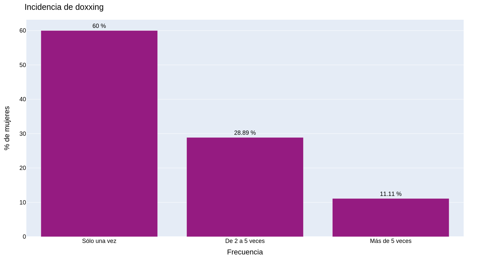
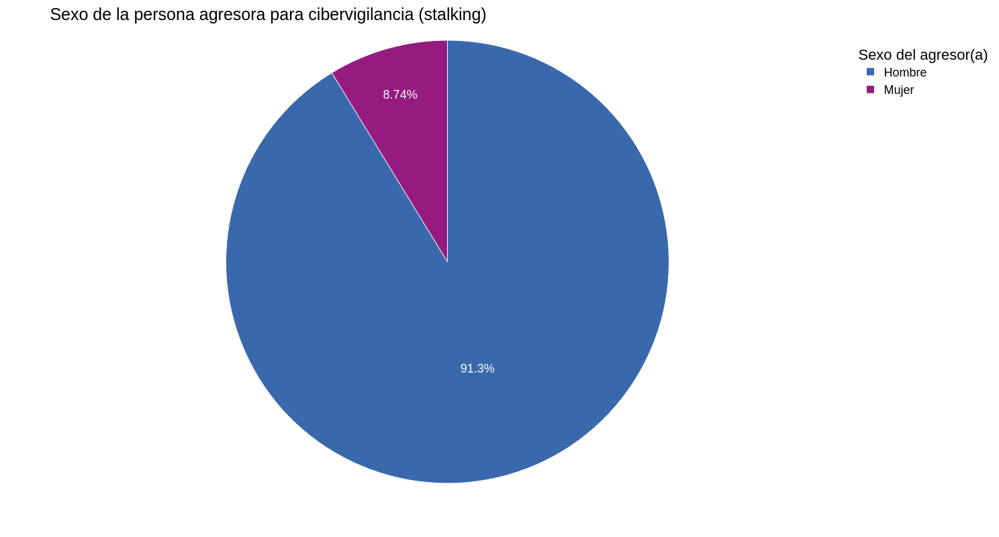
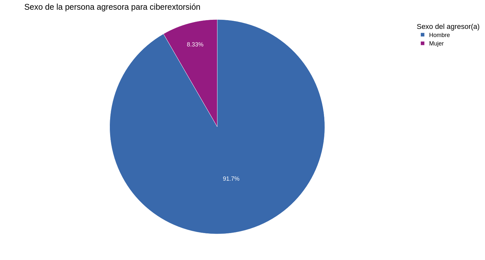
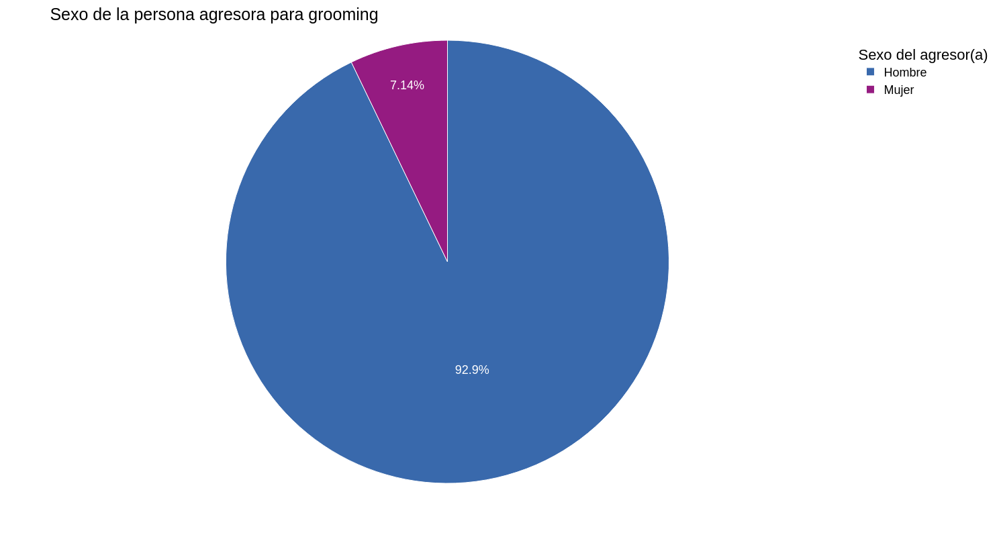
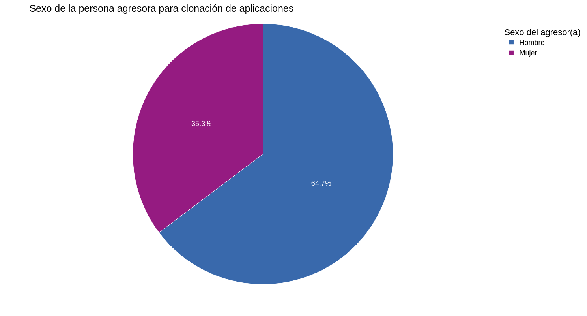

# Reporte de resultados 2023

Los resultados corresponden a 386 respuestas obtenidas. A continuación se muestra la cantidad de respuestas por sexo y género.

Un poco menos del 6% de las personas encuestadas manifestaron ser hombres o no indicar el sexo. 

### Respuestas por género

<table border="1" class="dataframe">
  <thead>
    <tr style="text-align: right;">
      <th>Sexo</th>
      <th>Hombre</th>
      <th>Mujer</th>
      <th>Prefiero no responder</th>
    </tr>
    <tr>
      <th>Género</th>
      <th></th>
      <th></th>
      <th></th>
    </tr>
  </thead>
  <tbody>
    <tr>
      <th>Femenino</th>
      <td>0</td>
      <td>360</td>
      <td>1</td>
    </tr>
    <tr>
      <th>Masculino</th>
      <td>20</td>
      <td>1</td>
      <td>0</td>
    </tr>
    <tr>
      <th>Otro</th>
      <td>0</td>
      <td>1</td>
      <td>0</td>
    </tr>
    <tr>
      <th>Prefiero no decir</th>
      <td>1</td>
      <td>1</td>
      <td>0</td>
    </tr>
    <tr>
      <th>Trans femenino</th>
      <td>0</td>
      <td>0</td>
      <td>1</td>
    </tr>
  </tbody>
</table>

## Resultados para las mujeres

Los siguientes resultados corresponden a las **mujeres** que respondieron la encuesta.

### Respuestas por rangos de edad

Alrededor del 72% de los encuestados tienen edades comprendidas entre 26 y 60 años.

### Respuestas por estados
    

    
Los lugares donde hubo más respuestas fue Distrito Capital con 31.96%, seguido de Mérida y Miranda con 13.5% y 10.74% respectivamente.

<table border="1" class="dataframe">
  <thead>
    <tr style="text-align: right;">
      <th></th>
      <th>Nº de mujeres</th>
      <th>%</th>
    </tr>
    <tr>
      <th>Estado</th>
      <th></th>
      <th></th>
    </tr>
  </thead>
  <tbody>
    <tr>
      <th>Amazonas</th>
      <td>3</td>
      <td>0.83</td>
    </tr>
    <tr>
      <th>Anzoátegui</th>
      <td>19</td>
      <td>5.23</td>
    </tr>
    <tr>
      <th>Apure</th>
      <td>16</td>
      <td>4.41</td>
    </tr>
    <tr>
      <th>Aragua</th>
      <td>13</td>
      <td>3.58</td>
    </tr>
    <tr>
      <th>Barinas</th>
      <td>1</td>
      <td>0.28</td>
    </tr>
    <tr>
      <th>Bolívar</th>
      <td>14</td>
      <td>3.86</td>
    </tr>
    <tr>
      <th>Carabobo</th>
      <td>19</td>
      <td>5.23</td>
    </tr>
    <tr>
      <th>Distrito Capital</th>
      <td>116</td>
      <td>31.96</td>
    </tr>
    <tr>
      <th>Falcón</th>
      <td>3</td>
      <td>0.83</td>
    </tr>
    <tr>
      <th>Lara</th>
      <td>16</td>
      <td>4.41</td>
    </tr>
    <tr>
      <th>Miranda</th>
      <td>39</td>
      <td>10.74</td>
    </tr>
    <tr>
      <th>Mérida</th>
      <td>49</td>
      <td>13.50</td>
    </tr>
    <tr>
      <th>Nueva Esparta</th>
      <td>2</td>
      <td>0.55</td>
    </tr>
    <tr>
      <th>Portuguesa</th>
      <td>2</td>
      <td>0.55</td>
    </tr>
    <tr>
      <th>Sucre</th>
      <td>6</td>
      <td>1.65</td>
    </tr>
    <tr>
      <th>Táchira</th>
      <td>15</td>
      <td>4.13</td>
    </tr>
    <tr>
      <th>Vargas</th>
      <td>6</td>
      <td>1.65</td>
    </tr>
    <tr>
      <th>Yaracuy</th>
      <td>3</td>
      <td>0.83</td>
    </tr>
    <tr>
      <th>Zulia</th>
      <td>21</td>
      <td>5.79</td>
    </tr>
  </tbody>
</table>

### Ocupaciones más comunes de las mujeres

<table border="1" class="dataframe">
  <thead>
    <tr style="text-align: right;">
      <th></th>
      <th>Nº de mujeres</th>
      <th>%</th>
    </tr>
    <tr>
      <th>Ocupación</th>
      <th></th>
      <th></th>
    </tr>
  </thead>
  <tbody>
    <tr>
      <th>Docente</th>
      <td>56</td>
      <td>15.43</td>
    </tr>
    <tr>
      <th>Abogado(a)</th>
      <td>40</td>
      <td>11.02</td>
    </tr>
    <tr>
      <th>Psicólogo(a)</th>
      <td>24</td>
      <td>6.61</td>
    </tr>
    <tr>
      <th>Empleado(a) Público(a)</th>
      <td>19</td>
      <td>5.23</td>
    </tr>
    <tr>
      <th>Trabajo social</th>
      <td>17</td>
      <td>4.68</td>
    </tr>
    <tr>
      <th>Ingeniero(a)</th>
      <td>17</td>
      <td>4.68</td>
    </tr>
    <tr>
      <th>Estudiante</th>
      <td>15</td>
      <td>4.13</td>
    </tr>
    <tr>
      <th>Periodista</th>
      <td>14</td>
      <td>3.86</td>
    </tr>
    <tr>
      <th>Jubilado(a)</th>
      <td>10</td>
      <td>2.75</td>
    </tr>
    <tr>
      <th>Gerente</th>
      <td>8</td>
      <td>2.20</td>
    </tr>
  </tbody>
</table>

Una cuarta parte de las mujeres encuestadas indican ser docentes o abogadas.

En el caso de "otra" hay 34 respuestas, que se dividen de la siguiente manera:

<table border="1" class="dataframe">
  <thead>
    <tr style="text-align: right;">
      <th></th>
      <th>Nº de mujeres</th>
    </tr>
    <tr>
      <th>Ocupación</th>
      <th></th>
    </tr>
  </thead>
  <tbody>
    <tr>
      <th>Desempleada</th>
      <td>3</td>
    </tr>
    <tr>
      <th>Socióloga</th>
      <td>3</td>
    </tr>
    <tr>
      <th>Promotora</th>
      <td>1</td>
    </tr>
    <tr>
      <th>antropologa</th>
      <td>1</td>
    </tr>
    <tr>
      <th>Repostera</th>
      <td>1</td>
    </tr>
    <tr>
      <th>Consultora</th>
      <td>1</td>
    </tr>
    <tr>
      <th>Educadora ambiental. Redactora</th>
      <td>1</td>
    </tr>
    <tr>
      <th>Promotora</th>
      <td>1</td>
    </tr>
    <tr>
      <th>Creación de comidas alternativas y comunes</th>
      <td>1</td>
    </tr>
    <tr>
      <th>Promotora de Lectura, Cuenta Cuentos</th>
      <td>1</td>
    </tr>
    <tr>
      <th>Organización y métodos</th>
      <td>1</td>
    </tr>
    <tr>
      <th>Nutricionista</th>
      <td>1</td>
    </tr>
    <tr>
      <th>Artista audiovisual</th>
      <td>1</td>
    </tr>
    <tr>
      <th>Lcda. Recursos Humanos</th>
      <td>1</td>
    </tr>
    <tr>
      <th>Investigadora</th>
      <td>1</td>
    </tr>
    <tr>
      <th>Profesor Universitario</th>
      <td>1</td>
    </tr>
    <tr>
      <th>Asistente personal</th>
      <td>1</td>
    </tr>
    <tr>
      <th>Trabajadora social</th>
      <td>1</td>
    </tr>
    <tr>
      <th>Comunicadora</th>
      <td>1</td>
    </tr>
    <tr>
      <th>Tareas digitales</th>
      <td>1</td>
    </tr>
    <tr>
      <th>Emprendedor en casa de encomiendas</th>
      <td>1</td>
    </tr>
    <tr>
      <th>Agente de Viajes y Turismo</th>
      <td>1</td>
    </tr>
    <tr>
      <th>Trainer Coach Profesional</th>
      <td>1</td>
    </tr>
    <tr>
      <th>Investigadora</th>
      <td>1</td>
    </tr>
    <tr>
      <th>Ilustradora</th>
      <td>1</td>
    </tr>
    <tr>
      <th>Xxx</th>
      <td>1</td>
    </tr>
    <tr>
      <th>Representante en ventas</th>
      <td>1</td>
    </tr>
    <tr>
      <th>desempleada</th>
      <td>1</td>
    </tr>
    <tr>
      <th>Correctora de estilo</th>
      <td>1</td>
    </tr>
    <tr>
      <th>Agente de operaciones remoto</th>
      <td>1</td>
    </tr>
  </tbody>
</table>

### Horas de uso diario de internet

Alrededor del 72% de las mujeres indicaron que utilizan al menos 5 horas de internet al día. 

### Principales usos de internet

Frecuentemente utilizan el internet para estudiar o investigar, trabajar, comunicarse con familiares y amigos y realizar operaciones bancarias.

<
En el caso de la respuesta "Otras actividades", podemos observar lo siguiente:

<table border="1" class="dataframe">
  <thead>
    <tr style="text-align: right;">
      <th></th>
      <th>Nº de mujeres</th>
    </tr>
    <tr>
      <th>Otros usos de internet</th>
      <th></th>
    </tr>
  </thead>
  <tbody>
    <tr>
      <th>Temas de salud</th>
      <td>1</td>
    </tr>
    <tr>
      <th>Talleres y formaciones</th>
      <td>1</td>
    </tr>
    <tr>
      <th>Investigación</th>
      <td>1</td>
    </tr>
    <tr>
      <th>Subir estados de mensajes claves y de empoderamiento</th>
      <td>1</td>
    </tr>
    <tr>
      <th>Buscar direccciones</th>
      <td>1</td>
    </tr>
    <tr>
      <th>Comprar productos</th>
      <td>1</td>
    </tr>
    <tr>
      <th>Escuchar música, poner comiquitas educativas, buscar poesías, corregir ortografía, …</th>
      <td>1</td>
    </tr>
    <tr>
      <th>Compartir contenido</th>
      <td>1</td>
    </tr>
    <tr>
      <th>Jugar</th>
      <td>1</td>
    </tr>
  </tbody>
</table>

### Aumento de uso de internet por Covid19

La mayoría de las mujeres indicaron haber aumentado el tiempo de conexión a internet post-pandemia, alrededor del 77%.

### Uso de redes sociales/aplicaciones

Las aplicaciones más utilizadas por las mujeres son WhatsApp e Instagram, sin embargo, WhatsApp la utilizan cerca del 40% de las mujeres por más de 7 horas.

### Incidencia de violencias

En la siguiente tabla se muestran los diferentes tipos de violencias manejadas en esta encuesta y la cantidad de mujeres encuestadas que manifestaron haber sufrido cada una de estas.

<table border="1" class="dataframe">
  <thead>
    <tr>
      <th></th>
      <th>No</th>
      <th>Sí</th>
    </tr>
  </thead>
  <tbody>
    <tr>
      <th>Duplicación de identidad</th>
      <td>320</td>
      <td>43</td>
    </tr>
    <tr>
      <th>Ciberacoso</th>
      <td>228</td>
      <td>135</td>
    </tr>
    <tr>
      <th>Doxxing</th>
      <td>318</td>
      <td>45</td>
    </tr>
    <tr>
      <th>Mobbing</th>
      <td>305</td>
      <td>58</td>
    </tr>
    <tr>
      <th>Ciberdifamación</th>
      <td>303</td>
      <td>60</td>
    </tr>
    <tr>
      <th>Cibervigilancia (stalking)</th>
      <td>197</td>
      <td>166</td>
    </tr>
    <tr>
      <th>Ciberextorsión</th>
      <td>342</td>
      <td>21</td>
    </tr>
    <tr>
      <th>Grooming</th>
      <td>323</td>
      <td>40</td>
    </tr>
    <tr>
      <th>Phishing/Vishing/Smishing</th>
      <td>285</td>
      <td>78</td>
    </tr>
    <tr>
      <th>Trata de personas en línea</th>
      <td>324</td>
      <td>39</td>
    </tr>
    <tr>
      <th>Captación con fines de explotación sexual</th>
      <td>356</td>
      <td>7</td>
    </tr>
    <tr>
      <th>Exclusión digital</th>
      <td>326</td>
      <td>37</td>
    </tr>
    <tr>
      <th>Cyberflashing</th>
      <td>173</td>
      <td>190</td>
    </tr>
    <tr>
      <th>Deepfake</th>
      <td>353</td>
      <td>10</td>
    </tr>
    <tr>
      <th>Clonación de aplicaciones</th>
      <td>313</td>
      <td>50</td>
    </tr>
  </tbody>
</table>

Posteriormente se observa el gráfico de incidencias de acuerdo a cada tipo de violencia:

Las violencias que más reportaron las mujeres haber sufrido son Cyberflashing, cibervigilancia(stalking) y ciberacoso.Al contrario, las violencias con menos incidencia son captaciones con fines e explotación sexual y deepfake.

#### Cantidad de violencias sufridas

Cerca del 47% de las mujeres sufrieron entre 1 y 3 tipos diferentes de violencias y, en promedio, una mujer es víctima de 3 diferentes tipos de violencias digitales.

#### Resultados para los casos de duplicación de identidad

- Se han reportado 43 casos de duplicación de identidad, de los cuales el 74,4% indica solo haberla sufrido una vez.

- Más del 70% de las mujeres reportó que los casos ocurrieron en los seis meses previos a la encuesta.

- Con respecto a los **rangos de edades** en que las mujeres sufrieron duplicación de identidad por primera vez se tiene lo siguiente:

Se observa que la mayoría de las mujeres reporta haber tenido entre 30 y 49 años cuando fueron víctimas de esta violencia por primera vez.

- El siguiente gráfico muestra el **Parentesco de la persona agresora con las mujeres víctimas de duplicación de identidad**

Cabe destacar que más del 50% de las mujeres víctimas no pudieron identificar a la persona que duplicó su identidad. Y solo menos del 10% manifiesta que fue su pareja o un familiar.

- En cuanto al **Sexo de la persona agresora** se observa que en la mayoría de los casos el agresor es un hombre.

- Por otra parte, más del 74% de las mujeres indican haber sufrido esta violencia por Facebook. Luego de esta, las plataformas más comunes por donde fueron víctimas de duplicación de identidad son Instagram, correo electrónico y WhatsApp, como se muestra a continuación:

#### Resultados para los casos de ciberacoso

- Se han reportado 135 casos de ciberacoso.

- La frecuencia con la que ocurrió la violencia se muestra en el siguiente gráfico:

Más del 70% de las mujeres reportan haber sido víctimas de ciberacoso en más de dos ocasiones.

- Por su parte, solo el 32% de las víctimas indica que sufrió la violencia en los seis meses previos a la encuesta como se muestra en el siguiente gráfico:

- Posteriormente se visualizan los **rangos de edades** en que las mujeres fueron víctimas de ciberacoso por primera vez:

Cerca al 55% de las víctimas de ciberacoso tenían entre 18 y 39 años cuando la sufrieron por primera vez.

- De acuerdo al **parentesco con la persona agresora** se tiene que:

Un poco más del 62% de las víctimas manifiesta que no pudo identificar al agresor o que no lo conocía pero le pudo identificar.

- _Las mujeres víctimas de ciberacoso indican que en el 75% de los casos, sus agresores son hombres_.

- Facebook, WhatsApp e Instagram son las aplicaciones por las cuales la mayoría de las víctimas reporta haber sufrido ciberacoso. Se puede ver con más detalle en el gráfico a continuación:

#### Resultados para los casos doxxing

Se han reportado 45 casos de doxxing.

Alrededor del 40% de las mujeres víctimas de doxxing reportan haberlo sufrido al menos 2 veces.

- En el siguiente gráfico se observa que un poco menos del 30% de las mujeres indica que la violencia se produjo en los seis meses anteriores a la encuesta.

- A continuación se observan los **rangos de edades** en que las mujeres fueron víctimas de doxxing por primera vez:

Cerca del 35% de las mujeres reportan haber tenido entre 10 y 29 años cuando sufrieron la violencia por primera vez.

- En cuanto al **Parentesco con la persona agresora**, tenemos lo siguiente:

El 40% de las mujeres víctimas de doxxing manifiestan que la persona que los agredió era su ex-pareja en ese momento o que tenían una amistad.

- _Un poco más del 46% de los casos reportados indican que la persona agresora es también una mujer_.

- Así como para ciberacoso, se observa que Facebook, WhatsApp e Instagram son las aplicaciones por donde ocurren la mayoría de casos de doxxing.

Posteriormente se muestra una tabla con las respuestas de acuerdo a otras aplicaciones o redes sociales reportadas.

<table border="1" class="dataframe">
  <thead>
    <tr style="text-align: right;">
      <th></th>
      <th>N° de mujeres</th>
    </tr>
    <tr>
      <th>Otras aplicaciones o redes sociales</th>
      <th></th>
    </tr>
  </thead>
  <tbody>
    <tr>
      <th>Hispachan</th>
      <td>1</td>
    </tr>
    <tr>
      <th>Correo electrónico</th>
      <td>1</td>
    </tr>
  </tbody>
</table>

#### Resultados para los casos de mobbing

Se han reportado 58 casos de mobbing, de los cuales alrededor del 60% manifiesta haberlo sufrido al menos 2 veces.

- La mayoría de las mujeres manifiestan que la violencia no ocurrió en los seis meses previos a la encuesta.

- A continuación se muestran los **rangos de edad** en que las mujeres fueron victimas de mobbing por primera vez:

Cerca del 65% de las mujeres víctimas de mobbing, indican haber tenido entre 30 y 59 años cuando sufrieron la violencia por primera vez.

- Para el caso de mobbing, debido a la naturaleza de la violencia, se reformuló la pregunta acerca del parentesco con la persona agresora y en su lugar se pidió información sobre la relación laboral con esta.

Se reportan pocos casos en los que el agresor fue un subalterno y alrededor del 30% son víctimas de su propio jefe(a).

- Asimismo, _las víctimas de mobbing indican que en la mayoría de los casos su agresor es un hombre_
 

- A continuación se muestran las aplicaciones o redes sociales por las cuales las mujeres sufrieron mobbing.

Resultando WhatsApp como la aplicación más común, seguida de Facebook y SMS.

La siguiente tabla muestra las respuestas de las mujeres de acuerdo a otras aplicaciones por las cuales fueron víctimas de mobbing:

<table border="1" class="dataframe">
  <thead>
    <tr style="text-align: right;">
      <th></th>
      <th>N° de mujeres</th>
    </tr>
    <tr>
      <th>Otras aplicaciones o redes sociales</th>
      <th></th>
    </tr>
  </thead>
  <tbody>
    <tr>
      <th>Llamada</th>
      <td>1</td>
    </tr>
    <tr>
      <th>Persona</th>
      <td>1</td>
    </tr>
    <tr>
      <th>Televisión</th>
      <td>1</td>
    </tr>
    <tr>
      <th>Personal</th>
      <td>1</td>
    </tr>
    <tr>
      <th>Google hangouts</th>
      <td>1</td>
    </tr>
    <tr>
      <th>Impreso</th>
      <td>1</td>
    </tr>
  </tbody>
</table>

#### Resultados para los casos de ciberdifamación

Se han reportado 60 casos de ciberdifamación, indicando el 36.67% haber sido víctimas en 2 o más ocasiones.  

- Pocas mujeres manifiestan haber sufrido esta violencia en los últimos seis meses, como se muestra en el siguiente gráfico:

- Alrededor del 70% de las mujeres indican haber tenido 39 años o menos cuando fueron víctimas de ciberdifamación por primera vez.

- A continuación se observan las respuestas en cuanto al parentesco de la víctima con la persona agresora:

El 70% logró identificar a la persona agresora, de los cuales el 25% indica que tenía una amistad con su agresor.

- De estos casos, _alrededor del 65% reporta haber sufrido de ciberdifamación causada por una mujer_.

- Por su parte, Facebook es la red social más frecuente donde se produce la ciberdifamación, seguida de WhatsApp y correo electrónico. Esto se observa en el gráfico a continuación:

Posteriormente se muestra una tabla con otras aplicaciones reportadas por las víctimas de ciberdifamación:

<table border="1" class="dataframe">
  <thead>
    <tr style="text-align: right;">
      <th></th>
      <th>N° de mujeres</th>
    </tr>
    <tr>
      <th>Otras aplicaciones o redes sociales</th>
      <th></th>
    </tr>
  </thead>
  <tbody>
    <tr>
      <th>Ask.fm</th>
      <td>1</td>
    </tr>
    <tr>
      <th>Portal web</th>
      <td>1</td>
    </tr>
    <tr>
      <th>Twitter</th>
      <td>1</td>
    </tr>
    <tr>
      <th>Mensajería Blackberry</th>
      <td>1</td>
    </tr>
    <tr>
      <th>Prensa escrita</th>
      <td>1</td>
    </tr>
  </tbody>
</table>

#### Resultados para los casos de cibervigilancia (stalking)

Se han reportado 166 casos de stalking, de los cuales cerca del 70% indica haberlo sufrido más de 2 veces.

- De estos casos, un poco más del 59% de las mujeres reporta que la violencia no ocurrió en los últimos 6 meses.

- Alrededor del 27% de las mujeres, cuando sufrieron stalking por primera vez eran menores a 25 años.

- El siguiente gráfico muestra el parentesco de las mujeres que sufrieron stalking con su agresor(a):

Un poco más del 62% de las mujeres lograron identificar a la persona agresora.

- _Alrededor del 91% de las mujeres fueron víctimas de un hombre_

- Así como se observó para otros tipos de violencia, WhatsApp y Facebook fueron los medios más utilizados por los cuales las víctimas sufrieron de cibervigilancia. Seguido a estos se tienen las llamadas telefónicas.

Una mujer reporta haber sufrido cibervigilancia a través de la aplicación Skype.

#### Resultados para los casos de ciberextorsión

Se han reportado 21 casos de ciberextorsión, de los cuales la mayoría (más del 65%) de las mujeres manifiesta haberlo sufrido en una ocasión.

- En los casos encuestados cerca del 29% indica que la ciberextorsión ocurrió en los últimos seis meses.

- El siguiente gráfico muestra los rangos de edades que tenían las víctimas cuando sufrieron la violencia por primera vez:

Un poco más del 61% de las mujeres que sufrieron ciberextorsión, reportaron que tenían menos de 39 años.

- Alrededor del 33% de las mujeres indica haber tenido una relación cercana con su agresor(amistad, pareja o ex-pareja).

- _En más del 90% de los casos, la persona agresora fue un hombre_.

- Nuevamente, WhatsApp y Facebook son las aplicaciones más frecuentes por las cuales las mujeres reportaron haber sufrido de ciberextorsión.

Una mujer indica haber sufrido esta violencia a través de la aplicación Skype.

#### Resultados para los casos de grooming

Se han reportado 40 casos de grooming, de los cuales el 37.5% manifiesta haberlo sufrido más de una vez.

- Solo en el 20% de los casos la violencia ocurrió en los últimos seis meses.

- A continuación se muestran los rangos de edades de las víctimas cuando sufrieron grooming por primera vez:

De los casos reportados, 20 mujeres manifiestan haber tenido menos de 25 años.

- Por la naturaleza de la agresión, en este caso se preguntó si la víctima logró identificar al agresor(a).

Solo 14 mujeres identificaron a la persona que las agredió y _en 13 de esos casos fue un hombre_.

- Facebook seguido de Instagram, fueron las dos redes sociales más comunes a través de las cuales las mujeres sufrieron grooming.

La siguiente tabla muestra las respuestas a "Otras aplicaciones" por las cuales algunas mujeres reportan haber sufrido grooming:

<table border="1" class="dataframe">
  <thead>
    <tr style="text-align: right;">
      <th></th>
      <th>N° de mujeres</th>
    </tr>
    <tr>
      <th>Otras aplicaciones o redes sociales</th>
      <th></th>
    </tr>
  </thead>
  <tbody>
    <tr>
      <th>Hello tall</th>
      <td>1</td>
    </tr>
    <tr>
      <th>Messenger, cuando existia</th>
      <td>1</td>
    </tr>
    <tr>
      <th>Chats internacionales (Latinchat)</th>
      <td>1</td>
    </tr>
    <tr>
      <th>Skype</th>
      <td>1</td>
    </tr>
    <tr>
      <th>Messenger, hi5, latinchat</th>
      <td>1</td>
    </tr>
    <tr>
      <th>Messenger</th>
      <td>1</td>
    </tr>
    <tr>
      <th>Iqc</th>
      <td>1</td>
    </tr>
  </tbody>
</table>

#### Resultados para los casos de phishing-vishing-smishing

Se han reportado 78 víctimas de phishing-vishing-smishing y de ellos cerca del 62% indica haberlo sufrido en más de una ocasión.

- En los últimos seis meses ocurrieron 40 de los casos reportados.

- Alrededor del 49% de las mujeres indican haber tenido entre 30 y 49 años cuando sufrieron phishing-vishing-smishing por primera vez:

- En este caso se preguntó si la víctima logró identificar al agresor(a).

Solo 12 mujeres identificaron a la persona que las agredió y _en la mayoría de esos casos fue un hombre_.

Por la naturaleza de la violencia, se incluyó la opción "Un grupo de personas" como agresor.

- WhastApp y correo electrónico son las aplicaciones más frecuentes por las cuales las mujeres reportan haber sufrido esta violencia.

Una mujer indica haber sufrido esta violencia por Messenger Live y otra a través de LinkedIn.

#### Resultados para los casos de trata de personas en línea

Se han reportado 39 casos de trata de personas en línea de los cuales, alrededor del 49% indica haber sufrido la violencia en más de una ocasión.

- 10 de las personas que sufrieron la violencia indican que ocurrió en los 6 meses previos.

- A continuación se muestran las edades que tenían las mujeres cuando sufrieron la violencia por primera vez:

28 de las 39 mujeres tenían entre 18 y 39 años de edad cuando fueron victimas de trata de personas en línea por primera vez.

- Solo 4 mujeres lograron identificar al agresor(a). 

La mitad de las mujeres que lograron identificar a su victimario(a) indican que era un hombre.

- Facebook es la aplicación más frecuente por la cual las mujeres reportan haber sufrido esta violencia.

Una mujer indica haber sufrido esta violencia por Badoo y otra a través de Gmail.

#### Resultados para los casos de captación con fines de explotación sexual

Se han reportado 7 casos de captación con fines de explotación sexual y más del 85% de estos indica haberla sufrido más de una vez.

- 4 de las personas que sufrieron la violencia indican que ocurrió en los 6 meses previos.

- Alrededor del 85% de las mujeres tenían entre 15 y 59 años de edad cuando sufrieron la violencia por primera vez:

- 4 mujeres no lograron identificar al agresor(a) y dos de ellas indican que tenían una amistad o que fue un compañero(a) de trabajo.

- Para captación con fines de explotación sexual todas las personas agresoras son de sexo Hombre

- Facebook es la aplicación más frecuente por la cual las mujeres reportan haber sufrido esta violencia.

Una mujer indica haber sufrido esta violencia por mensaje de texto.

#### Resultados para los casos de exclusión digital

Se han reportado 37 casos de exclusión digital, de los cuales 28 mujeres indican que ocurrió en más de 2 ocasiones.

- De estos casos, 22 mujeres reportan que la violencia ocurrió en los últimos 6 meses.

- Alrededor del 65% de las mujeres cuando sufrieron exclusión digital por primera vez, eran menores a 39 años y una de ellas reporta haber tenido entre 10 y 14 años de edad.

En el caso de exclusión digital, debido a la naturaleza de la agresión no se realizaron las preguntas asociadas al parentesco y sexo de las personas agresoras.

- Telegram es la aplicación por la cual la mayoría de las mujeres reportan haber sido excluidas, seguido de Facebook.

Dos mujeres indican haber sufrido la violencia por medio de la telefonía local.

#### Resultados para los casos de cyberflashing

Se han reportado 190 casos de cyberflashing de los cuales 132 mujeres indican haber sufrido la violencia en más de una ocasión.

- 53 de las personas que sufrieron la violencia indican que ocurrió en los 6 meses previos a la encuesta.

- A continuación se muestran las edades que tenían las mujeres cuando sufrieron la violencia por primera vez:

138 de las 190 mujeres que reportan haber sufrido la violencia, tenían entre 18 y 49 años de edad cuando fueron victimas por primera vez.

- Solo 38 mujeres indican que no conocían al agresor pero pudieron identificarlo. Asimismo, 55 mujeres indican que tenían una amistad con su agresor(a), mientras que 80 mujeres no pudieron identificar al agresor(a).

_183 de las 190 mujeres indican haber sido víctimas de un hombre_

- WhatsApp y Facebook son las aplicaciones más frecuentes por las cualés las mujeres sufren de cyberflashing.

La siguiente tabla muestra información sobre Otras aplicaciones por las cuales las mujeres sufrieron la violencia. 

<table border="1" class="dataframe">
  <thead>
    <tr style="text-align: right;">
      <th></th>
      <th>N° de mujeres</th>
    </tr>
    <tr>
      <th>Otras aplicaciones o redes sociales</th>
      <th></th>
    </tr>
  </thead>
  <tbody>
    <tr>
      <th>Pink</th>
      <td>1</td>
    </tr>
    <tr>
      <th>Canales de ver series</th>
      <td>1</td>
    </tr>
    <tr>
      <th>No recuerdo</th>
      <td>1</td>
    </tr>
    <tr>
      <th>Instagram</th>
      <td>1</td>
    </tr>
    <tr>
      <th>Messenger</th>
      <td>3</td>
    </tr>
    <tr>
      <th>Skype, mensajes texto y el antiguo chat de Google "talk".</th>
      <td>2</td>
    </tr>
    <tr>
      <th>YouTube red</th>
      <td>1</td>
    </tr>
    <tr>
      <th>Latinchat</th>
      <td>1</td>
    </tr>
    <tr>
      <th>Mensaje de texto</th>
      <td>1</td>
    </tr>
    <tr>
      <th>Kik</th>
      <td>1</td>
    </tr>
  </tbody>
</table>

#### Resultados para los casos de deepfake

Se han reportado 10 casos de deepfake de los cuales 7 mujeres reportan que solo ocurrió una vez.

- De estos casos, solo una mujer reporta que la violencia ocurrió en los últimos 6 meses.

- La mayoría de las mujeres (6) tenían entre 18 y 39 años de edad cuando sufrieron deepfake por primera vez.

- 3 mujeres reportan que no conocían a su agresor(a) pero que pudieron identificarlo y la misma cantidad indican que no lograron identificarle.

_7 de las 10 mujeres indican haber sido víctimas de un hombre_

- Facebook y WhatsApp son las aplicaciones más frecuentes por las cuales las mujeres reportan hav¡ber sufrido deepfake.

Una mujer indica haber sufrido la violencia por Messenger y otra por BB PIN.

#### Resultados para los casos de clonación de aplicaciones

Se han reportado 50 casos de clonación de aplicaciones y solo 12 de ellas indican haberla sufrido más de una vez.

- 13 de las mujeres que sufrieron la violencia indican que ocurrió en los 6 meses previos.

- Alrededor del 68% de las mujeres tenían entre 30 y 59 años de edad cuando sufrieron la violencia por primera vez:

- 33 mujeres no lograron identificar al agresor(a), 4 indican que fue un compañero(a) de trabajo y 6 no conocían al agresor pero pudieron identificarlo.

- Para esta violencia, en 32 de los casos el agresor es un hombre.

- Nuevamente FAcebook y WhatsApp son las aplicaciones más frecuentes por las cuales las mujeres reportan haber sufrido esta violencia.

Una mujer indica haber sufrido esta violencia por Messenger y otra reporta que falsificaron su firma.

### Conocimiento sobre violencia digital basada en género

- 264 mujeres afirman haber escuchado antes el término Violencia digital basada en género.

- A continuación se muestra una tabla con información sobre el número de violencias conocidas por las mujeres.

<table border="1" class="dataframe">
  <thead>
    <tr style="text-align: right;">
      <th></th>
      <th>Cantidad de mujeres</th>
      <th>%</th>
    </tr>
    <tr>
      <th>Nº de violencias conocidas</th>
      <th></th>
      <th></th>
    </tr>
  </thead>
  <tbody>
    <tr>
      <th>1</th>
      <td>17</td>
      <td>4.68</td>
    </tr>
    <tr>
      <th>2</th>
      <td>19</td>
      <td>5.23</td>
    </tr>
    <tr>
      <th>3</th>
      <td>27</td>
      <td>7.44</td>
    </tr>
    <tr>
      <th>4</th>
      <td>29</td>
      <td>7.99</td>
    </tr>
    <tr>
      <th>5</th>
      <td>22</td>
      <td>6.06</td>
    </tr>
    <tr>
      <th>6</th>
      <td>24</td>
      <td>6.61</td>
    </tr>
    <tr>
      <th>7</th>
      <td>32</td>
      <td>8.82</td>
    </tr>
    <tr>
      <th>8</th>
      <td>26</td>
      <td>7.16</td>
    </tr>
    <tr>
      <th>9</th>
      <td>21</td>
      <td>5.79</td>
    </tr>
    <tr>
      <th>10</th>
      <td>15</td>
      <td>4.13</td>
    </tr>
    <tr>
      <th>11</th>
      <td>11</td>
      <td>3.03</td>
    </tr>
    <tr>
      <th>12</th>
      <td>9</td>
      <td>2.48</td>
    </tr>
    <tr>
      <th>13</th>
      <td>5</td>
      <td>1.38</td>
    </tr>
    <tr>
      <th>14</th>
      <td>2</td>
      <td>0.55</td>
    </tr>
    <tr>
      <th>15</th>
      <td>5</td>
      <td>1.38</td>
    </tr>
  </tbody>
</table>

- Los tipos de violencias más conocidas por las mujeres son la duplicación de identidad, seguida del ciberacoso y doxxing. POr su parte, las menos conocidas son el deepfake y la clonación de aplicaciones.

### Reacciones de las víctima al sufrir la(s) violencia(s)

Las reacciones más frecuentes fueron bloquear al agresor(a), ignorarlo(a) y reportar el perfil o publicación en la red social.

### Conocimiento de víctimas

226 mujeres afirman que conocen a otras mujeres que han sido víctimas de alguna violencia digital.

79 de ellas indican conocer entre 2 y 4 mujeres que también han sufrido alguna violencia.

### Conocimiento de leyes y normas

De las mujeres encuestadas, solo 67 indican no conocer leyes o normativas en el país que regulen el tema de Violencias digitales basadas en género.

### Interacciones entre ciertos ítems de la encuesta

#### Tipos de violencia y edad en que ocurrió por primera vez

    title="Tasa de incidencia por grupo etario según tipo de violencia",

#### Tipo de violencia según el medio por el cual ocurrió

#### Parentesco de la persona agresora con las mujeres que han sufrido violencias

¡
    title="Parentesco de la persona agresora con las mujeres que han sufrido violencias",
  
  NOTA: Para las siguientes violencias, la pregunta sobre parentesco se reformuló consultando si se logró o no identificar al agresor(a).

<table border="1" class="dataframe">
  <thead>
    <tr style="text-align: right;">
      <th></th>
      <th>No</th>
      <th>Sí</th>
    </tr>
  </thead>
  <tbody>
    <tr>
      <th>Grooming</th>
      <td>26</td>
      <td>14</td>
    </tr>
    <tr>
      <th>Phishing</th>
      <td>66</td>
      <td>12</td>
    </tr>
    <tr>
      <th>Trata</th>
      <td>35</td>
      <td>4</td>
    </tr>
  </tbody>
</table>

NOTA: Para mobbing, por la naturaleza de la agresión, la víctima conoce a su agresor(a).

<table border="1" class="dataframe">
  <thead>
    <tr style="text-align: right;">
      <th></th>
      <th>N° de mujeres</th>
    </tr>
    <tr>
      <th>Relación laboral</th>
      <th></th>
    </tr>
  </thead>
  <tbody>
    <tr>
      <th>Tu compañero(a)</th>
      <td>31</td>
    </tr>
    <tr>
      <th>Un(a) jefe(a)</th>
      <td>17</td>
    </tr>
    <tr>
      <th>Un(a) subalterno(a)</th>
      <td>10</td>
    </tr>
  </tbody>
</table>

#### Identificación de la persona agresora

#### Sexo del agresor por tipo de violencia

#### Sexo del agresor(a) y parentesco con la víctima por tipo de violencia

#### Sexo del agresor(a) y parentesco con la víctima por tipo de violencia: individual

    explotacion Son solo hombres

#### Violencias por ocupación

    title="Ocupaciones más frecuentes por violencia sufrida"

#### Violencias por estados

#### Promedio de incidencias

    2.697

En promedio una mujer es víctima de 3 violencias.

#### Cantidad de veces en que la víctima reporta haber sufrido la violencia

#### Patrón de uso de aplicaciones por tipo de violencias y medio más frecuente por el que ocurrió

#### Víctimas y conocimiento del nombre de la violencia que sufrieron

Esta tabla contiene la información de las mujeres que sufrieron las violencias y se compara con la respuesta de si conoce o no el nombre.

<table border="1" class="dataframe">
  <thead>
    <tr style="text-align: right;">
      <th>Conocimiento del nombre de la violencia</th>
      <th>Sí</th>
      <th>No</th>
    </tr>
  </thead>
  <tbody>
    <tr>
      <th>Duplicación de identidad</th>
      <td>79.07</td>
      <td>20.93</td>
    </tr>
    <tr>
      <th>Ciberacoso</th>
      <td>76.30</td>
      <td>23.70</td>
    </tr>
    <tr>
      <th>Doxxing</th>
      <td>68.89</td>
      <td>31.11</td>
    </tr>
    <tr>
      <th>Mobbing</th>
      <td>75.86</td>
      <td>24.14</td>
    </tr>
    <tr>
      <th>Ciberdifamación</th>
      <td>76.67</td>
      <td>23.33</td>
    </tr>
    <tr>
      <th>Cibervigilancia (stalking)</th>
      <td>75.30</td>
      <td>24.70</td>
    </tr>
    <tr>
      <th>Ciberextorsión</th>
      <td>76.19</td>
      <td>23.81</td>
    </tr>
    <tr>
      <th>Grooming</th>
      <td>75.00</td>
      <td>25.00</td>
    </tr>
    <tr>
      <th>Phishing/Vishing/Smishing</th>
      <td>79.49</td>
      <td>20.51</td>
    </tr>
    <tr>
      <th>Trata de personas en línea</th>
      <td>69.23</td>
      <td>30.77</td>
    </tr>
    <tr>
      <th>Captación con fines de explotación sexual</th>
      <td>42.86</td>
      <td>57.14</td>
    </tr>
    <tr>
      <th>Exclusión digital</th>
      <td>70.27</td>
      <td>29.73</td>
    </tr>
    <tr>
      <th>Cyberflashing</th>
      <td>71.58</td>
      <td>28.42</td>
    </tr>
    <tr>
      <th>Deepfake</th>
      <td>80.00</td>
      <td>20.00</td>
    </tr>
    <tr>
      <th>Clonación de aplicaciones</th>
      <td>58.00</td>
      <td>42.00</td>
    </tr>
  </tbody>
</table>

## Reporte de resultados para los hombres que respondieron la encuesta

Los siguientes resultados corresponden a los 21 **hombres** que respondieron la encuesta.

### Rangos de edad

fig.write_image("img/hombres/edades.png");

### Respuestas por estados

    

    

<table border="1" class="dataframe">
  <thead>
    <tr style="text-align: right;">
      <th></th>
      <th>Nº de hombres</th>
      <th>%</th>
    </tr>
    <tr>
      <th>Estado</th>
      <th></th>
      <th></th>
    </tr>
  </thead>
  <tbody>
    <tr>
      <th>Anzoátegui</th>
      <td>1</td>
      <td>4.76</td>
    </tr>
    <tr>
      <th>Aragua</th>
      <td>2</td>
      <td>9.52</td>
    </tr>
    <tr>
      <th>Carabobo</th>
      <td>2</td>
      <td>9.52</td>
    </tr>
    <tr>
      <th>Distrito Capital</th>
      <td>8</td>
      <td>38.10</td>
    </tr>
    <tr>
      <th>Miranda</th>
      <td>4</td>
      <td>19.05</td>
    </tr>
    <tr>
      <th>Mérida</th>
      <td>1</td>
      <td>4.76</td>
    </tr>
    <tr>
      <th>Sucre</th>
      <td>1</td>
      <td>4.76</td>
    </tr>
    <tr>
      <th>Zulia</th>
      <td>2</td>
      <td>9.52</td>
    </tr>
  </tbody>
</table>

#### Ocupaciones más comunes

<table border="1" class="dataframe">
  <thead>
    <tr style="text-align: right;">
      <th></th>
      <th>Nº de hombres</th>
      <th>%</th>
    </tr>
    <tr>
      <th>Ocupación</th>
      <th></th>
      <th></th>
    </tr>
  </thead>
  <tbody>
    <tr>
      <th>Docente</th>
      <td>4</td>
      <td>19.05</td>
    </tr>
    <tr>
      <th>Estudiante</th>
      <td>3</td>
      <td>14.29</td>
    </tr>
    <tr>
      <th>Ingeniero(a)</th>
      <td>3</td>
      <td>14.29</td>
    </tr>
    <tr>
      <th>Empleado(a) Público(a)</th>
      <td>3</td>
      <td>14.29</td>
    </tr>
    <tr>
      <th>Abogado(a)</th>
      <td>2</td>
      <td>9.52</td>
    </tr>
    <tr>
      <th>Estadístico(a)</th>
      <td>1</td>
      <td>4.76</td>
    </tr>
    <tr>
      <th>Médico</th>
      <td>1</td>
      <td>4.76</td>
    </tr>
    <tr>
      <th>Analista</th>
      <td>1</td>
      <td>4.76</td>
    </tr>
    <tr>
      <th>Jubilado(a)</th>
      <td>1</td>
      <td>4.76</td>
    </tr>
  </tbody>
</table>

En "otros" hay 2 respuestas, que se dividen de la siguiente manera:

<table border="1" class="dataframe">
  <thead>
    <tr style="text-align: right;">
      <th></th>
      <th>N° de hombres</th>
    </tr>
    <tr>
      <th>Ocupación</th>
      <th></th>
    </tr>
  </thead>
  <tbody>
    <tr>
      <th>Coordinador</th>
      <td>1</td>
    </tr>
    <tr>
      <th>Gestor de Casos</th>
      <td>1</td>
    </tr>
  </tbody>
</table>

### Horas de uso de internet

fig.write_image("img/hombres/uso_internet.png")

### Principales usos de internet

fig.write_image("img/hombres/usos_internet.png")

En el caso de la respuesta "Otras actividades", se desglosa de la siguiente manera:

<table border="1" class="dataframe">
  <thead>
    <tr style="text-align: right;">
      <th></th>
      <th>Nº de hombres</th>
    </tr>
    <tr>
      <th>Otros usos de internet</th>
      <th></th>
    </tr>
  </thead>
  <tbody>
    <tr>
      <th>Noticias, documentales, trámites legales</th>
      <td>1</td>
    </tr>
  </tbody>
</table>

### Aumento de uso de internet por Covid19

aumento de tiempo de conexión por covid

fig.write_image("img/hombres/covid.png")
¡

### Uso de redes sociales/aplicaciones

fig.write_image("img/hombres/uso_apps.png")

### Incidencia de violencias

fig.write_image("img/hombres/incidencia.png")

fig.write_image("img/hombres/numero_violencia.png")

#### Resultados para los casos de duplicación de identidad

Se han reportado 4 casos de duplicación de identidad.

Se han reportado 60 casos de ciberdifamación, indicando el 36.67% haber sido víctimas en 2 o más ocasiones.  

- Pocas mujeres manifiestan haber sufrido esta violencia en los últimos seis meses, como se muestra en el siguiente gráfico:

- Alrededor del 70% de las mujeres indican haber tenido 39 años o menos cuando fueron víctimas de ciberdifamación por primera vez.

- A continuación se observan las respuestas en cuanto al parentesco de la víctima con la persona agresora:

El 70% logró identificar a la persona agresora, de los cuales el 25% indica que tenía una amistad con su agresor.

- De estos casos, _alrededor del 65% reporta haber sufrido de ciberdifamación causada por una mujer_.

- Por su parte, Facebook es la red social más frecuente donde se produce la ciberdifamación, seguida de WhatsApp y correo electrónico. Esto se observa en el gráfico a continuación:

Posteriormente se muestra una tabla con otras aplicaciones reportadas por las víctimas de ciberdifamación:

    Para duplicación de identidad todas las personas agresoras son de sexo Hombre

#### Resultados para los casos de ciberacoso

Se han reportado 5 casos de ciberacoso.

#### Resultados para los casos de doxxing

Se han reportado 2 casos de doxxing.

    Las personas que sufrieron de doxxing, manifiestan que no ocurrió durante los últimos 6 meses

    Para doxxing todas las personas agresoras son de sexo Hombre

<table border="1" class="dataframe">
  <thead>
    <tr style="text-align: right;">
      <th></th>
      <th>N° de hombres</th>
    </tr>
    <tr>
      <th>Otras aplicaciones o redes sociales</th>
      <th></th>
    </tr>
  </thead>
  <tbody>
    <tr>
      <th>Buscador de internet Google crome</th>
      <td>1</td>
    </tr>
  </tbody>
</table>

#### Resultados para los casos de mobbing

Se han reportado 6 casos de mobbing

#### Resultados para los casos de ciberdifamación

Se han reportado 4 casos de ciberdifamación.

#### Resultados para los casos de cibervigilancia (stalking)

Se han reportado 7 casos de cibervigilancia (stalking).

#### Resultados para los casos de ciberextorsión

Se han reportado 4 casos de ciberextorsión.

    Las personas que sufrieron de ciberextorsion, manifiestan que no ocurrió durante los últimos 6 meses

    Para ciberextorsión todas las personas agresoras son de sexo Hombre

#### Resultados para los casos de grooming

Se han reportado 8 casos de grooming.

    Para grooming todas las personas agresoras son de sexo Hombre

<table border="1" class="dataframe">
  <thead>
    <tr style="text-align: right;">
      <th></th>
      <th>N° de hombres</th>
    </tr>
    <tr>
      <th>Otras aplicaciones o redes sociales</th>
      <th></th>
    </tr>
  </thead>
  <tbody>
    <tr>
      <th>Chatroomde Digitel</th>
      <td>1</td>
    </tr>
  </tbody>
</table>

#### Resultados para los casos de los casos de phishing/vishing/smishing

Se han reportado 7 casos de phishing/vishing/smishing.

#### Resultados para los casos de trata

 Se han reportado 2 casos de trata de persona en línea.

    Las personas que sufrieron de trata, manifiestan que sí ocurrió durante los últimos 6 meses

#### Resultados para los casos de exclusión

Se han reportado 3 víctimas de exclusión digital.

Para exclusión no se pregunto por agresor.

#### Resultados para los casos de cyberflashing

Se han reportado 9 casos de cyberflashing

#### Resultados para los casos de clonación de aplicaciones

Se han reportado 4 casos de clonación de aplicaciones

### Conocimiento sobre violencia digital basada en género

    legend_title="¿Habías escuchado antes el término   Violencia Digital Basada en Género?",
 

<table border="1" class="dataframe">
  <thead>
    <tr style="text-align: right;">
      <th></th>
      <th>Cantidad de hombres</th>
      <th>%</th>
    </tr>
    <tr>
      <th>Nº de violencias conocidas</th>
      <th></th>
      <th></th>
    </tr>
  </thead>
  <tbody>
    <tr>
      <th>1</th>
      <td>1</td>
      <td>4.76</td>
    </tr>
    <tr>
      <th>4</th>
      <td>1</td>
      <td>4.76</td>
    </tr>
    <tr>
      <th>5</th>
      <td>1</td>
      <td>4.76</td>
    </tr>
    <tr>
      <th>6</th>
      <td>1</td>
      <td>4.76</td>
    </tr>
    <tr>
      <th>7</th>
      <td>1</td>
      <td>4.76</td>
    </tr>
    <tr>
      <th>8</th>
      <td>2</td>
      <td>9.52</td>
    </tr>
    <tr>
      <th>10</th>
      <td>1</td>
      <td>4.76</td>
    </tr>
    <tr>
      <th>11</th>
      <td>2</td>
      <td>9.52</td>
    </tr>
    <tr>
      <th>12</th>
      <td>1</td>
      <td>4.76</td>
    </tr>
  </tbody>
</table>

fig.write_image("img/hombres/conocimiento_violencia.png")

### Reacciones de las víctimas al sufrir la(s) violencia(s)

### Conocimiento de víctimas

    legend_title="¿Conoces a alguna mujer que haya   sido víctima de violencia digital?",

Número de víctimas

### Conocimiento de leyes y normas

    legend_title="¿Conoces leyes o normativas en el país   que contemplan las violencias digitales?",

### Interacciones entre ciertos ítems de la encuesta

#### Tipos de violencia y edad en que ocurrió por primera vez

    title="Tasa de incidencia por grupo etario según tipo de violencia",

#### Tipo de violencia según el medio por el cual ocurrió

#### Parentesco de la persona agresora con las mujeres que han sufrido violencias

NOTA: Para las siguientes violencias la pregunta sobre parentesco se reformuló a si logró o no identificar el agresor.

<table border="1" class="dataframe">
  <thead>
    <tr style="text-align: right;">
      <th></th>
      <th>No</th>
      <th>Sí</th>
    </tr>
  </thead>
  <tbody>
    <tr>
      <th>Grooming</th>
      <td>7.0</td>
      <td>1.0</td>
    </tr>
    <tr>
      <th>Phishing</th>
      <td>5.0</td>
      <td>2.0</td>
    </tr>
    <tr>
      <th>Trata</th>
      <td>2.0</td>
      <td>0.0</td>
    </tr>
  </tbody>
</table>

NOTA: Para mobbing la víctima por la naturaleza de la agresión conoce a su agresor(a).

<table border="1" class="dataframe">
  <thead>
    <tr style="text-align: right;">
      <th></th>
      <th>N° de hombres</th>
    </tr>
    <tr>
      <th>Relación laboral</th>
      <th></th>
    </tr>
  </thead>
  <tbody>
    <tr>
      <th>Tu compañero(a)</th>
      <td>3</td>
    </tr>
    <tr>
      <th>Un(a) subalterno(a)</th>
      <td>2</td>
    </tr>
    <tr>
      <th>Un(a) jefe(a)</th>
      <td>1</td>
    </tr>
  </tbody>
</table>

#### Identificación de la persona agresora

#### Sexo del agresor por tipo de violencia

    title="Sexo del agresor por tipo de violencia",

#### Sexo del agresor(a) y parentesco con la víctima por tipo de violencia

#### Sexo del agresor(a) y parentesco con la víctima por tipo de violencia: individual

    El sexo de las personas agresoras es ['Hombre'] para identidad

    El sexo de las personas agresoras es ['Hombre'] para doxxing

    El sexo de las personas agresoras es ['Hombre'] para ciberextorsion

#### Violencias por ocupación

    title="Ocupaciones más frecuentes por violencia sufrida",

#### Violencias por estados

#### Promedio de incidencias

    3.1

En promedio, un hombre es víctima de 3 violencias.

#### Cantidad de veces en que la víctima reporta haber sufrido la violencia

#### Patrón de uso de aplicaciones por tipo de violencias y según medio más frecuente por el que ocurrió

#### Víctimas y conocimiento del nombre de la violencia que sufrieron

Esta tabla contiene la información de las mujeres que sufrieron las violencias y se compara con la respuesta de si conoce o no el nombre.

<table border="1" class="dataframe">
  <thead>
    <tr>
      <th></th>
      <th>Sí</th>
      <th>No</th>
    </tr>
  </thead>
  <tbody>
    <tr>
      <th>Duplicación de identidad</th>
      <td>75.00</td>
      <td>25.00</td>
    </tr>
    <tr>
      <th>Ciberacoso</th>
      <td>60.00</td>
      <td>40.00</td>
    </tr>
    <tr>
      <th>Doxxing</th>
      <td>100.00</td>
      <td>0.00</td>
    </tr>
    <tr>
      <th>Mobbing</th>
      <td>50.00</td>
      <td>50.00</td>
    </tr>
    <tr>
      <th>Ciberdifamación</th>
      <td>50.00</td>
      <td>50.00</td>
    </tr>
    <tr>
      <th>Cibervigilancia (stalking)</th>
      <td>71.43</td>
      <td>28.57</td>
    </tr>
    <tr>
      <th>Ciberextorsión</th>
      <td>50.00</td>
      <td>50.00</td>
    </tr>
    <tr>
      <th>Grooming</th>
      <td>62.50</td>
      <td>37.50</td>
    </tr>
    <tr>
      <th>Phishing/Vishing/Smishing</th>
      <td>71.43</td>
      <td>28.57</td>
    </tr>
    <tr>
      <th>Trata de personas en línea</th>
      <td>100.00</td>
      <td>0.00</td>
    </tr>
    <tr>
      <th>Exclusión digital</th>
      <td>100.00</td>
      <td>0.00</td>
    </tr>
    <tr>
      <th>Cyberflashing</th>
      <td>55.56</td>
      <td>44.44</td>
    </tr>
    <tr>
      <th>Clonación de aplicaciones</th>
      <td>50.00</td>
      <td>50.00</td>
    </tr>
  </tbody>
</table>

